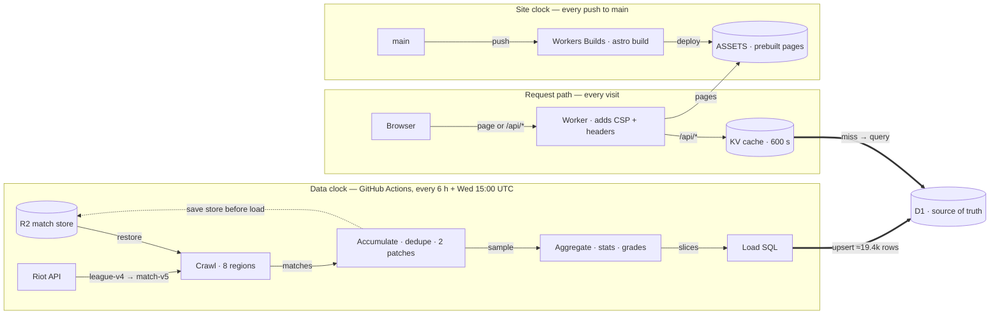

# lolperform.com — architecture

How the site is built, where every number comes from, and what to check when something breaks.
Code is cited by file and function or constant name rather than line number, so references survive edits.
Checked against commit `91c8b9a` on 2026-09-23.

## Contents

1. [Something's wrong?](#1-somethings-wrong)
2. [How the pieces fit](#2-how-the-pieces-fit)
3. [Collecting the data: the Riot API crawl](#3-collecting-the-data-the-riot-api-crawl)
4. [Turning matches into statistics: aggregation](#4-turning-matches-into-statistics-aggregation)
5. [The honesty machinery: confidence, floors and grading](#5-the-honesty-machinery-confidence-floors-and-grading)
6. [Storing it: the D1 database](#6-storing-it-the-d1-database)
7. [Serving it: the Cloudflare Worker and API](#7-serving-it-the-cloudflare-worker-and-api)
8. [Showing it: the Astro site](#8-showing-it-the-astro-site)
9. [Keeping it healthy: CI, quality gates and the schedule](#9-keeping-it-healthy-ci-quality-gates-and-the-schedule)
10. [Glossary](#10-glossary)

## 1. Something's wrong?

| What you see                                                                                                                                                                                                                          | Part          | Likely cause                                                                                                                                                                                                                                                                                                                                                                                                                                   | Where to look                                                                                                                                                                                                            | Fix                                                                                                                                                                                                                                                                                                                                 |
| ------------------------------------------------------------------------------------------------------------------------------------------------------------------------------------------------------------------------------------- | ------------- | ---------------------------------------------------------------------------------------------------------------------------------------------------------------------------------------------------------------------------------------------------------------------------------------------------------------------------------------------------------------------------------------------------------------------------------------------- | ------------------------------------------------------------------------------------------------------------------------------------------------------------------------------------------------------------------------ | ----------------------------------------------------------------------------------------------------------------------------------------------------------------------------------------------------------------------------------------------------------------------------------------------------------------------------------- |
| Patch Watch run is red with "crawl kept zero matches across all regions — Riot API likely unavailable"                                                                                                                                | Crawl         | Every region produced zero usable matches: a Riot outage, a bad key, or every ladder entry filtered out                                                                                                                                                                                                                                                                                                                                        | `pipeline/src/crawl.ts` → `crawl`; the run log's earlier `[crawl] … seeding failed` / `region failed` lines                                                                                                              | Check Riot's service status and re-run. The per-region flush only rewrote the previous matches, so the stored pile keeps its contents.                                                                                                                                                                                              |
| Patch Watch run is red and the log is full of "Riot API 401/403 … The RIOT_API_KEY is invalid, expired, or lacks access"                                                                                                              | Crawl         | The key has expired or been revoked. `401`/`403` is the one status that stops the request with an error (404 and other non-429 client errors are not retried either, but return nothing quietly)                                                                                                                                                                                                                                               | `pipeline/src/riot/client.ts` → `RiotClient.request`                                                                                                                                                                     | Generate a new key on the Riot developer portal, replace the `RIOT_API_KEY` secret, and re-run                                                                                                                                                                                                                                      |
| Patch Watch runs its full ~5.5 h but the per-region log lines show only a small number of matches kept, and most champions stay in _Unranked_                                                                                         | Crawl         | The key's advertised app limit is low. With the dev-key windows (20/s and 100/120 s) the sustained rate is about 0.83 requests/s, roughly 2 000 requests per 41-minute region                                                                                                                                                                                                                                                                  | The run log line `[riot] pacing at the key's advertised app limit: …`; `pipeline/src/riot/rateLimiter.ts` → `DEV_KEY_WINDOWS`                                                                                            | Get a higher-limit key; the limiter re-tunes itself from the header. Or lower `MAX_MATCHES_PER_REGION` so the budget isn't spread thin. The store keeps growing across runs anyway.                                                                                                                                                 |
| One region's champions look thin or missing and the run is still green                                                                                                                                                                | Crawl         | A region or tier failed, was logged, and was skipped. That never fails the job                                                                                                                                                                                                                                                                                                                                                                 | Search the run log for `[crawl] `. A healthy region prints `{region}: N ids discovered, K matches kept (…)`, and a missing line means it was skipped                                                                     | Re-run. If the same region keeps failing, check that platform's Riot status                                                                                                                                                                                                                                                         |
| Site shows last patch for days after a new patch shipped                                                                                                                                                                              | Crawl         | Neither flip condition is met yet: fresh crawl below 20% on the new patch and fewer than 3000 banked matches                                                                                                                                                                                                                                                                                                                                   | `pipeline/src/accumulate.ts` → `accumulate`; the run log line `[run] crawl … on patch X (+N accumulating on Y)`                                                                                                          | Wait for the banked threshold, or lower `MIN_TARGET_PATCH_MATCHES`                                                                                                                                                                                                                                                                  |
| Patch Watch run was cancelled or evicted, and roughly one region's worth of new matches is missing                                                                                                                                    | Crawl         | Progress is flushed only between regions, so the region in progress was only in memory                                                                                                                                                                                                                                                                                                                                                         | `pipeline/src/crawl.ts` → `crawl` (`onRegionDone`); `pipeline/src/run.ts` → `main`                                                                                                                                       | Accept it, or flush more often inside `crawlRegion`                                                                                                                                                                                                                                                                                 |
| Patch Watch run shows the warning "Match store save FAILED"                                                                                                                                                                           | Crawl         | The R2 upload failed. The next run starts from the older store and this run's matches don't carry over                                                                                                                                                                                                                                                                                                                                         | `.github/workflows/patch-watch.yml` → "Save match store" (it prints `r2err.log`)                                                                                                                                         | Fix the R2 access or upload problem and re-run                                                                                                                                                                                                                                                                                      |
| Patch Watch log says "No prior store (fresh start)" when a store should exist                                                                                                                                                         | Crawl         | The R2 download failed; errors in the restore step are ignored on purpose                                                                                                                                                                                                                                                                                                                                                                      | `.github/workflows/patch-watch.yml` → "Restore match store"                                                                                                                                                              | Check R2 access before the next save overwrites the store with a single run's matches                                                                                                                                                                                                                                               |
| Opening-item ("starting build") data exists for only about a fifth of matches                                                                                                                                                         | Crawl         | By design: only every 5th match gets a timeline, and failed timeline calls are dropped silently                                                                                                                                                                                                                                                                                                                                                | `pipeline/src/crawl.ts` → `TIMELINE_SAMPLE_EVERY`                                                                                                                                                                        | Lower `TIMELINE_SAMPLE_EVERY`, at the cost of more match-v5 requests                                                                                                                                                                                                                                                                |
| A region's log line appears well after its time slice should have ended                                                                                                                                                               | Crawl         | A very large `retry-after` or a long limiter wait. Deadlines are only checked before a request starts, and `fetch` has no timeout                                                                                                                                                                                                                                                                                                              | `pipeline/src/riot/client.ts` → `RiotClient.request` (429 branch); `crawlRegion` deadline checks                                                                                                                         | Cap the 429 wait and/or add a fetch timeout                                                                                                                                                                                                                                                                                         |
| Tier list shows "Building the sample" for a lane                                                                                                                                                                                      | Aggregation   | No champion in that slice has 1000 games this patch, and none has a usable prior (a prior-patch row with 1000 or more games, plus 50 or more games now)                                                                                                                                                                                                                                                                                        | `packages/shared/src/tier.ts` → `gradeSlice`; `apps/web/src/components/islands/TierGrid.tsx`                                                                                                                             | Expected on single regions and just after a patch flip. Check All Regions, which fills first. If it lasts, the crawl isn't producing enough games for that slice.                                                                                                                                                                   |
| A popular champion is missing from the tier list and its page shows NR                                                                                                                                                                | Aggregation   | Below 1000 current-patch games with no usable prior patch                                                                                                                                                                                                                                                                                                                                                                                      | `packages/shared/src/tier.ts` → `gradeSlice`, `TIER_LIST_MIN_GAMES`                                                                                                                                                      | Check `games` in the `role_slice` payload and in the previous patch's row. This resolves as games accumulate. Don't lower the threshold to hide it.                                                                                                                                                                                 |
| Tier list is thin right after a new patch, with many provisional grades                                                                                                                                                               | Aggregation   | The dataset flipped to the new patch (20% of the new crawl, or 3000 stored games) and the new patch's sample is small                                                                                                                                                                                                                                                                                                                          | `pipeline/src/accumulate.ts` → `accumulate`, `TARGET_PATCH_FLIP_SHARE`, `MIN_TARGET_PATCH_MATCHES`                                                                                                                       | Expected. Confirm the previous patch still has rows (`RETAIN_PATCHES` = 3 in `load.ts`), since blending needs them.                                                                                                                                                                                                                 |
| Site still shows the previous patch days after a release                                                                                                                                                                              | Aggregation   | Neither flip condition has been met                                                                                                                                                                                                                                                                                                                                                                                                            | `pipeline/src/accumulate.ts` → `accumulate`; the `[run]` log line from `run.ts`                                                                                                                                          | Read the run log ("N on patch X … ddragon reported Y"). Volume on the new patch will trigger the flip.                                                                                                                                                                                                                              |
| A champion page is missing its opening buys, core-build options or per-slot options while other champions have them                                                                                                                   | Aggregation   | `trimPayload` shrank a payload over 60,000 bytes. Nothing is logged when this happens.                                                                                                                                                                                                                                                                                                                                                         | `pipeline/src/load.ts` → `trimPayload`, `MAX_PAYLOAD_BYTES`                                                                                                                                                              | Measure the payload size for that slice/champion/role. Cut the option-list widths in `aggregateSlice`, or raise the cap while staying safely under the 80,000-byte statement limit and D1's 100 KB limit.                                                                                                                           |
| Patch Watch run is red at "Load into D1" with SQLITE_TOOBIG                                                                                                                                                                           | Aggregation   | A generated statement exceeded 100 KB, usually because a size constant was raised                                                                                                                                                                                                                                                                                                                                                              | `pipeline/src/load.ts` → `insertRows`, `MAX_STATEMENT_BYTES`, `MAX_PAYLOAD_BYTES`; `pipeline/src/load.test.ts`                                                                                                           | Restore the constants and run `pnpm test`. The load test asserts that every statement stays under 100 KB.                                                                                                                                                                                                                           |
| D1 writes run out for the day and later loads fail                                                                                                                                                                                    | Aggregation   | Loads exceeded the D1 write allowance: 100,000 rows a day on the Free plan (the account has been on Workers Paid since 2026-09-02, where the allowance is monthly and far larger), for example after adding regions or slices, or a backfill                                                                                                                                                                                                   | `pipeline/src/load.ts` → `estimateRowWrites`; the `[load] … D1 rows written, X% of the free daily ceiling` log line                                                                                                      | Read that line before shipping anything that adds rows. Each extra platform adds a pooled-and-regional set of slices across 3 brackets.                                                                                                                                                                                             |
| Patch Watch run is red at "Crawl + aggregate" with "ddragon item.json" or "ddragon champion.json" in the log                                                                                                                          | Aggregation   | A Data Dragon fetch failed. `getCompletedItems`, `getBootItems` and `getChampionMeta` throw on a bad HTTP status.                                                                                                                                                                                                                                                                                                                              | `pipeline/src/ddragon.ts`; `pipeline/src/run.ts`                                                                                                                                                                         | Re-run once Data Dragon is back. The store was saved before the catalog fetch, so the crawl isn't lost.                                                                                                                                                                                                                             |
| ADC build pages show no boots                                                                                                                                                                                                         | Aggregation   | Stored games predate the `quest` field, which is where the 2026 ADC quest keeps boots                                                                                                                                                                                                                                                                                                                                                          | `pipeline/src/aggregate.ts` → `aggregateSlice` (boot tally); `pipeline/src/riot/types.ts` → `NormParticipant.quest`                                                                                                      | Games crawled since `quest` was added carry it. Older games leave the store as the patch rolls over.                                                                                                                                                                                                                                |
| Someone reports "win rate doesn't equal wins ÷ games"                                                                                                                                                                                 | Aggregation   | Not a bug. Role-stat `winRate` is the weighted `wWins/wGames`, while `games`/`wins` are raw. Build headlines, matchups and duos use raw `wins/games`.                                                                                                                                                                                                                                                                                          | `pipeline/src/aggregate.ts` → `aggregateSlice` (role-stat emit)                                                                                                                                                          | Nothing to fix. This is documented policy.                                                                                                                                                                                                                                                                                          |
| "All Regions" shows nothing while single regions work                                                                                                                                                                                 | Aggregation   | The run covered only one region, so the pooled `'all'` slice wasn't emitted                                                                                                                                                                                                                                                                                                                                                                    | `pipeline/src/aggregate.ts` → `aggregate` (`pool = regions.length > 1`)                                                                                                                                                  | Check which regions the dataset contains. A multi-region crawl restores it.                                                                                                                                                                                                                                                         |
| A champion's grade jumps several steps between loads with no balance change                                                                                                                                                           | Aggregation   | A (tier × region) cell with too few games is pinned at the maximum weight of 4, or the pool size changed as champions crossed 1000 games                                                                                                                                                                                                                                                                                                       | `pipeline/src/aggregate.ts` → `matchWeights`; `packages/shared/src/tier.ts` → `gradeSlice`                                                                                                                               | Log the weights for that slice. If many cells sit at 4 or 0.25, fix the crawl mix rather than widening the clamp.                                                                                                                                                                                                                   |
| A keystone is listed that no displayed rune page uses                                                                                                                                                                                 | Aggregation   | Normal when the keystone's games are spread across several style combinations, none reaching `MIN_RUNE_PAGE_GAMES` (30). The reverse, a page whose keystone is not listed, cannot happen unless the two floors were changed separately                                                                                                                                                                                                         | `pipeline/src/aggregate.ts` → rune-page and keystone emit in `aggregateSlice`                                                                                                                                            | Change the two floors together and re-run `pipeline/src/aggregate.test.ts`.                                                                                                                                                                                                                                                         |
| Site keeps showing the old numbers for a few minutes after a load                                                                                                                                                                     | Aggregation   | KV cache entries last `DEFAULT_TTL` = 600 s                                                                                                                                                                                                                                                                                                                                                                                                    | `worker/src/cache.ts` → `cachedJson`                                                                                                                                                                                     | Wait out the TTL (10 minutes).                                                                                                                                                                                                                                                                                                      |
| The slice end-to-end tests pass but test nothing                                                                                                                                                                                      | Aggregation   | `pipeline/src/slices.e2e.test.ts` switches to `describe.skip` when `node:sqlite` can't be imported                                                                                                                                                                                                                                                                                                                                             | `pipeline/src/slices.e2e.test.ts` (`withSqlite`)                                                                                                                                                                         | Run on a Node where `node:sqlite` loads, and confirm the suite reports as run, not skipped.                                                                                                                                                                                                                                         |
| Tier list says "Building the sample" instead of showing grades                                                                                                                                                                        | Statistics    | No champion in that role or slice has 1,000 games this patch, and no champion has a previous-patch row with 1,000+ games to blend with. Typical right after a patch change, especially on a single region                                                                                                                                                                                                                                      | `packages/shared/src/tier.ts` → `gradeSlice` (pool filter); `apps/web/src/components/islands/TierGrid.tsx`                                                                                                               | Switch to All Regions (the default, `DEFAULT_REGION = 'all'`), which fills first, or wait for more crawls. Do not lower `TIER_LIST_MIN_GAMES`                                                                                                                                                                                       |
| Tier list shows the "awaiting data" empty state, or the API returns 503 "dataset not loaded yet"                                                                                                                                      | Statistics    | No patch loaded, or no `role_slice` row for that slice                                                                                                                                                                                                                                                                                                                                                                                         | `worker/src/api.ts` → `resolvePatch`; `worker/src/db.ts` → `fetchRoleSlice`                                                                                                                                              | Check that the pipeline load ran and wrote the slice                                                                                                                                                                                                                                                                                |
| A rarely played champion appears on the tier list with a dashed (provisional) badge and a small game count                                                                                                                            | Statistics    | Expected: it has 50+ games this patch and a previous-patch row with 1,000+ games, so its ranking is mostly last patch's numbers (`w = games/1000`)                                                                                                                                                                                                                                                                                             | `tier.ts` → `blendWithPrior`, `gradeSlice` (`usablePrior`); `worker/src/db.ts` → `getGradedRoleStats`                                                                                                                    | Nothing, if the prior really had 1,000+ games. If it didn't, check that `getGradedRoleStats` still passes `games` on `priorPatch`                                                                                                                                                                                                   |
| Champion page shows "NR" where you expected a grade                                                                                                                                                                                   | Statistics    | Under 1,000 games this patch, and no usable previous-patch row (new champion, off-role pick, or a thin prior)                                                                                                                                                                                                                                                                                                                                  | `apps/web/src/components/islands/ChampionStats.tsx`; `tier.ts` → `gradeSlice`                                                                                                                                            | Expected. The grade appears once the champion reaches 1,000 games, or 50 games with a usable prior                                                                                                                                                                                                                                  |
| A curated counter pick shows a dash instead of a win rate                                                                                                                                                                             | Statistics    | That pick's own lane row in the tier list has fewer than 50 games (`isRanked`). Live head-to-head picks under `MIN_H2H_GAMES` (25) are not shown at all                                                                                                                                                                                                                                                                                        | `apps/web/src/components/islands/CounterRecommender.tsx`; `tier.ts` → `MIN_TIER_GAMES`                                                                                                                                   | Expected. Wait for more data                                                                                                                                                                                                                                                                                                        |
| A matchup, duo, build, keystone, rune page or starting-item option is missing from a champion page                                                                                                                                    | Statistics    | The row fell below its `MIN_*_GAMES` floor and was never written                                                                                                                                                                                                                                                                                                                                                                               | `pipeline/src/aggregate.ts` (`MIN_MATCHUP_GAMES`, `MIN_DUO_GAMES`, `MIN_BUILD_GAMES`, `MIN_KEYSTONE_GAMES`, `MIN_RUNE_PAGE_GAMES`, `MIN_START_GAMES`)                                                                    | Expected. Lowering a floor grows each champion's payload rather than the row count; watch the payload size limit                                                                                                                                                                                                                    |
| The displayed win rate doesn't equal wins ÷ games for the same champion                                                                                                                                                               | Statistics    | By design: `winRate` is population-weighted (`wWins/wGames`), while `games`/`wins` are raw counts                                                                                                                                                                                                                                                                                                                                              | `pipeline/src/aggregate.ts` → `aggregateSlice`, `matchWeights`                                                                                                                                                           | Nothing to fix. If the gap is large, the crawl's tier/region mix is far from the targets and the [0.25, 4] clamp is binding on many cells                                                                                                                                                                                           |
| Player-pool correction has no effect: `adjustedWinRate` is null on every row in the API response                                                                                                                                      | Statistics    | No seed baselines reached the slice (no match carried a seed, or all seeds had under 20 career games)                                                                                                                                                                                                                                                                                                                                          | Pipeline crawl log line "`(N with a seed baseline)`" from `pipeline/src/crawl.ts`; `aggregate.ts` → `centredBaselines`                                                                                                   | This is a designed no-op, not a crash. Check the seed count in the crawl log                                                                                                                                                                                                                                                        |
| Many champions' `playerPoolDelta` sits at exactly ±0.04                                                                                                                                                                               | Statistics    | The cap is binding. Real gaps are well under 4 points, so the baseline inputs are probably broken (lost centring, or baselines repeated per match)                                                                                                                                                                                                                                                                                             | `playerSkill.ts` → `MAX_PLAYER_POOL_DELTA`; `aggregate.ts` → `centredBaselines` and the `poolMean: 0` call; `crawl.ts` (`carried` flag)                                                                                  | Restore per-tier centring or the one-per-seed rule. Do not raise the cap                                                                                                                                                                                                                                                            |
| A new champion looks slightly misplaced at a grade boundary                                                                                                                                                                           | Statistics    | Its Data Dragon id isn't in `LOW`/`HIGH` (or is misspelled), so it gets `medium` (0 offset)                                                                                                                                                                                                                                                                                                                                                    | `packages/shared/src/skillFloor.ts` → `skillFloorFor`                                                                                                                                                                    | Add the exact Data Dragon id to `LOW` or `HIGH`, only with two agreeing outside signals                                                                                                                                                                                                                                             |
| Grades are still old a few minutes after a data load                                                                                                                                                                                  | Statistics    | KV cache (600 s) and browser/edge caching (`max-age=300`, `s-maxage=600`)                                                                                                                                                                                                                                                                                                                                                                      | `worker/src/cache.ts` → `cachedJson`, `DEFAULT_TTL`                                                                                                                                                                      | Wait up to about 10 minutes                                                                                                                                                                                                                                                                                                         |
| Worker logs show `[cache] put failed` and responses carry `x-cache: BYPASS`                                                                                                                                                           | Statistics    | KV write failed, for example the daily KV quota on the Free plan                                                                                                                                                                                                                                                                                                                                                                               | `worker/src/cache.ts` → `cachedJson`; Cloudflare dashboard → Workers & Pages → the lolperform Worker → Logs                                                                                                              | Pages still work, uncached. Check that nothing is minting cache keys (`worker/src/api.ts` → `cacheKey` must use only parsed params)                                                                                                                                                                                                 |
| Every API page says "dataset not loaded yet"                                                                                                                                                                                          | Database      | `patches` is empty: no load has ever succeeded against this database                                                                                                                                                                                                                                                                                                                                                                           | `worker/src/api.ts` → `resolvePatch`; the "Patch already loaded in D1" step of `patch-watch.yml`                                                                                                                         | Run the pipeline and load (`pnpm --filter @lolperform/pipeline load`, then `wrangler d1 execute lolperform --remote --file db/.generated/load.sql`), or rerun Patch Watch with `force_load`                                                                                                                                         |
| Patch Watch run is red at "Load into D1"                                                                                                                                                                                              | Database      | All 3 `wrangler d1 execute` attempts failed. Possible reasons: a daily write limit, an oversized statement, a CHECK violation, or missing Cloudflare credentials                                                                                                                                                                                                                                                                               | The step's log in GitHub Actions → Patch Watch; `CLOUDFLARE_API_TOKEN` / `CLOUDFLARE_ACCOUNT_ID` secrets (names only)                                                                                                    | Read the error. For a limit, wait for the daily reset; for `SQLITE_TOOBIG`, see the next row; for a CHECK error, fix the producer. The next load rewrites the same rows safely                                                                                                                                                      |
| Load fails with `SQLITE_TOOBIG`                                                                                                                                                                                                       | Database      | One statement went over D1's 100 KB limit, usually because `MAX_STATEMENT_BYTES` or `MAX_PAYLOAD_BYTES` was raised                                                                                                                                                                                                                                                                                                                             | `pipeline/src/load.ts` → `insertRows`, `trimPayload`                                                                                                                                                                     | Bring the byte caps back toward 80,000 / 60,000                                                                                                                                                                                                                                                                                     |
| Load fails on a CHECK constraint and nothing updates                                                                                                                                                                                  | Database      | A rank or role outside the allowed values reached the database                                                                                                                                                                                                                                                                                                                                                                                 | `db/migrations/0011_slice_tables.sql`; `packages/shared/src/constants.ts` → `ROLES`, `RANK_BRACKETS`                                                                                                                     | Fix the pipeline output. Widening a CHECK means rebuilding the table, as 0002 and 0009 did                                                                                                                                                                                                                                          |
| Site still shows the old patch or old numbers for a few minutes after a successful load                                                                                                                                               | Database      | KV responses cached for 600 s; the cache key does not include the patch                                                                                                                                                                                                                                                                                                                                                                        | `worker/src/cache.ts` → `DEFAULT_TTL`, `cachedJson`                                                                                                                                                                      | Wait out the TTL (up to 10 minutes)                                                                                                                                                                                                                                                                                                 |
| Site shows last patch's data many hours later                                                                                                                                                                                         | Database      | Patch Watch decided not to load (patch unchanged and last load newer than `MAX_LOAD_AGE_HOURS`), or the load step failed                                                                                                                                                                                                                                                                                                                       | The "Decide" step output in the Patch Watch run                                                                                                                                                                          | Rerun Patch Watch with `force_load`, after checking the row estimate                                                                                                                                                                                                                                                                |
| Tier list is empty for one region/rank/role                                                                                                                                                                                           | Database      | No `role_slice` row for that key in the current patch; `getGradedRoleStats` then returns an empty list                                                                                                                                                                                                                                                                                                                                         | `worker/src/db.ts` → `fetchRoleSlice`; the load's printed row counts                                                                                                                                                     | Reload. If the pipeline produced no role stats for that slice, fix it upstream                                                                                                                                                                                                                                                      |
| Right after a patch change, low-sample champions get hard grades instead of provisional ones                                                                                                                                          | Database      | No previous patch left in `patches`, so there is nothing to blend champions under 1000 games with                                                                                                                                                                                                                                                                                                                                              | `worker/src/db.ts` → `getPreviousPatch`; `pipeline/src/load.ts` → `RETAIN_PATCHES`                                                                                                                                       | Keep `RETAIN_PATCHES` at 2 or more. After a fresh database, backfill or load the prior patch                                                                                                                                                                                                                                        |
| One champion's page is missing its rarer matchups or its item/spell/starting-buy alternatives while others look complete                                                                                                              | Database      | That payload exceeded 60,000 bytes and `trimPayload` cut it down                                                                                                                                                                                                                                                                                                                                                                               | `pipeline/src/load.ts` → `trimPayload`, `MAX_PAYLOAD_BYTES`                                                                                                                                                              | Raise `MAX_PAYLOAD_BYTES` carefully (staying under the 100 KB statement limit) or emit less per champion. Do not split the payload into more rows                                                                                                                                                                                   |
| A duo appears on a champion page but not on the duo board                                                                                                                                                                             | Database      | The board keeps only the 500 duos with the most games                                                                                                                                                                                                                                                                                                                                                                                          | `pipeline/src/load.ts` → `DUO_BOARD_LIMIT`, `groupDuoSlices`                                                                                                                                                             | Raise `DUO_BOARD_LIMIT`. It costs bytes in one row, not extra rows                                                                                                                                                                                                                                                                  |
| Counter-pick list never shows more than 24 champions                                                                                                                                                                                  | Database      | Hard `LIMIT 24` in the counter query                                                                                                                                                                                                                                                                                                                                                                                                           | `worker/src/db.ts` → `getCounters`                                                                                                                                                                                       | Change the LIMIT                                                                                                                                                                                                                                                                                                                    |
| Site errors after a deploy that added a migration                                                                                                                                                                                     | Database      | The new migration was never applied to the remote database (`pnpm run deploy` does not apply migrations)                                                                                                                                                                                                                                                                                                                                       | `db/migrations/`; the Worker's logs in the Cloudflare dashboard (Workers & Pages → the lolperform Worker → Logs)                                                                                                         | Run `wrangler d1 migrations apply lolperform --remote`                                                                                                                                                                                                                                                                              |
| Stale rows for a champion that left a role linger in a slice                                                                                                                                                                          | Database      | A load was interrupted before its prune DELETEs ran                                                                                                                                                                                                                                                                                                                                                                                            | `pipeline/src/load.ts` → `buildLoadSql`                                                                                                                                                                                  | Rerun the full load. It can be repeated safely, and the prune runs last                                                                                                                                                                                                                                                             |
| Tier list, champion pages, counters and duos are all empty or show an error, while `/api/health` still says ok                                                                                                                        | Worker & API  | `patches` table is empty, so those endpoints return 503 `dataset not loaded yet`                                                                                                                                                                                                                                                                                                                                                               | `worker/src/api.ts` → `resolvePatch`; `worker/src/db.ts` → `getLatestPatch`. Check with `wrangler d1 execute lolperform --remote --command "SELECT patch, generated_at FROM patches ORDER BY generated_at DESC LIMIT 3"` | Run the pipeline load. If tables are missing, run `wrangler d1 migrations apply lolperform --remote`                                                                                                                                                                                                                                |
| Right after the first-ever load, the site still says no patch is loaded for about 10 minutes                                                                                                                                          | Worker & API  | `/api/v1/meta` cached its `{patch: null}` answer, which lives out the TTL                                                                                                                                                                                                                                                                                                                                                                      | `worker/src/api.ts` → `meta`; `worker/src/cache.ts` → `cachedJson`                                                                                                                                                       | Wait up to 600 s, or delete the key: `wrangler kv key delete --binding CACHE --remote "/api/v1/meta"`                                                                                                                                                                                                                               |
| Site shows last patch's numbers for a while after Patch Watch loaded a new one                                                                                                                                                        | Worker & API  | Expected: nothing clears the cache, the patch isn't in the cache key, and entries live 600 s (plus up to 300 s in the visitor's browser)                                                                                                                                                                                                                                                                                                       | `worker/src/cache.ts` → `DEFAULT_TTL`; `worker/src/api.ts` → `cacheKey`                                                                                                                                                  | Wait it out, or delete specific keys with `wrangler kv key delete --binding CACHE --remote "<key>"`                                                                                                                                                                                                                                 |
| Pages feel slower; API responses carry `x-cache: BYPASS`; logs show `[cache] put failed for …`                                                                                                                                        | Worker & API  | KV writes are failing: daily free-plan quota used up, or a KV outage. Data is still correct                                                                                                                                                                                                                                                                                                                                                    | `worker/src/cache.ts` → `cachedJson`; Cloudflare dashboard → Workers & Pages → the lolperform Worker → Logs, or `wrangler tail`                                                                                          | No code fix needed; this is the intended fallback. If it's the quota, look for anything creating extra keys and confirm every handler builds its key with `cacheKey` from validated parameters only                                                                                                                                 |
| Every API call returns `{"error":"internal error"}`                                                                                                                                                                                   | Worker & API  | A handler threw, for example a D1 table missing or a binding misconfigured. The `catch` doesn't log the exception                                                                                                                                                                                                                                                                                                                              | `worker/src/index.ts` → `fetch`; `wrangler.toml` bindings; migrations status                                                                                                                                             | Apply migrations and check that the `DB` and `CACHE` bindings exist; run `pnpm run cf:dev` to reproduce locally                                                                                                                                                                                                                     |
| A hand-typed API URL returns `invalid query parameters`                                                                                                                                                                               | Worker & API  | A required parameter is missing, or a value isn't in the allowed list (for example `role=ADC` or `region=euw`)                                                                                                                                                                                                                                                                                                                                 | `worker/src/http.ts` → `parseQuery`; `packages/shared/src/constants.ts` → `ROLES`, `RANK_BRACKETS`, `PLATFORMS`. The `details` field names the bad parameter                                                             | Use the exact values (`BOTTOM`, `UTILITY`, `euw1`, `all`). If the site's own pages start getting 400s after a change to the allowed values, redeploy so the site and Worker ship the same `@lolperform/shared`                                                                                                                      |
| A champion link shows `invalid champion id` or `champion not found`                                                                                                                                                                   | Worker & API  | The id has characters outside `[A-Za-z0-9]`, or no `champions` row has that exact Data Dragon id (casing matters)                                                                                                                                                                                                                                                                                                                              | `worker/src/api.ts` → `champion`; `worker/src/db.ts` → `getChampionById`                                                                                                                                                 | Use the exact id (for example `MissFortune`). Check with `wrangler d1 execute lolperform --remote --command "SELECT id, name FROM champions ORDER BY name"`                                                                                                                                                                         |
| A champion page loads but matchups, builds or runes are blank, with no error                                                                                                                                                          | Worker & API  | Its `champion_slice` payload is truncated or malformed; the parsers fall back to empty lists                                                                                                                                                                                                                                                                                                                                                   | `worker/src/db.ts` → `parseChampionPayload`, `fetchChampionRows`                                                                                                                                                         | Reload that slice with the pipeline. The Worker can't repair the row                                                                                                                                                                                                                                                                |
| Ads, the analytics beacon or champion art don't show; the browser console reports CSP refusals                                                                                                                                        | Worker & API  | The resource's host is missing from the relevant CSP directive                                                                                                                                                                                                                                                                                                                                                                                 | `worker/src/security.ts` → `CSP`, `GOOGLE_ADS`, `CF_INSIGHTS_SCRIPT`, `CF_INSIGHTS_CONNECT`                                                                                                                              | Add the host to the directive named in the console message, and update `worker/src/security.test.ts`                                                                                                                                                                                                                                |
| A security scan says pages have no Content-Security-Policy, or pages are stale after a deploy                                                                                                                                         | Worker & API  | `run_worker_first` was removed or narrowed, so the asset layer answers directly and the Worker never runs                                                                                                                                                                                                                                                                                                                                      | `wrangler.toml` → `[assets]`. Check with `curl -sI https://lolperform.com/ \                                                                                                                                             | grep -i content-security-policy`                                                                                                                                                                                                                                                                                                    |
| An integration that sends POST gets "not found"                                                                                                                                                                                       | Worker & API  | The API is read-only; only GET routes exist, so other methods hit the `/api/*` catch-all                                                                                                                                                                                                                                                                                                                                                       | `worker/src/index.ts` route table                                                                                                                                                                                        | Use GET. No fix needed                                                                                                                                                                                                                                                                                                              |
| Deploy fails at the build step and no pages are produced                                                                                                                                                                              | Site          | Data Dragon unreachable or returned non-JSON during build. `loadBuildChampions` has no error handling, and every page depends on it through the header                                                                                                                                                                                                                                                                                         | `apps/web/src/lib/ddragonBuild.ts` → `loadBuildChampions`; try fetching `https://ddragon.leagueoflegends.com/api/versions.json`                                                                                          | Re-run once Data Dragon responds. The lasting fix is a timeout plus a fallback roster. The `'16.12.1'` fallback only covers an empty versions list                                                                                                                                                                                  |
| Every tier list, champion page and duo grid says "Stats land after the first patch crawl"                                                                                                                                             | Site          | No dataset loaded yet (the API returns 503), or the API is failing. The UI shows the same state for both because of `retry: false` and `isError` handling                                                                                                                                                                                                                                                                                      | `apps/web/src/components/islands/States.tsx` → `AWAITING_DATA`; browser network tab on `/api/v1/tierlist`; Cloudflare dashboard → Workers & Pages → the lolperform Worker → Logs                                         | A 503 means wait for or run the pipeline load. A 500 means debug the Worker and D1                                                                                                                                                                                                                                                  |
| Tier list says "Building the sample" with a games count                                                                                                                                                                               | Site          | Champions exist on this region/rank slice, but none has `score > 0` yet                                                                                                                                                                                                                                                                                                                                                                        | `TierGrid.tsx` (the `ranked` filter); `packages/shared/src/tier.ts` → `TIER_LIST_MIN_GAMES`                                                                                                                              | Expected on thin slices. Switch to All Regions, or wait for more games                                                                                                                                                                                                                                                              |
| Champion page shows item icons but no item names, rune trees or spell names, or whole build sections are missing                                                                                                                      | Site          | `/api/v1/meta` returned no `version` (the catalog queries never fire and the sections return `null`), or the CSP `connect-src` no longer allows Data Dragon                                                                                                                                                                                                                                                                                    | `ChampionStats.tsx` → `runeCatalog`, `spellCatalog`, `itemCatalog`; `worker/src/security.ts` → `CSP`                                                                                                                     | Make sure `/meta` returns `version` and `connect-src` still lists `https://ddragon.leagueoflegends.com`                                                                                                                                                                                                                             |
| Champion portraits and item icons show as broken images                                                                                                                                                                               | Site          | The image URL uses a Data Dragon version that doesn't exist on the CDN (a fallback before `/meta` answers, or a bad `version`), or `img-src` lost the Data Dragon host                                                                                                                                                                                                                                                                         | `apps/web/src/lib/ddragon.ts` → `FALLBACK_DDRAGON_VERSION`; `ddragonBuild.ts`; `worker/src/security.ts` → `CSP`                                                                                                          | Correct the version (it appears in both files) or restore `img-src`                                                                                                                                                                                                                                                                 |
| Pages load without the security headers, or look stale after a deploy                                                                                                                                                                 | Site          | `run_worker_first` was changed, so the asset layer answers without the Worker                                                                                                                                                                                                                                                                                                                                                                  | `wrangler.toml` `[assets]`                                                                                                                                                                                               | Restore `run_worker_first = ["/*", "!/_astro/*"]`                                                                                                                                                                                                                                                                                   |
| Words run together on the page after a formatter or Prettier plugin update                                                                                                                                                            | Site          | `astroCompressHTML` and Astro's `compressHTML` disagree                                                                                                                                                                                                                                                                                                                                                                                        | `.prettierrc.json`; `apps/web/astro.config.mjs`                                                                                                                                                                          | Make them match again (both `"jsx"` today) and re-run `pnpm format`                                                                                                                                                                                                                                                                 |
| `/styleguide` appears in the sitemap even though robots.txt disallows it                                                                                                                                                              | Site          | `sitemap()` is called with no options, so it lists every route                                                                                                                                                                                                                                                                                                                                                                                 | `apps/web/astro.config.mjs`; `apps/web/public/robots.txt`                                                                                                                                                                | Add a `filter` to `sitemap({...})`                                                                                                                                                                                                                                                                                                  |
| `/matchup` briefly shows "Loading matchup…" for every visitor                                                                                                                                                                         | Site          | The page is static and `MatchupDetail` reads the URL query only after mount                                                                                                                                                                                                                                                                                                                                                                    | `apps/web/src/components/islands/MatchupDetail.tsx`                                                                                                                                                                      | Working as designed. Prerendered matchup routes would be needed for anything else                                                                                                                                                                                                                                                   |
| Browser Back doesn't undo tier-list tab switches                                                                                                                                                                                      | Site          | `TierGrid` uses `history.replaceState`, not `pushState`                                                                                                                                                                                                                                                                                                                                                                                        | `TierGrid.tsx` → `selectRole`                                                                                                                                                                                            | Intentional. Switch to `pushState` plus a `popstate` listener if Back should step through roles                                                                                                                                                                                                                                     |
| A curated counter pick never shows up on /bot-lane                                                                                                                                                                                    | Site          | Its id in `COUNTERS` doesn't match the Data Dragon id exactly (e.g. `Kaisa`, `MonkeyKing`), so the roster lookup drops it                                                                                                                                                                                                                                                                                                                      | `apps/web/src/data/counters.ts`                                                                                                                                                                                          | Use the exact Data Dragon `id`                                                                                                                                                                                                                                                                                                      |
| "quality gates" check on a PR is red with `[coverage] dropped to …`                                                                                                                                                                   | CI & schedule | New or changed code lowered overall statement coverage below baseline − 0.5 points                                                                                                                                                                                                                                                                                                                                                             | `.quality-gates/run-gates.mjs` ratchet block; the `coverage` artifact                                                                                                                                                    | Add tests for the new code. Never lower `baseline.coverage`.                                                                                                                                                                                                                                                                        |
| "quality gates" check is red with `[crap]` or `[complexity]`                                                                                                                                                                          | CI & schedule | A function got more tangled or less tested than the worst recorded one                                                                                                                                                                                                                                                                                                                                                                         | "worst offenders" table printed by `crap.mjs` → `formatReport`                                                                                                                                                           | Split the function or test it; CRAP only falls through simpler code or more coverage.                                                                                                                                                                                                                                               |
| "quality gates" check is red: `coverage was requested but coverage/coverage-final.json was not produced`                                                                                                                              | CI & schedule | Coverage flags never reached vitest, or `@vitest/coverage-v8` failed to load                                                                                                                                                                                                                                                                                                                                                                   | The failure prints the exact command to reproduce                                                                                                                                                                        | Re-run that command. Keep `scripts.test` a plain `vitest run` so the direct-binary path is used.                                                                                                                                                                                                                                    |
| CI is red at "Format check" on a PR that didn't touch formatting                                                                                                                                                                      | CI & schedule | A prettier or `prettier-plugin-astro` bump reformatted files                                                                                                                                                                                                                                                                                                                                                                                   | `.github/workflows/ci.yml` "Format check"                                                                                                                                                                                | Run `pnpm format` and commit it as a separate change.                                                                                                                                                                                                                                                                               |
| Words run together on a page (e.g. "assix"), or CI is red at "Check rendered whitespace"                                                                                                                                              | CI & schedule | An `.astro` template breaks a line right next to `<strong>`, `<code>`, `<a>` or `<em>`                                                                                                                                                                                                                                                                                                                                                         | `scripts/check-inline-whitespace.mjs` output (`JOIN in …`)                                                                                                                                                               | In the `.astro` source, break lines only between plain words.                                                                                                                                                                                                                                                                       |
| "security" check is red with `[security-tooling] gitleaks is not installed`                                                                                                                                                           | CI & schedule | The pinned gitleaks download failed                                                                                                                                                                                                                                                                                                                                                                                                            | `.github/workflows/quality-gates-security.yml` "Install gitleaks"                                                                                                                                                        | Bump `VERSION` to a release that still publishes `gitleaks_<v>_linux_x64.tar.gz`.                                                                                                                                                                                                                                                   |
| "security" check is red with `[security-tooling] pnpm audit: …`                                                                                                                                                                       | CI & schedule | The audit command produced no usable output                                                                                                                                                                                                                                                                                                                                                                                                    | `.quality-gates/security.mjs` → `scanDependencies`                                                                                                                                                                       | Check the audit output in the log. The `ci.yml` comment notes npm's classic audit endpoints were shut off.                                                                                                                                                                                                                          |
| "security" or "CI / secret-scan" check is red listing a gitleaks finding                                                                                                                                                              | CI & schedule | Something that looks like a credential is in a file or anywhere in history                                                                                                                                                                                                                                                                                                                                                                     | The finding's `allowlist id` in the log                                                                                                                                                                                  | Rotate the real credential; deleting it in a later commit does not clear history. Allowlist only a genuine false positive, with a reason and `expires`.                                                                                                                                                                             |
| Security log says `allowlist entry expired … is live again` and the check is red                                                                                                                                                      | CI & schedule | An accepted finding reached its `expires` date                                                                                                                                                                                                                                                                                                                                                                                                 | `.quality-gates/security-allowlist.json`                                                                                                                                                                                 | Re-review: fix the finding, or commit a renewed entry with a new expiry.                                                                                                                                                                                                                                                            |
| "mutation testing" run is red                                                                                                                                                                                                         | CI & schedule | Mutation score fell below `break: 33`, or the 60-minute timeout hit                                                                                                                                                                                                                                                                                                                                                                            | Job summary "Mutation score", `mutation-report` artifact                                                                                                                                                                 | Strengthen tests around the listed surviving mutants.                                                                                                                                                                                                                                                                               |
| Patch Watch run is red at "Load into D1" (`Load failed after 3 attempts`)                                                                                                                                                             | CI & schedule | D1 rejected or reset the import three times                                                                                                                                                                                                                                                                                                                                                                                                    | The run log for that step                                                                                                                                                                                                | Usually transient: the next run re-loads from the larger store, and the upsert is idempotent. Or dispatch manually with `force_load`.                                                                                                                                                                                               |
| Patch Watch run is red at the start: `CLOUDFLARE_API_TOKEN is not set for this step`                                                                                                                                                  | CI & schedule | Repository secret missing or renamed                                                                                                                                                                                                                                                                                                                                                                                                           | GitHub → Settings → Secrets and variables → Actions                                                                                                                                                                      | Re-add `CLOUDFLARE_API_TOKEN` and `CLOUDFLARE_ACCOUNT_ID`.                                                                                                                                                                                                                                                                          |
| Patch Watch run is red: `Refusing suspicious ddragon patch string`                                                                                                                                                                    | CI & schedule | Data Dragon returned something other than digits and dots, or nothing                                                                                                                                                                                                                                                                                                                                                                          | "Latest Data Dragon patch" step                                                                                                                                                                                          | Usually a Riot-side hiccup; re-run later.                                                                                                                                                                                                                                                                                           |
| Patch Watch is green but shows a "Match store save FAILED" warning, and sample sizes stop growing                                                                                                                                     | CI & schedule | R2 upload failed                                                                                                                                                                                                                                                                                                                                                                                                                               | "Save match store" step output (`r2err.log`)                                                                                                                                                                             | Fix the R2 access or size problem shown in the log. The crawl's matches are lost for that run.                                                                                                                                                                                                                                      |
| Site still shows the old patch hours after Riot shipped                                                                                                                                                                               | CI & schedule | Scheduled runs start late and queue behind a ~5.5 h crawl, and the dataset only flips once 20% of a fresh crawl or 3,000 banked matches are on the new patch                                                                                                                                                                                                                                                                                   | Actions → Patch Watch run history; the `[run] … on patch` log line                                                                                                                                                       | Usually nothing: the next load after the flip lands it. A manual run cannot speed this up, because it queues behind any running crawl and then runs its own ~5.5 h crawl first; before the flip, `force_load` just reloads the old patch.                                                                                           |
| Numbers are unchanged for a few minutes after a green load                                                                                                                                                                            | CI & schedule | KV answers are cached for up to 600 s                                                                                                                                                                                                                                                                                                                                                                                                          | `worker/src/cache.ts` → `DEFAULT_TTL`                                                                                                                                                                                    | Wait up to 10 minutes.                                                                                                                                                                                                                                                                                                              |
| A local `git push` runs no gate at all                                                                                                                                                                                                | CI & schedule | `.githooks/pre-push` isn't wired up (committed without the executable bit; git isn't pointed at `.githooks`)                                                                                                                                                                                                                                                                                                                                   | `git config --get core.hooksPath`                                                                                                                                                                                        | `git config core.hooksPath .githooks` and `chmod +x .githooks/pre-push`.                                                                                                                                                                                                                                                            |
| `pnpm run gates` lists failures but the shell says success, and the baseline never moves                                                                                                                                              | CI & schedule | That script passes `--report`, which never fails and never auto-tightens                                                                                                                                                                                                                                                                                                                                                                       | `package.json` → `scripts.gates`                                                                                                                                                                                         | Run `node .quality-gates/run-gates.mjs` to get the real verdict and tightening.                                                                                                                                                                                                                                                     |
| The accumulated sample suddenly resets. The Patch Watch log shows 'Restored N stored matches' with a large N, but the run.ts line reads '[run] crawl X + stored 0 -> ...', and the next run restores only one run's worth of matches. | Crawl         | readStore wraps the whole NDJSON parse in one try/catch. A single truncated or corrupt line makes it return [] for the entire store. That can happen when a runner is killed in the middle of a per-region writeStore, and Save match store (if: always()) then uploads the partial file. The run carries on with prior = [], the flush and final writeStore rewrite the file with only this run's matches, and Save overwrites the R2 object. | pipeline/src/run.ts → readStore / writeStore; the Restore step's 'Restored N' line vs the '[run] crawl … + stored …' line; .github/workflows/patch-watch.yml 'Save match store'                                          | Before the next run saves, recover an older copy of lolperform-matches/matches.ndjson.gz if one exists (R2 object versioning or backup) or repair the file by dropping the bad last line. Longer term, parse line by line and skip bad lines instead of discarding everything, and write the store atomically (temp file + rename). |
| The 'Restored N stored matches' count drops sharply from one run to the next, and the '[run]' line reports a large '(… duplicate/off-patch dropped …)' figure.                                                                        | Crawl         | Expected on a patch flip. accumulate keeps only {dominantPatch, targetPatch} in the store, so every match from the outgoing patch is pruned when the dataset moves to the new patch (or when the fresh crawl's dominant patch changes).                                                                                                                                                                                                        | pipeline/src/accumulate.ts → accumulate (`keep = new Set([dominantPatch, targetPatch])`); the run.ts '[run] crawl … dropped' log line                                                                                    | Nothing to fix if the dataset patch just changed. If the drop happened with no patch change, look for a Data Dragon version jump or the corrupt-store case above.                                                                                                                                                                   |
| A Patch Watch run fails with 'The job has exceeded the maximum execution time of 355m0s'. 'Load into D1' never runs and the site doesn't update.                                                                                      | CI & schedule | The crawl alone is budgeted at MAX_RUNTIME_MINUTES = 330, and regions can overrun their slice (deadlines are checked only before a request starts, retry-after has no cap, fetch has no timeout). Install, the R2 restore of a large store, aggregation over the whole store (27 slices each re-filter it), the R2 save and the D1 load all have to fit in the remaining ~25 minutes.                                                          | The run's step timings in Actions; .github/workflows/patch-watch.yml timeout-minutes: 355; pipeline/src/config.ts maxRuntimeMinutes; pipeline/src/crawl.ts deadline checks                                               | Set MAX_RUNTIME_MINUTES lower (for example 300) in the crawl step's env so there is room for the overhead, and/or cap the 429 wait and add a fetch timeout.                                                                                                                                                                         |
| A Patch Watch run (often a manual force_load dispatch) shows as Cancelled without ever starting, or scheduled runs go missing from the history.                                                                                       | CI & schedule | The 'patch-watch' concurrency group, even with cancel-in-progress: false, allows one running and one pending run. A newer queued run (for example the next 6-hourly cron) cancels the older pending one. With ~5.5 h crawls and late cron starts, the queue is often full.                                                                                                                                                                     | Actions → Patch Watch run list (Cancelled runs with no steps); .github/workflows/patch-watch.yml `concurrency:` block                                                                                                    | Dispatch manually just after a scheduled run starts rather than while another run is already pending, or re-dispatch after the cancellation. Expect only one run pending at a time.                                                                                                                                                 |
| The Patch Watch Summary says 'Loaded patch 16.X into D1', but the site and /api/v1/meta still show the previous patch.                                                                                                                | CI & schedule | The Summary step prints the Data Dragon patch (DD_PATCH), not the patch that was aggregated and loaded. accumulate only flips the dataset once 20% of the fresh crawl or 3,000 banked matches are on the new patch, so D1 was loaded with the old dominant patch. Because D1's patch then keeps differing from Data Dragon's, Decide also loads on every run until the flip.                                                                   | patch-watch.yml 'Summary' step (uses steps.ddragon.outputs.patch); the run.ts log line '… on patch X … ; ddragon reported Y'; pipeline/src/accumulate.ts                                                                 | Read the '[run] … on patch' line for the real dataset patch. Optionally change the Summary to print dataset-meta.json's patch.                                                                                                                                                                                                      |
| A newly released champion has stats in the API and appears on the tier list, but /champion/<NewChamp> returns the site's 404 page and the header search can't find it.                                                                | Site          | Champion pages and the search roster are generated at build time from Data Dragon (getStaticPaths / getBuildChampions). The site is rebuilt only on a push to main (Workers Builds), and Patch Watch loads D1 without redeploying.                                                                                                                                                                                                             | apps/web/src/pages/champion/[slug].astro → getStaticPaths; apps/web/src/lib/ddragonBuild.ts; Workers Builds deploy history                                                                                               | Trigger a redeploy (push to main, or `pnpm run deploy`) once Data Dragon lists the champion.                                                                                                                                                                                                                                        |
| After the first load (or after fixing a Worker 500), some visitors still see 'Stats land after the first patch crawl' or an error for up to about 5 minutes, even though the API now answers correctly for others.                    | Worker & API  | error() builds its responses with json(), so 400/404/500/503 replies carry the same `cache-control: public, max-age=300, s-maxage=600` as good data, and browsers can reuse a cached 503/500.                                                                                                                                                                                                                                                  | worker/src/http.ts → error / json                                                                                                                                                                                        | Have visitors hard-refresh, or wait 5 minutes. The lasting fix is to send `cache-control: no-store` on error responses.                                                                                                                                                                                                             |

## 2. How the pieces fit

Three clocks that never wait on each other. The data clock writes D1; the request path reads it; the site
clock rebuilds the pages. D1 is the only place the data and the requests meet, so a broken crawl leaves the site
up with older numbers, and a broken site deploy leaves the data untouched.



## 3. Collecting the data: the Riot API crawl

### In plain English

Every six hours a scheduled job asks Riot Games' official data service for the ranked leaderboards in eight regions. It picks a few thousand players at random and downloads their last few ranked games in full. It works like a pollster: you can't interview everyone, so you phone a well-mixed random sample and ask what they did last week. Riot only answers a limited number of questions per second, so a built-in "traffic warden" paces every request. Each run's games are added to a growing pile kept in cloud storage, and all the tier lists are later computed from that pile.

### Where it lives

| File                                                                  | Responsible for                                                                                                                                                                                                                                   |
| --------------------------------------------------------------------- | ------------------------------------------------------------------------------------------------------------------------------------------------------------------------------------------------------------------------------------------------- |
| `pipeline/src/crawl.ts`                                               | Runs the crawl: picks sample players per tier, collects and de-duplicates match ids, fetches matches (and every 5th timeline), enforces per-region time budgets, and keeps going after failures (`crawl`, `crawlRegion`, `seedPuuids`, `mapPool`) |
| `pipeline/src/riot/client.ts`                                         | `RiotClient`: the only code that calls `api.riotgames.com`. Builds URLs, adds the `X-Riot-Token` header, applies the rate limiters, and decides what to do with each status code (`request`, `MAX_RETRIES`)                                       |
| `pipeline/src/riot/rateLimiter.ts`                                    | `RateLimiter` (multi-window pacing), `DEV_KEY_WINDOWS`, `parseRateLimitHeader`                                                                                                                                                                    |
| `pipeline/src/riot/types.ts`                                          | Riot response shapes and `normalizeMatch`: turns a raw match (plus an optional timeline) into the stored `NormMatch` and drops the player identifier                                                                                              |
| `pipeline/src/config.ts`                                              | `loadConfig` (crawl settings, their environment variables and defaults) and `assertApiKey` (checks the key's format)                                                                                                                              |
| `pipeline/src/run.ts`                                                 | The `crawl` script entrypoint: detect patch → restore store → `crawl()` with a per-region flush → `accumulate` → aggregate → write `pipeline/data/latest/*.json` and `state.json`                                                                 |
| `pipeline/src/accumulate.ts`                                          | Merges the new crawl into the stored matches by match id and picks the dataset's patch (`accumulate`, `TARGET_PATCH_FLIP_SHARE`, `MIN_TARGET_PATCH_MATCHES`)                                                                                      |
| `pipeline/src/detect-patch.ts`, `pipeline/src/ddragon.ts`             | Newest Data Dragon version (`getLatestVersion`) and its two-part patch label (`patchLabel`, `detectPatch`)                                                                                                                                        |
| `pipeline/src/state.ts`                                               | Reads and writes `pipeline/state.json` (`lastPatch`, `lastVersion`, `lastRunAt`)                                                                                                                                                                  |
| `packages/shared/src/constants.ts`                                    | `PLATFORMS`, `ACTIVE_REGIONS`, `REGION_ROUTE`, `LEAGUE_DIVISIONS`, `QUEUE_RANKED_SOLO`                                                                                                                                                            |
| `.github/workflows/patch-watch.yml`                                   | Scheduler: cron, job timeout, restoring and saving the match store in R2, running the crawl step, deciding whether to load D1                                                                                                                     |
| `pipeline/src/crawl.test.ts`, `pipeline/src/riot/rateLimiter.test.ts` | Crawler tests (tier mix, one sample per player, no identifier stored, per-region flush, failure handling) and header-parser tests                                                                                                                 |

### How it works

#### Regions and hosts

`PLATFORMS` = `na1, euw1, kr, eun1, br1, jp1, oc1, vn2`, and `loadConfig` sets `regions: ACTIVE_REGIONS` (which equals `PLATFORMS`). Every request goes to `https://{host}.api.riotgames.com{path}` (`RiotClient.request`). Ladder calls (league-v4) use the platform host, such as `na1`. Match calls (match-v5) use the regional route host from `REGION_ROUTE`: `na1`/`br1` → `americas`, `euw1`/`eun1` → `europe`, `kr`/`jp1` → `asia`, `oc1`/`vn2` → `sea`. `crawl` handles regions one after another in a `for…of` loop, never in parallel.

#### Endpoints called, in order (per region)

Here an API (a published set of web addresses a program can query for data) is Riot's, and each address is an _endpoint_.

1. Apex ladders (Master and above), in the order Challenger, Grandmaster, Master (`RiotClient.getApexLeague`): `GET /lol/league/v4/{challengerleagues|grandmasterleagues|masterleagues}/by-queue/RANKED_SOLO_5x5`.
2. Paged ladders for Diamond, then Emerald. Each goes through divisions `I`–`IV` and up to pages 1–5 (`RiotClient.getLeagueEntries`): `GET /lol/league/v4/entries/RANKED_SOLO_5x5/{tier}/{division}?page={n}`.
3. One call per sampled player (`getMatchIds`): `GET /lol/match/v5/matches/by-puuid/{puuid}/ids?queue=420&type=ranked&count={matchesPerPlayer}`. `420` is `QUEUE_RANKED_SOLO`.
4. One call per unique match id (`getMatch`): `GET /lol/match/v5/matches/{matchId}`.
5. For the sampled fifth of matches only (`getMatchTimeline`): `GET /lol/match/v5/matches/{matchId}/timeline`.

Every request sends the `X-Riot-Token` header. Before a PUUID (Riot's permanent anonymous id for a player account) or a match id goes into a path, it must match `/^[A-Za-z0-9_-]+$/`. If it doesn't, the method returns `null` and sends no request.

#### Choosing sample players ("seeds")

With `p = playersPerDivision` (default 400), each tier's target is `Math.round(p × weight)`. The weights in `APEX` and `LADDER` are: Challenger 0.34, Grandmaster 0.5, Master 1, Diamond 3, Emerald 4. At the default that gives 136 / 200 / 400 / 1200 / 1600.

- `toSeedPlayers` keeps only entries that have a string `puuid` and `wins + losses >= MIN_BASELINE_GAMES` (20). It records `baselineWinRate = wins / (wins + losses)`.
- `apexPuuids` shuffles the whole apex list (Fisher-Yates, unseeded `Math.random`) and takes `.slice(0, target)`.
- `ladderPuuids` sets `perDivision = Math.ceil(target / 4)`. For each division it fetches pages while `got < perDivision` and `page <= 5`, and stops at an empty page. It only checks the count between pages and never trims to `target`, so it can overshoot by up to one page. The client's own doc comment gives a page as ~205 entries. With full pages, both Diamond (300 per division) and Emerald (400 per division) stop after two pages.
- Each of the five tiers has its own `try/catch` in `seedPuuids`. A tier that fails logs `[crawl] {region}: {tier} seeding failed, tier skipped` and contributes nothing.
- The comment on `APEX` explains the choice: apex tiers are deliberately oversampled so the master_plus bracket keeps a usable sample, and aggregation re-weights every bracket back to `TIER_POPULATION_SHARE`.

#### Uniform shuffle and the seed cap

`sampleOrder` merges all five tier lists into one list and shuffles it, so any prefix keeps the tier proportions on average. `crawlRegion` keeps the first `needPuuids = Math.ceil((maxMatchesPerRegion / matchesPerPlayer) × 1.5)` entries. At the defaults that is `ceil(25000 / 8 × 1.5) = 4688`. The 1.5 factor covers duplicates and matches dropped later.

#### Bounded concurrency

`mapPool(items, concurrency, fn)` runs `max(1, min(concurrency, items.length))` workers that pull from a shared cursor and keep results in order. `concurrency = config.riotRps` (default 20). The rate limiter still caps the actual request rate. Concurrency only keeps that many requests in flight, so time goes to Riot's rate limit rather than to waiting on each reply.

#### Finding and de-duplicating matches

Each worker returns an empty id list once `Date.now() > idDeadline`, or when `getMatchIds` throws. The ids go into one `Map` keyed by match id. Ids already present are skipped, and inserting stops at `discovered.size >= maxMatchesPerRegion`. A `carried` flag attaches the player's sample record (`seed`) to only the first new match from that player. That player's other matches get `seed: undefined`, so each player counts once per crawl. De-duplication here is per region. Duplicates across runs are removed later by match id in `run.ts` (the flush callback) and in `accumulate`.

#### Timeline sampling (1 in 5)

`TIMELINE_SAMPLE_EVERY = 5`. Matches at positions `i % 5 === 0` in discovery order get a timeline call right after `getMatch`. If the timeline call fails, the error is swallowed and the match is kept without opening-item data. `normalizeMatch` (through `startingPurchases`) keeps `ITEM_PURCHASED` events with `timestamp <= START_WINDOW_MS` (30 000 ms). It skips `TRINKET_ITEMS` {3340, 3363, 3364, 3330} and sorts each player's list.

#### Rate limiting

`RateLimiter` stores a list of timestamps for each window, i.e. a sliding-window log (the times of recent requests, checked against every allowance). `acquire()` drops hits older than `now − intervalMs` in each window. If any window is full, it sleeps for the largest `hits[0] + intervalMs − now` across windows and checks again. Otherwise it records the current time in every window and returns. There is no jitter, and nothing coordinates two processes that share one key.

`RiotClient` keeps three limiters:

- **App-wide**, which starts as `{rps, 1000 ms}` plus the longer `DEV_KEY_WINDOWS` entry `{100, 120 000 ms}`.
- **Apex**: `{27, 10 000}` + `{450, 600 000}`.
- **Entries**: `{45, 10 000}`.

The client's comment gives Riot's league-v4 method limits as 30/10 s + 500/10 min (apex) and 50/10 s (entries), so the apex and entries limiters sit about 10% below them. `methodLimiterFor` sends paths containing `leagues/by-queue` to the apex limiter and paths containing `/league/v4/entries` to the entries limiter. All match-v5 calls get no method limiter. `request` waits on the method limiter first, then on the app limiter.

#### Self-tuning from `X-App-Rate-Limit`

`tuneFromHeaders` handles the first response that carries an `x-app-rate-limit` header. `parseRateLimitHeader` turns it into windows, for example `"20:1,100:120"` → `{20, 1000}, {100, 120000}`. Those windows replace the whole app limiter once, and the client logs `[riot] pacing at the key's advertised app limit: <header>`. A malformed part makes the parser return `[]`, and the current windows stay. `X-Method-Rate-Limit` is not parsed, so the apex and entries limits stay fixed.

#### Status codes, retries, backoff

`MAX_RETRIES = 8` allows up to 9 attempts per request (`attempt` 0–8).

- `2xx` → return the JSON.
- `404` → `null`, no retry.
- `401`/`403` → throw right away: `Riot API {status} for {path}. The RIOT_API_KEY is invalid, expired, or lacks access.`
- `429` (Riot's "too many requests") → sleep `retry-after` seconds (default 1, and 1 if the header isn't a number) and retry. There is no upper limit on the wait.
- `>= 500` → sleep `2^attempt × 500` ms and retry, i.e. exponential backoff (waiting twice as long after each failure). Across all 9 attempts that adds up to about 4.3 minutes.
- Any other `4xx` → `null`.
- After the last attempt it throws `Riot API exhausted retries for {path}`.

`429` and `5xx` retries use the same attempt counter. `fetch` has no per-request timeout.

#### Failure containment

- **Per request:** failures in `getMatchIds`, `getMatch` or `getMatchTimeline` become an empty list or `null`.
- **Per tier:** caught in `seedPuuids`.
- **Per region:** caught in `crawl` and logged as `[crawl] {region}: region failed, continuing`.
- **Whole run:** only when every region produced nothing does `crawl` throw `crawl kept zero matches across all regions — Riot API likely unavailable`.

A `401`/`403` during seeding is therefore caught per tier. The region ends with no seeds, and a key that is bad everywhere ends in the zero-matches error.

#### Per-region time budget

`regionBudgetMs = maxRuntimeMinutes × 60 000 / max(1, regions.length)`. At the defaults that is 330 × 60 000 / 8 = 2 475 000 ms, or 41.25 min. Inside `crawlRegion`, `regionStart` is taken first, then `idDeadline = regionStart + 0.35 × budget` (about 14.4 min) and `matchDeadline = regionStart + 0.97 × budget` (about 40 min). Only after that does `seedPuuids` run. Seeding has no clock check of its own, but its time counts against both deadlines: a slow seeding phase eats into the id-discovery window. Deadlines are checked only before a request starts, so an in-flight request or a long limiter or `retry-after` wait can run past them. A region that finishes early does not pass its leftover time to the next one.

#### Normalization and privacy

`crawlRegion` drops any match whose `info.queueId !== QUEUE_RANKED_SOLO`. `normalizeMatch` returns `null` in any of these cases:

- `patchFromGameVersion` fails. It takes the first two parts of `gameVersion`, which must match `/^\d{1,2}\.\d{1,2}$/`.
- There aren't exactly 10 participants.
- Any `teamPosition` is outside {TOP, JUNGLE, MIDDLE, BOTTOM, UTILITY}. This removes remakes and games without positions.
- Any `teamId` is not 100 or 200.

For each participant it keeps: champion key, role, team, win, the sorted summoner-spell pair, `quest` (`roleBoundItem`), `start` (when a timeline was sampled), `items` 0–5 minus `NON_CORE_ITEMS`, and the rune page. It also keeps bans. The sample player's PUUID is used only to find them inside the match (`findIndex`). What gets stored is `{championKey, role, baselineWinRate}`, with the win rate rounded to 3 decimals. `crawl.test.ts` checks that no identifier ever reaches the serialized output. There is no patch filter at crawl time.

#### Progress flushing and resume

There is no crawl cursor. `state.json` holds only `lastPatch`, `lastVersion` and `lastRunAt`. It is written at the end of a successful run, and a missing file reads as all-`null`. What actually survives between runs is the match store `pipeline/data/store/matches.ndjson`, in NDJSON (a text file with one JSON record per line). `run.ts` reads it before crawling (missing or corrupt → empty). It passes `crawl` an `onRegionDone` callback that rewrites the file from `prior` + everything crawled so far, de-duplicated by match id. `crawl` awaits that callback after every region, and a failed flush only logs a warning. The workflow restores `matches.ndjson.gz` from the R2 bucket `lolperform-matches` before the crawl, falling back to an old uncompressed object. It uploads the file again under `if: always()`, so a killed crawl loses at most the region in progress.

#### Patch detection and the flip

`detectPatch` reads element 0 of Data Dragon's `/api/versions.json` and cuts it to two parts (`patchLabel`, e.g. `14.12.1` → `14.12`). `run.ts` uses only `latestVersion` and `latestPatch` from it and ignores `isNew`. `accumulate(prior, fresh, targetPatch)` then works as follows:

- It de-duplicates by match id; the fresh copy wins.
- It flips the dataset to `targetPatch` if `freshShare >= TARGET_PATCH_FLIP_SHARE` (0.2) **or** the union holds `>= MIN_TARGET_PATCH_MATCHES` (3000) matches on that patch.
- If there is no flip, it uses the fresh crawl's most common patch, then the union's, then `targetPatch`.
- It keeps only `{dominantPatch, targetPatch}` in the store.

`run.ts` aggregates only the dominant-patch subset. The workflow does its own Data Dragon lookup with `curl` + `jq` and does not call the `detect-patch` script.

#### Schedule

`patch-watch.yml` runs on cron `0 */6 * * *` and on `0 15 * * 3`, an extra Wednesday 15:00 UTC run timed for right after NA patch maintenance. It can also be started by hand (`workflow_dispatch`). `timeout-minutes: 355` sits under GitHub's 360-minute job limit. The crawl step always runs (`run=true`). Only the D1 load is gated, by patch change, `force_load`, or `MAX_LOAD_AGE_HOURS`. `RIOT_API_KEY` is passed only to the crawl step. The Cloudflare credentials are passed only to the steps that run wrangler, and each of those steps stops right away if `CLOUDFLARE_API_TOKEN` is missing.

### What goes in and what comes out

- **Inputs:**
  - the `RIOT_API_KEY` environment variable, which `assertApiKey` checks against `/^RGAPI-[0-9a-f-]{36}$/i`
  - the settings `PLAYERS_PER_DIVISION`, `MATCHES_PER_PLAYER`, `MAX_MATCHES_PER_REGION`, `RIOT_RPS`, `MAX_RUNTIME_MINUTES`
  - Data Dragon `/api/versions.json`
  - the previous store `lolperform-matches/matches.ndjson.gz` in R2, unzipped to `pipeline/data/store/matches.ndjson`
- **Processing:**
  - For each of the 8 regions in turn: league-v4 seeding → shuffle and cap → match-v5 id discovery → de-duplication (capped) → match and 1-in-5 timeline fetch → `normalizeMatch`.
  - After each region, the store is flushed to `matches.ndjson`.
  - Then `accumulate` → the store is rewritten → aggregation on the dominant patch.
- **Outputs:**
  - `pipeline/data/store/matches.ndjson`, gzipped and uploaded to R2 by "Save match store"
  - `pipeline/data/latest/`: `dataset-meta.json`, `champions.json`, `role-stats.json`, `keystones.json`, `rune-pages.json`, `matchups.json`, `duos.json`, `builds.json`
  - `pipeline/state.json`
  - Downstream, when the load gate opens: `pnpm --filter @lolperform/pipeline load` writes `db/.generated/load.sql`, which wrangler applies to the D1 database `lolperform` (binding `DB`), with up to 3 attempts 30 s apart.
- **Never stored:** the PUUID.

### When it breaks

| What you see                                                                                                                                  | Likely cause                                                                                                                                                                                     | Where to look                                                                                                                                        | Fix                                                                                                                                                                                 |
| --------------------------------------------------------------------------------------------------------------------------------------------- | ------------------------------------------------------------------------------------------------------------------------------------------------------------------------------------------------ | ---------------------------------------------------------------------------------------------------------------------------------------------------- | ----------------------------------------------------------------------------------------------------------------------------------------------------------------------------------- |
| Patch Watch run is red with "crawl kept zero matches across all regions — Riot API likely unavailable"                                        | Every region produced zero usable matches: a Riot outage, a bad key, or every ladder entry filtered out                                                                                          | `pipeline/src/crawl.ts` → `crawl`; the run log's earlier `[crawl] … seeding failed` / `region failed` lines                                          | Check Riot's service status and re-run. The per-region flush only rewrote the previous matches, so the stored pile keeps its contents.                                              |
| Patch Watch run is red and the log is full of "Riot API 401/403 … The RIOT_API_KEY is invalid, expired, or lacks access"                      | The key has expired or been revoked. `401`/`403` is the one status that stops the request with an error (404 and other non-429 client errors are not retried either, but return nothing quietly) | `pipeline/src/riot/client.ts` → `RiotClient.request`                                                                                                 | Generate a new key on the Riot developer portal, replace the `RIOT_API_KEY` secret, and re-run                                                                                      |
| Patch Watch runs its full ~5.5 h but the per-region log lines show only a small number of matches kept, and most champions stay in _Unranked_ | The key's advertised app limit is low. With the dev-key windows (20/s and 100/120 s) the sustained rate is about 0.83 requests/s, roughly 2 000 requests per 41-minute region                    | The run log line `[riot] pacing at the key's advertised app limit: …`; `pipeline/src/riot/rateLimiter.ts` → `DEV_KEY_WINDOWS`                        | Get a higher-limit key; the limiter re-tunes itself from the header. Or lower `MAX_MATCHES_PER_REGION` so the budget isn't spread thin. The store keeps growing across runs anyway. |
| One region's champions look thin or missing and the run is still green                                                                        | A region or tier failed, was logged, and was skipped. That never fails the job                                                                                                                   | Search the run log for `[crawl] `. A healthy region prints `{region}: N ids discovered, K matches kept (…)`, and a missing line means it was skipped | Re-run. If the same region keeps failing, check that platform's Riot status                                                                                                         |
| Site shows last patch for days after a new patch shipped                                                                                      | Neither flip condition is met yet: fresh crawl below 20% on the new patch and fewer than 3000 banked matches                                                                                     | `pipeline/src/accumulate.ts` → `accumulate`; the run log line `[run] crawl … on patch X (+N accumulating on Y)`                                      | Wait for the banked threshold, or lower `MIN_TARGET_PATCH_MATCHES`                                                                                                                  |
| Patch Watch run was cancelled or evicted, and roughly one region's worth of new matches is missing                                            | Progress is flushed only between regions, so the region in progress was only in memory                                                                                                           | `pipeline/src/crawl.ts` → `crawl` (`onRegionDone`); `pipeline/src/run.ts` → `main`                                                                   | Accept it, or flush more often inside `crawlRegion`                                                                                                                                 |
| Patch Watch run shows the warning "Match store save FAILED"                                                                                   | The R2 upload failed. The next run starts from the older store and this run's matches don't carry over                                                                                           | `.github/workflows/patch-watch.yml` → "Save match store" (it prints `r2err.log`)                                                                     | Fix the R2 access or upload problem and re-run                                                                                                                                      |
| Patch Watch log says "No prior store (fresh start)" when a store should exist                                                                 | The R2 download failed; errors in the restore step are ignored on purpose                                                                                                                        | `.github/workflows/patch-watch.yml` → "Restore match store"                                                                                          | Check R2 access before the next save overwrites the store with a single run's matches                                                                                               |
| Opening-item ("starting build") data exists for only about a fifth of matches                                                                 | By design: only every 5th match gets a timeline, and failed timeline calls are dropped silently                                                                                                  | `pipeline/src/crawl.ts` → `TIMELINE_SAMPLE_EVERY`                                                                                                    | Lower `TIMELINE_SAMPLE_EVERY`, at the cost of more match-v5 requests                                                                                                                |
| A region's log line appears well after its time slice should have ended                                                                       | A very large `retry-after` or a long limiter wait. Deadlines are only checked before a request starts, and `fetch` has no timeout                                                                | `pipeline/src/riot/client.ts` → `RiotClient.request` (429 branch); `crawlRegion` deadline checks                                                     | Cap the 429 wait and/or add a fetch timeout                                                                                                                                         |

### Knobs

| To change…                                | Edit                                                                                                                   | Effect                                                                                                                                           |
| ----------------------------------------- | ---------------------------------------------------------------------------------------------------------------------- | ------------------------------------------------------------------------------------------------------------------------------------------------ |
| How many players are sampled per tier     | `PLAYERS_PER_DIVISION` env (`pipeline/src/config.ts` → `loadConfig`, default 400)                                      | Multiplied by the tier weights (136/200/400/1200/1600 at the default); more ladder pages per region                                              |
| Matches pulled per player                 | `MATCHES_PER_PLAYER` (default 8)                                                                                       | Sets `count` on by-puuid/ids and the divisor in `needPuuids`. Higher means fewer players, and a smaller share of matches carries a player record |
| Match cap per region                      | `MAX_MATCHES_PER_REGION` (default 25000)                                                                               | Hard cap on unique ids per region. Roughly that many match calls plus a fifth as many timeline calls                                             |
| In-flight requests / starting rate        | `RIOT_RPS` (default 20)                                                                                                | `mapPool` concurrency and the starting 1-second window. After tuning from the header only the concurrency remains                                |
| Total crawl time                          | `MAX_RUNTIME_MINUTES` (default 330)                                                                                    | Split evenly across regions. Must stay under the workflow's `timeout-minutes: 355`                                                               |
| Tier mix                                  | `pipeline/src/crawl.ts` → `APEX`, `LADDER` weights                                                                     | Changes each bracket's sample size; published rates are re-weighted during aggregation                                                           |
| Minimum ladder record for a sample player | `pipeline/src/crawl.ts` → `MIN_BASELINE_GAMES` (20)                                                                    | Lower gives a bigger pool but noisier baseline win rates                                                                                         |
| Opening-item coverage                     | `pipeline/src/crawl.ts` → `TIMELINE_SAMPLE_EVERY` (5)                                                                  | 1 = every match (more match-v5 calls); higher = less coverage                                                                                    |
| Discovery vs fetch time split             | `pipeline/src/crawl.ts` → `crawlRegion` (`0.35`, `0.97`, and the `1.5` buffer in `needPuuids`)                         | Moves wall-clock time between finding ids and fetching matches                                                                                   |
| League-v4 pacing                          | `pipeline/src/riot/client.ts` → `RiotClient` constructor (`apexLimiter`, `entriesLimiter`)                             | Faster seeding if raised, but Riot's method limits aren't read from headers, so 429s won't self-correct                                          |
| Retry depth                               | `pipeline/src/riot/client.ts` → `MAX_RETRIES` (8)                                                                      | Attempts per request and the longest 5xx backoff                                                                                                 |
| Which regions are crawled                 | `packages/shared/src/constants.ts` → `PLATFORMS` / `ACTIVE_REGIONS` (a new platform also needs a `REGION_ROUTE` entry) | Changes coverage and each region's time slice                                                                                                    |
| How eagerly the site moves to a new patch | `pipeline/src/accumulate.ts` → `TARGET_PATCH_FLIP_SHARE` (0.2), `MIN_TARGET_PATCH_MATCHES` (3000)                      | Lower values mean an earlier rollover on a thinner sample                                                                                        |
| How often D1 is loaded after a crawl      | `.github/workflows/patch-watch.yml` → "Decide" step, `MAX_LOAD_AGE_HOURS`                                              | Crawling always runs; this only gates the metered D1 write                                                                                       |

### Terms used here

| Term                      | Meaning                                                                                                                      |
| ------------------------- | ---------------------------------------------------------------------------------------------------------------------------- |
| Riot API                  | Riot Games' official web service for player and match data. It needs a key and limits how fast you may ask.                  |
| Endpoint                  | One specific web address in the API that answers one kind of question                                                        |
| league-v4 / match-v5      | The API families for ranked ladders and for match data                                                                       |
| Platform / regional route | A server region such as `euw1`, and the continental cluster (`americas`, `europe`, `asia`, `sea`) that serves its match data |
| PUUID                     | Riot's permanent anonymous id for a player account. It is used in memory to find games and never saved.                      |
| Seed player               | A randomly chosen ranked player whose recent games are used to discover matches                                              |
| Apex tiers                | Master, Grandmaster and Challenger, the small ranks above Diamond                                                            |
| Rate limit / 429          | Riot's cap on requests per time window. A 429 reply means "too many requests, wait".                                         |
| Sliding-window log        | A limiter that records the exact time of recent requests and waits until each allowance has room                             |
| Exponential backoff       | Retrying after a server error with the wait doubling each time                                                               |
| Concurrency               | How many requests are in flight at once                                                                                      |
| De-duplication            | Keeping only one copy of a match that several sampled players both played in                                                 |
| Timeline                  | A per-game event log fetched with a second request, used for opening item buys                                               |
| Queue 420                 | Riot's number for Ranked Solo/Duo, the only mode kept                                                                        |
| Patch                     | A numbered game update (e.g. `16.14`). Stats from different patches are never mixed.                                         |
| Data Dragon               | Riot's public file server for static game data and the list of released versions                                             |
| NDJSON                    | A text file with one JSON record per line                                                                                    |
| R2 / D1                   | Cloudflare file storage (holds the raw match pile) and Cloudflare's database (holds the summarized tables the site reads)    |
| Cron                      | A schedule format for recurring jobs, e.g. `0 */6 * * *` = every six hours                                                   |

## 4. Turning matches into statistics: aggregation

### In plain English

Every run takes the pile of finished ranked games the crawler collected and turns it into a scoreboard: for each champion in each lane, how often it was picked, banned and won. It doesn't just divide wins by games. The crawler deliberately collects too many top-ladder games and an equal number from every server, so the results are first re-weighted to look like the real ladder, the way a pollster adjusts a survey that talked to too many people in one city. Small samples are then penalised so a lucky streak can't top the list. Finally, champions are graded on a curve against the rest of their lane. Everything a champion page needs (matchups, bot-lane pairs, runes, builds) is counted in the same pass and packed into one bundle per champion per lane, because the free database plan charges per row written, not per byte.

### Where it lives

| File                                  | Responsible for                                                                                                                                                                                                                                        |
| ------------------------------------- | ------------------------------------------------------------------------------------------------------------------------------------------------------------------------------------------------------------------------------------------------------ |
| `pipeline/src/run.ts`                 | Runs the job in order: detect patch → crawl → `accumulate` → fetch Data Dragon catalogs → `aggregate` → write JSON to `pipeline/data/latest/`                                                                                                          |
| `pipeline/src/accumulate.ts`          | Merges the new crawl into the saved match store, picks which patch the dataset represents (`accumulate`, `topPatches`) and drops games from other patches                                                                                              |
| `pipeline/src/aggregate.ts`           | The whole counting pass: `aggregate` (splits the games into slices), `matchWeights` (re-weighting), `centredBaselines` (player-pool input) and `aggregateSlice` (counts everything and emits the rows), plus the minimum-sample floors (`MIN_*_GAMES`) |
| `pipeline/src/ddragon.ts`             | `getCompletedItems` and `getBootItems`: which item ids count as finished items or boots. `getChampionMeta`: champion names and ids                                                                                                                     |
| `packages/shared/src/tier.ts`         | Grading policy: `gradeSlice`, `TIER_LIST_MIN_GAMES`, `MIN_TIER_GAMES`, `TIER_PERCENTILES`, `presence`, `STRENGTH_WEIGHT` / `PRESENCE_WEIGHT`, prior-patch blending                                                                                     |
| `packages/shared/src/stats.ts`        | `wilsonLowerBound`, `confidenceLevel`, `toPercent`                                                                                                                                                                                                     |
| `packages/shared/src/playerSkill.ts`  | Player-pool correction: `playerPoolDelta`, `adjustWinRate`, `PLAYER_POOL_SHRINKAGE`, `MAX_PLAYER_POOL_DELTA`                                                                                                                                           |
| `packages/shared/src/skillFloor.ts`   | Hand-picked low/high skill-floor champion lists, `SKILL_FLOOR_OFFSET`, `skillFloorFor`                                                                                                                                                                 |
| `packages/shared/src/constants.ts`    | `RANK_BRACKETS`, `BRACKET_TIERS`, `TIER_POPULATION_SHARE`, `REGION_POPULATION_SHARE`, `PLATFORMS`, `SAMPLE_THRESHOLDS`                                                                                                                                 |
| `pipeline/src/load.ts`                | Turns the JSON into `db/.generated/load.sql`: `groupChampionPayloads`, `groupRoleSlices`, `groupDuoSlices`, `trimPayload`, `insertRows`, `buildLoadSql`, `estimateRowWrites`                                                                           |
| `db/migrations/0011_slice_tables.sql` | The three `WITHOUT ROWID` slice tables (`champion_slice`, `role_slice`, `duo_slice`) and why they're designed that way                                                                                                                                 |
| `worker/src/db.ts`                    | Read side: `getGradedRoleStats` re-grades live with the prior patch blended in; `getCounters` searches the stored matchups                                                                                                                             |
| `apps/web/src/data/counters.ts`       | `COUNTERS`: the hand-written counter-pick list (editorial, not calculated from match data)                                                                                                                                                             |

### How it works

#### Picking the dataset's patch (`pipeline/src/accumulate.ts` → `accumulate`)

The previous store and the new crawl are merged by `matchId`. If the same game appears in both, the new copy wins. The dataset switches to Data Dragon's announced patch (`targetPatch`) when either of these is true:

- `freshShare >= TARGET_PATCH_FLIP_SHARE` (0.2), where `freshShare` is the share of the new crawl already on the target patch, or
- `banked >= MIN_TARGET_PATCH_MATCHES` (3000), where `banked` is the number of stored games on the target patch.

If neither is true, the dataset patch is the most common patch in the new crawl, then the most common in the merged store, then the target patch. The store keeps only the dataset patch plus the target patch, so a new patch builds up volume in the background. `run.ts` then aggregates only the games where `m.patch === dominantPatch`. Stats never mix patches.

#### Slices (`pipeline/src/aggregate.ts` → `aggregate`)

A slice (one patch × region × rank-bracket combination) is the unit every statistic is computed for. The three brackets in `RANK_BRACKETS` are cumulative (each includes every higher tier), via `BRACKET_TIERS`:

| Bracket        | Tiers included                           |
| -------------- | ---------------------------------------- |
| `emerald_plus` | Emerald through Challenger               |
| `diamond_plus` | Diamond, Master, Grandmaster, Challenger |
| `master_plus`  | Master, Grandmaster, Challenger          |

Games are sorted into brackets by the tier of the seed player (the ladder player whose match history led the crawler to the game), `m.tier`, not by the other nine players.

For each bracket, `aggregateSlice` runs once for every region in the data. It also runs once for a pooled region `'all'`, but only when the crawl covered more than one region (`pool = regions.length > 1`). Empty slices are skipped. With all 8 `PLATFORMS`, a run produces up to 3 × (8 + 1) = 27 slices. Each slice re-filters the full match list.

#### Re-weighting to the real ladder (`matchWeights`)

This is post-stratification (re-weighting a lopsided sample after the fact so it matches the real population). Every game belongs to a cell `tier|region`:

- **Target share for a cell:** `TIER_POPULATION_SHARE[tier]`, multiplied by `REGION_POPULATION_SHARE[region]` in the pooled `'all'` slice (a missing region counts as 1). Per-region slices use the tier share alone.
- **Tier shares:** EMERALD 12, DIAMOND 4, MASTER 0.84, GRANDMASTER 0.062, CHALLENGER 0.025.
- **Region shares:** kr 2.57, euw1 2.31, vn2 1.8, na1 1.08, eun1 1.04, br1 0.87, jp1 0.3, oc1 0.13.
- **Weight for a cell with `n` games:** `raw = (target / presentShare) × (slice.length / n)`, where `presentShare` is the sum of targets over the cells present in this slice.
- **Clamp:** `min(4, max(0.25, raw))`. This stops an under-crawled cell with a large target from getting a huge weight and letting a handful of games swing a champion.

Weights feed only the weighted tallies (`wGames`, `wWins` in `add`). The raw `games` and `wins` counts are kept separately, so the sample size shown on the site is the real number of games.

#### Counting pass (`aggregateSlice`, main loop)

One pass over the slice. For each game, with weight `w`:

- **Bans:** `new Set(m.bans)` adds `w` per champion, so a champion banned by both teams counts once.
- **For each participant:**
  - role tally `role|champion`, weighted
  - keystone tally and rune-page tally when `runes.keystone > 0`, both weighted. The rune-page signature is `keystone-primaryStyle-subStyle`. An unweighted counter of exact full pages picks the representative page.
  - full-inventory build signature (`buildSignature`), unweighted
  - how often each finished item appears (deduped per game)
  - per-slot item counts: the position of each finished non-boot item in the inventory, used as a rough stand-in for build order
  - boots, including `p.quest` when it is a boot (the 2026 ADC role quest keeps boots outside item slots 0–5)
  - first-item groups: games grouped by the first finished non-boot item, weighted, plus unweighted counts of exact `a>b>c` three-item orders
  - summoner-spell pairs, weighted
  - opening buys (`p.start.join('+')`), weighted
- **Lane matchups:** for each of the five `ROLES`, if both teams have a player there, both directions are recorded with weight 1 (`champ|opp|role` and `opp|champ|role`). An opponent-specific build is recorded for each side.
- **Duos:** for each team, a BOTTOM plus UTILITY pair is tallied as `adc|support` with weight 1 and credited with the ADC's result.

#### Minimum samples before a row is emitted (`pipeline/src/aggregate.ts` constants)

| Constant              | Value | What it gates                                                                                                                                                  |
| --------------------- | ----- | -------------------------------------------------------------------------------------------------------------------------------------------------------------- |
| `MIN_MATCHUP_GAMES`   | 10    | Matchup rows                                                                                                                                                   |
| `MIN_DUO_GAMES`       | 10    | Duo rows                                                                                                                                                       |
| `MIN_BUILD_GAMES`     | 20    | Builds against a specific opponent, and first-item groups                                                                                                      |
| `MIN_KEYSTONE_GAMES`  | 100   | Keystone rows                                                                                                                                                  |
| `MIN_RUNE_PAGE_GAMES` | 30    | Rune pages                                                                                                                                                     |
| `MIN_START_GAMES`     | 10    | Opening-buy options. Lower because timelines, the only source of opening buys, are fetched for 1 game in `TIMELINE_SAMPLE_EVERY` = 5 (`pipeline/src/crawl.ts`) |

#### Role-stat rows (the tier-list inputs)

For each (role, champion):

- `winRate = wWins / wGames`: the weighted estimate, deliberately **not** `wins / games`.
- `games`, `wins`: raw counts.
- `pickRate = wGames / slice.length`
- `banRate = weighted bans / slice.length`
- `wilsonLower = wilsonLowerBound(wWins, wGames)`

#### Small-sample penalty (`packages/shared/src/stats.ts` → `wilsonLowerBound`)

This is the Wilson score lower bound (a cautious win rate: the lowest value the true rate plausibly has, given how many games there are). With `z = 1.96` (about 95% confidence):

- `phat = wins / games`
- `denom = 1 + z²/games`
- `center = phat + z²/(2·games)`
- `margin = z·√((phat(1−phat) + z²/(4·games)) / games)`
- result: `max(0, (center − margin) / denom)`, or 0 when `games <= 0`

Role stats, rune pages and keystones use it on weighted counts; matchups and duos use it on raw counts. Spell and opening-buy options carry no Wilson bound: they store only share, games, wins and a weighted win rate.

#### Player-pool correction (`centredBaselines`, `packages/shared/src/playerSkill.ts`)

This separates "the champion is strong" from "strong players pick this champion". Each game may carry one `seed` observation: the seed player's champion, role and career win rate, rounded to 0.1%. Seeds with fewer than 20 career games (`MIN_BASELINE_GAMES` in `crawl.ts`) are ignored. No player identity is stored.

1. `centredBaselines` subtracts the average career win rate of the seed's own tier, so Challenger players don't look strong just for being Challenger. The results are grouped by `role|champion`.
2. `playerPoolDelta({ baselines, poolMean: 0 })`: take the mean of the centred values, shrink it by `n / (n + PLAYER_POOL_SHRINKAGE)` with `PLAYER_POOL_SHRINKAGE` = 250, and clamp it to ±`MAX_PLAYER_POOL_DELTA` (0.04). With no observations the delta is exactly 0.
3. `adjustWinRate(winRate, delta) = clamp(winRate − delta, 0, 1)`. It subtracts: a champion propped up by strong players gives that part back.
4. `adjustedWinRate` and `playerPoolDelta` are stored as `null` when a champion has no observations.

#### Grading (`packages/shared/src/tier.ts` → `gradeSlice`)

Grading runs once per role per slice, with every champion in that role:

1. **Default:** every row starts at grade `D-` with `score = wilsonLower − 1`. That score is always negative, so ungraded rows sort last.
2. **Pool:** a champion enters the grading pool when `games >= TIER_LIST_MIN_GAMES` (1000). It can also enter with `games >= MIN_TIER_GAMES` (50) if it has a usable prior patch, meaning the prior-patch row itself had at least 1000 games. If the pool is empty, everyone stays `D-`.
3. **Prior-patch blend (`blendWithPrior`):** below 1000 games, with a usable prior, `w = games / 1000`. Win rate, pick rate, ban rate and `wilsonLower` are each blended as `current·w + prior·(1−w)`.
4. **Strength ranking:** sort by blended `wilsonLower` + `poolShift` + skill-floor offset.
   - `poolShift = adjustedWinRate − winRate`, or 0 when `adjustedWinRate` is null.
   - Skill-floor offset (`skillFloorOffset`): +0.004 for `low`, −0.004 for `high`, 0 otherwise.
5. **Presence ranking:** sort by `presence` = blended `pickRate + banRate`.
6. **Ties:** both rankings use midranks (tied champions all get the average of the positions they span).
7. **Combined order:** ascending by `2·strengthRank + 1·presenceRank` (`STRENGTH_WEIGHT`, `PRESENCE_WEIGHT`). Ties are broken by blended `wilsonLower`, highest first.
8. **Letter grades:** `pct = idx / pool.length`. A champion gets the first `TIER_PERCENTILES` band where `pct < upTo`:

   | Grade  | S+  | S   | S-  | A+  | A   | A-  | B+  | B   | B-  | C+  | C   | C-  | D+  | D   | D-   |
   | ------ | --- | --- | --- | --- | --- | --- | --- | --- | --- | --- | --- | --- | --- | --- | ---- |
   | `upTo` | .04 | .09 | .14 | .21 | .28 | .36 | .45 | .55 | .64 | .73 | .81 | .88 | .93 | .97 | 1.01 |

9. **Outputs:** `score = 1 − idx / pool.length`, so graded rows fall in (0, 1]. `provisional = games < 1000`. `baseTier` reduces `S+` to `S` for grouping and colour.

#### The pipeline grades, but the Worker re-grades

- **Pipeline:** `aggregateSlice` calls `gradeSlice` without any prior patch, so the stored `tier` and `score` in `role_slice` are grades for one patch on its own. The pipeline never stores a provisional flag.
- **Worker:** `getGradedRoleStats` in `worker/src/db.ts` re-grades on every uncached request:
  1. fetch the current `role_slice` row
  2. find the prior patch with `getPreviousPatch` (newest other row in `patches`) and fetch its `role_slice` row
  3. look up each champion's skill floor with `skillFloorFor`
  4. run the same `gradeSlice` and sort by score
- **What the Worker changes:** only `tier`, `score` and `provisional`. Games and win rates stay the current patch's real numbers.
- **Tier list page:** `apps/web/src/components/islands/TierGrid.tsx` shows only rows with `score > 0`.
- **Counters:** `getCounters` attaches the **stored** (pipeline) tier, not the live re-grade.

#### Matchups and duos

- **Matchup:** same lane, opposite teams, recorded in both directions. A duo is a same-team BOTTOM plus UTILITY pair.
- **Numbers:** both use raw counts, `winRate = wins / games` and `wilsonLowerBound(wins, games)`.
- **What a duo's number means:** it is the pair's plain win rate. There is no "better than expected" synergy calculation.
- **Counters are separate:** the counter picks are the hand-written `COUNTERS` map in `apps/web/src/data/counters.ts`. `GET /api/v1/counters` (`getCounters`) adds data to them: it searches the stored matchups with `json_each`, sorts by `wilsonLower` (highest first) and returns at most 24 rows.

#### Rune pages and keystones (must agree with each other)

- **Rune pages:** take the signatures with at least 30 games (`MIN_RUNE_PAGE_GAMES`), sorted by games, and keep the top 2. Then add further signatures, up to 4 in total, only if their keystone isn't already covered and that keystone has at least 100 games (`MIN_KEYSTONE_GAMES`).
  - The stored page is the most common exact page within the signature.
  - `games` and `wins` are the signature's raw counts. `winRate` and `wilsonLower` are weighted.
- **Keystones:** a keystone is emitted when it has at least 100 games, or when one of the emitted pages uses it and it has at least 30 games. So every displayed page's keystone is also listed. The reverse does not hold: a keystone with 100+ games is always listed, but it gets a page only if one of its signatures (keystone + primary style + sub style) reaches 30 games while fewer than 4 pages are chosen. A keystone spread thinly across style combinations can therefore be listed with no page.

#### The champion's own build (per role)

- **Headline items:** the most frequent finished items, top 7 for BOTTOM and UTILITY and top 6 elsewhere (`slotCount`).
- **Headline runes:** taken from the most common full-inventory signature.
- **Headline numbers:** `games`, `wins` and `winRate = wins / games`, all raw.
- **Option lists:**

  | Field          | What it holds                                                                                                                                                                                  |
  | -------------- | ---------------------------------------------------------------------------------------------------------------------------------------------------------------------------------------------- |
  | `slotOptions`  | Top 6 items for each inventory position, with share of that position. No win rate on purpose.                                                                                                  |
  | `bootOptions`  | Top 3 boots                                                                                                                                                                                    |
  | `spellOptions` | Top 3 spell pairs, with share and weighted win rate                                                                                                                                            |
  | `startOptions` | Opening buys with at least 10 games, top 4                                                                                                                                                     |
  | `coreOptions`  | First-item groups with at least 20 games and at least one recorded three-item order, top 5. Each shows the group's most common three-item order, but games and win rate cover the whole group. |

  Any empty list is stored as `null`.

- **Builds against a specific opponent:** the most common exact signature, emitted only with at least 20 games.

#### Finished items and boots (`pipeline/src/ddragon.ts`)

- **`getCompletedItems`** reads `…/cdn/{version}/data/en_US/item.json`. An item counts as finished when all of these hold:
  - it has no `requiredAlly`
  - it is purchasable
  - it is not excluded from map `11` (Summoner's Rift)
  - it has no `into`, or every `into` target is built from this item alone
  - it has a recipe (`from`) or costs at least 1600 gold
- **`getBootItems`:** items tagged `Boots` that cost more than 400 gold.
- **Failure behaviour:** both functions throw on an HTTP error.
- **With no catalog:** `aggregateSlice` treats every item as finished and nothing as boots. Only the unit tests hit this case.

#### Writing to D1 (`pipeline/src/load.ts`)

1. **Group into rows:**
   - `groupChampionPayloads`: one payload (a JSON bundle of matchups, builds, keystones, rune pages and duos) per region/rank/champion/role. A duo is filed under both the ADC's BOTTOM row and the support's UTILITY row. Every champion with role stats gets a row, even if it has nothing else.
   - `groupRoleSlices`: one `{stats}` row per region/rank/role.
   - `groupDuoSlices`: one row per region/rank, sorted by games and capped at `DUO_BOARD_LIMIT` (500).
2. **Shrink oversized payloads (`trimPayload`):** any payload over `MAX_PAYLOAD_BYTES` (60,000) is cut in this order until it fits:
   1. drop the thinnest matchups, keeping at least 10
   2. set build option lists to null, in the order start, core, slot, spell, boot
   3. keep only one build
   4. drop matchups down to 1
3. **Build statements (`insertRows`):** `INSERT OR REPLACE` statements of at most 100 rows or `MAX_STATEMENT_BYTES` (80,000), whichever comes first. D1 rejects any statement over 100 KB. Strings are escaped by `s()`; non-finite numbers become 0 via `n()`.
4. **Clean up:**
   - Delete rows of this patch that this run did not rewrite: `DELETE … WHERE patch = :patch AND loaded_at <> :run`.
   - Keep only the newest `RETAIN_PATCHES` (3) patches.
5. **Report cost:** `estimateRowWrites` = `1 + champions + champion payloads + role slices + duo slices`. The load prints this as a percentage of the 100,000 rows/day free limit.

### What goes in and what comes out

1. **In:**
   - the saved match store `pipeline/data/store/matches.ndjson` (restored from and saved back to R2 by the Patch Watch workflow)
   - the new crawl's `NormMatch[]`
   - the patch Data Dragon announces
2. **Accumulate:** `accumulate()` merges the two, picks `dominantPatch` and writes the store back. This happens before the Data Dragon catalogs are fetched.
3. **Catalogs:** `champion.json` (→ skill-floor map via `skillFloorFor`) and `item.json` (→ finished-item and boot sets).
4. **Aggregate:** `aggregate()` runs `aggregateSlice` for up to 27 slices.
5. **Out, files:** `pipeline/data/latest/{dataset-meta,champions,role-stats,keystones,rune-pages,matchups,duos,builds}.json`
6. **Load:** `pnpm --filter @lolperform/pipeline load` writes `db/.generated/load.sql`. The workflow applies it with `wrangler d1 execute lolperform --remote --file …`. It writes D1 (binding `DB`) tables `patches`, `champions`, `champion_slice`, `role_slice` and `duo_slice`.
7. **Serve:**
   - The Worker reads the slice rows and re-grades role slices live.
   - It serves `/api/v1/meta`, `/api/v1/tierlist`, `/api/v1/champion/:id`, `/api/v1/counters` and `/api/v1/duos`.
   - Responses are cached in KV (binding `CACHE`) with `DEFAULT_TTL` = 600 s (`worker/src/cache.ts`).

### When it breaks

| What you see                                                                                                        | Likely cause                                                                                                                                                                                                                                 | Where to look                                                                                                       | Fix                                                                                                                                                                                                       |
| ------------------------------------------------------------------------------------------------------------------- | -------------------------------------------------------------------------------------------------------------------------------------------------------------------------------------------------------------------------------------------- | ------------------------------------------------------------------------------------------------------------------- | --------------------------------------------------------------------------------------------------------------------------------------------------------------------------------------------------------- |
| Tier list shows "Building the sample" for a lane                                                                    | No champion in that slice has 1000 games this patch, and none has a usable prior (a prior-patch row with 1000 or more games, plus 50 or more games now)                                                                                      | `packages/shared/src/tier.ts` → `gradeSlice`; `apps/web/src/components/islands/TierGrid.tsx`                        | Expected on single regions and just after a patch flip. Check All Regions, which fills first. If it lasts, the crawl isn't producing enough games for that slice.                                         |
| A popular champion is missing from the tier list and its page shows NR                                              | Below 1000 current-patch games with no usable prior patch                                                                                                                                                                                    | `packages/shared/src/tier.ts` → `gradeSlice`, `TIER_LIST_MIN_GAMES`                                                 | Check `games` in the `role_slice` payload and in the previous patch's row. This resolves as games accumulate. Don't lower the threshold to hide it.                                                       |
| Tier list is thin right after a new patch, with many provisional grades                                             | The dataset flipped to the new patch (20% of the new crawl, or 3000 stored games) and the new patch's sample is small                                                                                                                        | `pipeline/src/accumulate.ts` → `accumulate`, `TARGET_PATCH_FLIP_SHARE`, `MIN_TARGET_PATCH_MATCHES`                  | Expected. Confirm the previous patch still has rows (`RETAIN_PATCHES` = 3 in `load.ts`), since blending needs them.                                                                                       |
| Site still shows the previous patch days after a release                                                            | Neither flip condition has been met                                                                                                                                                                                                          | `pipeline/src/accumulate.ts` → `accumulate`; the `[run]` log line from `run.ts`                                     | Read the run log ("N on patch X … ddragon reported Y"). Volume on the new patch will trigger the flip.                                                                                                    |
| A champion page is missing its opening buys, core-build options or per-slot options while other champions have them | `trimPayload` shrank a payload over 60,000 bytes. Nothing is logged when this happens.                                                                                                                                                       | `pipeline/src/load.ts` → `trimPayload`, `MAX_PAYLOAD_BYTES`                                                         | Measure the payload size for that slice/champion/role. Cut the option-list widths in `aggregateSlice`, or raise the cap while staying safely under the 80,000-byte statement limit and D1's 100 KB limit. |
| Patch Watch run is red at "Load into D1" with SQLITE_TOOBIG                                                         | A generated statement exceeded 100 KB, usually because a size constant was raised                                                                                                                                                            | `pipeline/src/load.ts` → `insertRows`, `MAX_STATEMENT_BYTES`, `MAX_PAYLOAD_BYTES`; `pipeline/src/load.test.ts`      | Restore the constants and run `pnpm test`. The load test asserts that every statement stays under 100 KB.                                                                                                 |
| D1 writes run out for the day and later loads fail                                                                  | Loads exceeded the D1 write allowance: 100,000 rows a day on the Free plan (the account has been on Workers Paid since 2026-09-02, where the allowance is monthly and far larger), for example after adding regions or slices, or a backfill | `pipeline/src/load.ts` → `estimateRowWrites`; the `[load] … D1 rows written, X% of the free daily ceiling` log line | Read that line before shipping anything that adds rows. Each extra platform adds a pooled-and-regional set of slices across 3 brackets.                                                                   |
| Patch Watch run is red at "Crawl + aggregate" with "ddragon item.json" or "ddragon champion.json" in the log        | A Data Dragon fetch failed. `getCompletedItems`, `getBootItems` and `getChampionMeta` throw on a bad HTTP status.                                                                                                                            | `pipeline/src/ddragon.ts`; `pipeline/src/run.ts`                                                                    | Re-run once Data Dragon is back. The store was saved before the catalog fetch, so the crawl isn't lost.                                                                                                   |
| ADC build pages show no boots                                                                                       | Stored games predate the `quest` field, which is where the 2026 ADC quest keeps boots                                                                                                                                                        | `pipeline/src/aggregate.ts` → `aggregateSlice` (boot tally); `pipeline/src/riot/types.ts` → `NormParticipant.quest` | Games crawled since `quest` was added carry it. Older games leave the store as the patch rolls over.                                                                                                      |
| Someone reports "win rate doesn't equal wins ÷ games"                                                               | Not a bug. Role-stat `winRate` is the weighted `wWins/wGames`, while `games`/`wins` are raw. Build headlines, matchups and duos use raw `wins/games`.                                                                                        | `pipeline/src/aggregate.ts` → `aggregateSlice` (role-stat emit)                                                     | Nothing to fix. This is documented policy.                                                                                                                                                                |
| "All Regions" shows nothing while single regions work                                                               | The run covered only one region, so the pooled `'all'` slice wasn't emitted                                                                                                                                                                  | `pipeline/src/aggregate.ts` → `aggregate` (`pool = regions.length > 1`)                                             | Check which regions the dataset contains. A multi-region crawl restores it.                                                                                                                               |
| A champion's grade jumps several steps between loads with no balance change                                         | A (tier × region) cell with too few games is pinned at the maximum weight of 4, or the pool size changed as champions crossed 1000 games                                                                                                     | `pipeline/src/aggregate.ts` → `matchWeights`; `packages/shared/src/tier.ts` → `gradeSlice`                          | Log the weights for that slice. If many cells sit at 4 or 0.25, fix the crawl mix rather than widening the clamp.                                                                                         |
| A keystone is listed that no displayed rune page uses                                                               | Normal when the keystone's games are spread across several style combinations, none reaching `MIN_RUNE_PAGE_GAMES` (30). The reverse, a page whose keystone is not listed, cannot happen unless the two floors were changed separately       | `pipeline/src/aggregate.ts` → rune-page and keystone emit in `aggregateSlice`                                       | Change the two floors together and re-run `pipeline/src/aggregate.test.ts`.                                                                                                                               |
| Site keeps showing the old numbers for a few minutes after a load                                                   | KV cache entries last `DEFAULT_TTL` = 600 s                                                                                                                                                                                                  | `worker/src/cache.ts` → `cachedJson`                                                                                | Wait out the TTL (10 minutes).                                                                                                                                                                            |
| The slice end-to-end tests pass but test nothing                                                                    | `pipeline/src/slices.e2e.test.ts` switches to `describe.skip` when `node:sqlite` can't be imported                                                                                                                                           | `pipeline/src/slices.e2e.test.ts` (`withSqlite`)                                                                    | Run on a Node where `node:sqlite` loads, and confirm the suite reports as run, not skipped.                                                                                                               |

### Knobs

| To change…                           | Edit                                                                                                                                                  | Effect                                                                                                                                                                                                                                                                                               |
| ------------------------------------ | ----------------------------------------------------------------------------------------------------------------------------------------------------- | ---------------------------------------------------------------------------------------------------------------------------------------------------------------------------------------------------------------------------------------------------------------------------------------------------- |
| Games needed to be graded            | `packages/shared/src/tier.ts` → `TIER_LIST_MIN_GAMES` (1000)                                                                                          | Lower means more, noisier grades and a faster fade-out of the prior-patch blend (`w = games / TIER_LIST_MIN_GAMES`). It is also the bar a prior patch must clear to be usable. The Worker re-grades live, so the tier list changes on Worker deploy. Stored grades change on the next pipeline load. |
| Provisional entry floor              | `packages/shared/src/tier.ts` → `MIN_TIER_GAMES` (50)                                                                                                 | Minimum current-patch games to enter the pool on a borrowed prior. `isRanked` also uses it to decide whether stats are shown.                                                                                                                                                                        |
| Grade distribution                   | `packages/shared/src/tier.ts` → `TIER_PERCENTILES`                                                                                                    | Changes how many champions land in each grade without changing any win rate                                                                                                                                                                                                                          |
| Strength vs presence mix             | `packages/shared/src/tier.ts` → `STRENGTH_WEIGHT` (2), `PRESENCE_WEIGHT` (1)                                                                          | More presence weight lifts heavily picked or banned champions                                                                                                                                                                                                                                        |
| Skill-floor nudge                    | `packages/shared/src/skillFloor.ts` → `SKILL_FLOOR_OFFSET` (0.004), the `LOW`/`HIGH` lists                                                            | ±0.4 win-rate points on the strength ranking. List entries must be exact Data Dragon ids.                                                                                                                                                                                                            |
| Player-pool correction               | `packages/shared/src/playerSkill.ts` → `PLAYER_POOL_SHRINKAGE` (250), `MAX_PLAYER_POOL_DELTA` (0.04)                                                  | A lower shrinkage makes the correction apply sooner and noisier. The cap limits it to ±4 points.                                                                                                                                                                                                     |
| Re-weighting targets                 | `packages/shared/src/constants.ts` → `TIER_POPULATION_SHARE`, `REGION_POPULATION_SHARE`                                                               | Only the ratios matter. Outdated numbers bias every weighted rate.                                                                                                                                                                                                                                   |
| Re-weighting clamp                   | `pipeline/src/aggregate.ts` → `matchWeights` (`[0.25, 4]`)                                                                                            | Wider corrects more bias but adds variance. Closer to 1 approaches the raw crawl mix.                                                                                                                                                                                                                |
| Sample floors for emitted rows       | `pipeline/src/aggregate.ts` → `MIN_MATCHUP_GAMES`, `MIN_DUO_GAMES`, `MIN_BUILD_GAMES`, `MIN_KEYSTONE_GAMES`, `MIN_RUNE_PAGE_GAMES`, `MIN_START_GAMES` | How much of each section appears versus how noisy it is. Change the keystone and rune-page floors together.                                                                                                                                                                                          |
| How many build options a page offers | `pipeline/src/aggregate.ts` → `aggregateSlice` (`slotCount` 7/6, and the 6 / 3 / 3 / 4 / 5 `slice` widths)                                            | More options per page, bigger payloads, and more often trimmed by `trimPayload`                                                                                                                                                                                                                      |
| When the dataset switches patch      | `pipeline/src/accumulate.ts` → `TARGET_PATCH_FLIP_SHARE` (0.2), `MIN_TARGET_PATCH_MATCHES` (3000)                                                     | Higher values keep the old patch longer. Lower values switch onto a thinner sample sooner.                                                                                                                                                                                                           |
| Opening-buy sample rate              | `pipeline/src/crawl.ts` → `TIMELINE_SAMPLE_EVERY` (5)                                                                                                 | Lower means more opening-buy data and more Riot API calls                                                                                                                                                                                                                                            |
| Patch retention and duo board size   | `pipeline/src/load.ts` → `RETAIN_PATCHES` (3), `DUO_BOARD_LIMIT` (500)                                                                                | Retention must stay at 2 or more, or the prior-patch blend loses its input                                                                                                                                                                                                                           |
| Payload and statement size limits    | `pipeline/src/load.ts` → `MAX_PAYLOAD_BYTES` (60,000), `MAX_STATEMENT_BYTES` (80,000), `insertRows` `chunk` (100)                                     | Safety margin under D1's 100 KB per-statement limit                                                                                                                                                                                                                                                  |
| Counter picks                        | `apps/web/src/data/counters.ts` → `COUNTERS`                                                                                                          | Editorial list with no statistical check                                                                                                                                                                                                                                                             |

### Terms used here

| Term                            | Meaning                                                                                                                                            |
| ------------------------------- | -------------------------------------------------------------------------------------------------------------------------------------------------- |
| Slice                           | One patch + region + rank-bracket combination, e.g. "16.16, Korea, Diamond and above". Every statistic is computed separately per slice.           |
| Rank bracket                    | Emerald+, Diamond+ or Master+. Each includes every tier above it. A game's bracket comes from the tier of the player the crawler found it through. |
| Seed player                     | The ladder player whose match history led the crawler to a game. Only their tier and career win rate are used, never their identity.               |
| Post-stratification / weighting | Scaling games up or down so an intentionally lopsided sample matches the real ladder's mix of ranks and regions                                    |
| Wilson lower bound              | A cautious win rate: the lowest value the true rate plausibly has given the number of games. Small samples get a big penalty.                      |
| Player-pool correction          | Removing the part of a champion's win rate explained by how skilled its players already are                                                        |
| Shrinkage                       | Applying a correction in proportion to how much data supports it: little data, little correction                                                   |
| Presence                        | Pick rate plus ban rate: how much of champion select a champion takes up                                                                           |
| Midrank                         | Tie handling in which tied champions share the average of the positions they span                                                                  |
| Percentile grading              | Grading on a curve: S+ means the top 4% of that lane's graded champions this patch, not a fixed win rate                                           |
| Provisional grade               | An early-patch grade that partly borrows last patch's numbers, flagged on the site                                                                 |
| Skill floor                     | A hand-picked label for how hard a champion is to play. It nudges the grade slightly.                                                              |
| Keystone / rune page            | The main rune choice / the full set of rune choices made before a game                                                                             |
| Data Dragon                     | Riot's free static catalog of champions and items, published for each game version                                                                 |
| Payload                         | One JSON bundle holding everything about a champion in a lane in a slice, stored as a single database row                                          |
| D1 / row write                  | Cloudflare's database. Its free plan limits rows written per day (100,000), not bytes stored.                                                      |
| `WITHOUT ROWID`                 | A SQLite table setting that avoids a hidden extra index, which would double every write                                                            |
| Upsert (`INSERT OR REPLACE`)    | Write a row, overwriting any existing row with the same key                                                                                        |
| NDJSON                          | A text file with one JSON record per line, used for the saved match store                                                                          |
| KV cache                        | Cloudflare's key-value store. The Worker keeps API responses there for 10 minutes.                                                                 |

## 5. The honesty machinery: confidence, floors and grading

### In plain English

A win rate from 10 games and one from 5,000 games are different kinds of fact, and this part of the site makes sure they never get treated the same. Champions are ranked by a cautious "worst plausible" win rate instead of the raw one, so a lucky small sample can't beat a proven large one. Every number on screen carries its game count, and nobody gets a grade until they have enough games. Grades work like grading on a curve: "S+" means "top 4% of this role right now", not "above some fixed win rate". The site also corrects for champions that are mostly played by strong players, and gives a very small nudge to champions that are easy to play well.

### Where it lives

| File                                                     | Responsible for                                                                                                                                                                                                  |
| -------------------------------------------------------- | ---------------------------------------------------------------------------------------------------------------------------------------------------------------------------------------------------------------- |
| `packages/shared/src/stats.ts`                           | `wilsonLowerBound` (the cautious win rate), `confidenceLevel` (which confidence bucket a game count falls in), `toPercent`                                                                                       |
| `packages/shared/src/constants.ts`                       | `SAMPLE_THRESHOLDS`, `TIER_POPULATION_SHARE`, `REGION_POPULATION_SHARE`, `BRACKET_TIERS`, `DEFAULT_REGION`                                                                                                       |
| `packages/shared/src/tier.ts`                            | Grading policy: `MIN_TIER_GAMES`, `TIER_LIST_MIN_GAMES`, `FULL_TIER_GRADES`, `TIER_PERCENTILES`, `presence`, `STRENGTH_WEIGHT` / `PRESENCE_WEIGHT`, `blendWithPrior`, `gradeSlice`, `isRanked`, `baseTier`       |
| `packages/shared/src/playerSkill.ts`                     | Player-pool correction: `PLAYER_POOL_SHRINKAGE`, `MAX_PLAYER_POOL_DELTA`, `playerPoolDelta`, `adjustWinRate`                                                                                                     |
| `packages/shared/src/skillFloor.ts`                      | Hand-curated `LOW` / `HIGH` champion lists, `SKILL_FLOOR_OFFSET`, `skillFloorOffset`, `skillFloorFor`                                                                                                            |
| `packages/shared/src/schemas.ts`                         | zod shapes for stored rows and API responses. Every rate field must be between 0 and 1. `adjustedWinRate` / `playerPoolDelta` can be null, and `provisional` defaults to false                                   |
| `pipeline/src/tier.ts`                                   | Re-exports the grading code from `@lolperform/shared`, so the pipeline and the UI use the same logic                                                                                                             |
| `pipeline/src/crawl.ts`                                  | `MIN_BASELINE_GAMES` seed filter. Makes sure each seed player's career win rate rides on only one match per crawl                                                                                                |
| `pipeline/src/riot/types.ts`                             | `normalizeMatch`: finds the seed player, keeps only their champion, role and rounded career win rate, and drops the player id                                                                                    |
| `pipeline/src/aggregate.ts`                              | `matchWeights` (population re-weighting), `centredBaselines`, `aggregateSlice` (Wilson bound and player-pool delta on every role row, then `gradeSlice` for each role), and the derived-row floors `MIN_*_GAMES` |
| `pipeline/src/run.ts`                                    | Builds the champion → skill-floor map with `skillFloorFor` and passes it to `aggregate`                                                                                                                          |
| `pipeline/src/load.ts`                                   | `groupRoleSlices`: writes one `role_slice` row per (region, rank, role)                                                                                                                                          |
| `worker/src/db.ts`                                       | `getGradedRoleStats`: re-grades a role slice live on each request, blending in the previous patch (`getPreviousPatch`). Used by `getTierList` and `getRoleStatsForChampion`                                      |
| `worker/src/api.ts`                                      | `cacheKey` (built only from validated parameters), plus the `tierlist` and `champion` handlers                                                                                                                   |
| `worker/src/cache.ts`                                    | `cachedJson`: KV cache with `DEFAULT_TTL`                                                                                                                                                                        |
| `apps/web/src/components/primitives/ConfidenceChip.tsx`  | The "n = X" badge next to every stat, with its three visual styles                                                                                                                                               |
| `apps/web/src/components/islands/TierGrid.tsx`           | Shows only rows with `score > 0` and displays the "Building the sample" empty state                                                                                                                              |
| `apps/web/src/components/islands/ChampionStats.tsx`      | Shows the grade badge, or "NR" when `score <= 0`                                                                                                                                                                 |
| `apps/web/src/components/primitives/TierBadge.tsx`       | Dashed border and "(provisional — early data)" label on provisional grades                                                                                                                                       |
| `apps/web/src/components/islands/CounterRecommender.tsx` | Uses `isRanked` to show a win rate or a dash                                                                                                                                                                     |

### How it works

#### Wilson lower bound: the cautious win rate

`packages/shared/src/stats.ts` → `wilsonLowerBound(wins, games, z = 1.96)` returns the bottom edge of a 95% Wilson score interval (a range the true win rate very probably sits inside):

```
if games <= 0 → 0
p̂ = wins / games;  z2 = z²
denom  = 1 + z2 / games
center = p̂ + z2 / (2·games)
margin = z · sqrt((p̂(1−p̂) + z2/(4·games)) / games)
result = max(0, (center − margin) / denom)
```

With few games the range is wide and its bottom edge sits far below the raw rate. As games grow, the bottom edge converges on the raw rate. Only the lower bound is ever computed or stored. The source comment calls this the "how to sort by upvotes" idea: a 60% win rate over 10 games must not outrank 53% over 5,000.

In `pipeline/src/aggregate.ts` → `aggregateSlice`, each role row's `wilsonLower` is `wilsonLowerBound(t.wWins, t.wGames)`, using the population-weighted counts (see Post-stratification below).

#### Confidence buckets and the "n = X" chip

`packages/shared/src/constants.ts` → `SAMPLE_THRESHOLDS = { low: 30, medium: 200, high: 1000 }`. `stats.ts` → `confidenceLevel(games)` sorts a game count into one of four buckets:

| Games         | Bucket         |
| ------------- | -------------- |
| below 30      | `insufficient` |
| 30 to 199     | `low`          |
| 200 to 999    | `medium`       |
| 1,000 or more | `high`         |

`ConfidenceChip.tsx` → `visual` turns the four buckets into three styles:

- `high`: a plain chip reading `n = X`.
- `medium`: an ⓘ chip.
- `low` and `insufficient`: a warning-coloured "⚠ low sample · n = X" chip.

The number comes from `formatSample` in `apps/web/src/lib/format.ts`. These thresholds only change how the chip looks. They do not decide grading or whether a number is shown.

#### Three different floors (easy to confuse)

| Floor           | Constant                                 | What it decides                                                                                                                              |
| --------------- | ---------------------------------------- | -------------------------------------------------------------------------------------------------------------------------------------------- |
| Confidence chip | `SAMPLE_THRESHOLDS` (30 / 200 / 1000)    | How the badge looks                                                                                                                          |
| Display floor   | `tier.ts` → `MIN_TIER_GAMES = 50`        | `isRanked(games)` is `games >= 50`. The counters UI shows a dash below it. It is also the fewest current-patch games a provisional row needs |
| Grading floor   | `tier.ts` → `TIER_LIST_MIN_GAMES = 1000` | A champion joins its role's ranking pool outright only at 1,000+ games this patch                                                            |

Derived rows have their own emission floors in `pipeline/src/aggregate.ts`. Rows below these floors are not written to D1 at all:

| Constant              | Row type       | Minimum games |
| --------------------- | -------------- | ------------- |
| `MIN_MATCHUP_GAMES`   | Matchup        | 10            |
| `MIN_DUO_GAMES`       | Duo            | 10            |
| `MIN_BUILD_GAMES`     | Build          | 20            |
| `MIN_KEYSTONE_GAMES`  | Keystone       | 100           |
| `MIN_RUNE_PAGE_GAMES` | Rune page      | 30            |
| `MIN_START_GAMES`     | Starting items | 10            |

#### `gradeSlice`: rank-sum grading with percentile cuts

`packages/shared/src/tier.ts` → `gradeSlice(rows)` grades one role of one slice. Its output is in the same order as its input. The steps:

1. **Placeholder for everyone.** Every row starts as grade `D-` with `score = wilsonLower − 1`. That score is always ≤ 0, so ungraded rows sort after every graded one.
2. **Build the pool.** A row enters the pool if `games >= TIER_LIST_MIN_GAMES`, or if it has a usable prior and `games >= MIN_TIER_GAMES`. A prior is usable only when `priorPatch.games >= TIER_LIST_MIN_GAMES`. A missing `games` counts as 0. If the pool is empty, the function returns the placeholders.
3. **Rank twice.** Each ranking uses midranks (tied values share the average of the positions they span):
   - Strength: `blended.wilsonLower + poolShift + skillFloorOffset(skillFloor)`.
   - Presence: `presence(blended) = pickRate + banRate`.
4. **Combine.** Rows sort ascending by `STRENGTH_WEIGHT·strengthRank + PRESENCE_WEIGHT·presenceRank`, with weights 2 and 1. Ties are broken by blended `wilsonLower`, higher first.
5. **Cut into grades.** For position `idx` in the combined order:
   - `pct = idx / pool.length`.
   - The grade is the first `TIER_PERCENTILES` entry where `pct < upTo`.
   - `score = 1 − idx / pool.length`, so graded rows land in (0, 1].
   - `provisional = games < TIER_LIST_MIN_GAMES`.

`TIER_PERCENTILES` holds cumulative ceilings:

| Grade   | S+   | S    | S-   | A+   | A    | A-   | B+   | B    | B-   | C+   | C    | C-   | D+   | D    | D-   |
| ------- | ---- | ---- | ---- | ---- | ---- | ---- | ---- | ---- | ---- | ---- | ---- | ---- | ---- | ---- | ---- |
| Ceiling | 0.04 | 0.09 | 0.14 | 0.21 | 0.28 | 0.36 | 0.45 | 0.55 | 0.64 | 0.73 | 0.81 | 0.88 | 0.93 | 0.97 | 1.01 |

`baseTier` takes the first letter (S/A/B/C/D) to group rows in the UI.

Why each piece exists, from the source comments:

- **Rank-sum** is scale-free, so a win rate and a pick-plus-ban rate can be combined without one drowning the other.
- **Midranks** exist because presence ties constantly (identical or zero ban rates). Arbitrary tie order would move a champion by whole grades.
- **Presence** replaced PBI, `(winRate − 0.5)·pick/(1 − ban)`. The `presence` doc comment calls PBI "the single largest distortion in the tier list", because popularity amplified the sign of the win-rate term.

#### Provisional grades: blending in the previous patch

`tier.ts` → `blendWithPrior` applies to rows below `TIER_LIST_MIN_GAMES` that have a usable prior:

```
w = games / TIER_LIST_MIN_GAMES
x = current·w + prior·(1 − w)    for winRate, pickRate, banRate, wilsonLower
```

At 0 games the row is pure prior. At 1,000+ games it is pure current and the prior is ignored.

The rule that the prior itself must have 1,000+ games came from a measured failure. The `gradeSlice` comment records that on live 16.14 bot lane the rule cut the pool from 95 to 45 champions, removing a 144-game Qiyana graded S and a 158-game Riven graded S-.

The pipeline grades each patch in isolation with no prior, so stored rows always have `provisional = false`. The provisional path only runs in the Worker (next mechanism).

#### Live re-grading at the edge

`worker/src/db.ts` → `getGradedRoleStats(env, slice, role)` runs on every tier-list or champion request that misses the cache:

1. Reads the current `role_slice` row.
2. Finds the previous patch with `getPreviousPatch`: the newest `patches` row other than the current one, by `generated_at`.
3. Reads that patch's `role_slice` row for the same region, rank and role.
4. Builds a `GradeInput` for each champion, including `adjustedWinRate`, `skillFloorFor(ddragonId)` and the prior's `games`.
5. Calls `gradeSlice`.
6. Overwrites `tier`, `score` and `provisional`, then sorts by `score` descending.

Displayed games and rates stay the real current-patch numbers. Only the ranking inputs are blended. `getTierList` (serving `/api/v1/tierlist`) and `getRoleStatsForChampion` (serving `/api/v1/champion/:id`) both go through it.

#### Player-pool correction

`packages/shared/src/playerSkill.ts` separates "this champion wins" from "the people who pick this champion win". The source comment gives the reason: on the live store, popularity and win rate correlate at −0.46 in BOTTOM (MID +0.13, TOP −0.04), and this holds inside every rank stratum.

Model, with everything measured relative to the slice mean:

- `w` = raw win rate − 50%
- `s` = mean career win rate of the champion's observed players − the pool mean
- `f` = the share of those players' games spent on this champion

The true champion effect is `θ = (w − s)/(1 − f)`. The code applies only `w − s` and never estimates `f`. That under-corrects by a factor of `(1 − f)`, but it can never overshoot or push in the wrong direction.

`playerPoolDelta({ baselines, poolMean })`:

```
n = baselines.length;  if n == 0 → { delta: 0, observations: 0 }
raw    = mean(baselines) − poolMean
shrunk = raw · n / (n + PLAYER_POOL_SHRINKAGE)        // PLAYER_POOL_SHRINKAGE = 250
delta  = clamp(shrunk, −MAX_PLAYER_POOL_DELTA, +MAX_PLAYER_POOL_DELTA)   // 0.04
```

`adjustWinRate(winRate, delta) = clamp(winRate − delta, 0, 1)`. At n = 250 half the measured gap is applied.

In `gradeSlice`, `poolShift = adjustedWinRate − winRate`, or 0 when `adjustedWinRate` is null. It is added to the Wilson bound rather than used to rebuild it, because the bound's width reflects sample size, and sample size does not depend on who played the champion.

#### Where the player signal comes from, and per-tier centring

- **Seed filter.** In `pipeline/src/crawl.ts`, ladder entries with fewer than `MIN_BASELINE_GAMES = 20` career games are dropped as seeds. Each remaining seed carries a career win rate of `wins / games`.
- **One observation per player.** Only the first match kept from each seed carries that seed's baseline (the `carried` flag). Otherwise one player's number would be counted several times.
- **No identity stored.** `pipeline/src/riot/types.ts` → `normalizeMatch` uses the seed's PUUID (Riot's permanent player id) only in memory to find them in the match. It keeps just `championKey`, `role` and `baselineWinRate` rounded to 3 decimals (0.1%). No player identifier is persisted.
- **Per-tier centring.** `pipeline/src/aggregate.ts` → `centredBaselines` subtracts each tier's mean career win rate from each seed's baseline, grouped by `role|championKey`. A Challenger's career record is naturally higher than an Emerald's, and this removes that rank effect. Because the values are already centred, `aggregateSlice` calls `playerPoolDelta({ baselines, poolMean: 0 })`.
- **Null when unmeasured.** When `observations === 0`, the row stores `adjustedWinRate: null` and `playerPoolDelta: null`.

#### Skill-floor nudge

`packages/shared/src/skillFloor.ts` → `SKILL_FLOOR_OFFSET = 0.004`. `skillFloorOffset` returns +0.004 for `low`, −0.004 for `high`, and 0 otherwise.

The lists are hand-curated and keyed by Data Dragon id (Riot's internal champion name, e.g. `MissFortune`, `KSante`, `MonkeyKing`). `LOW` has 70 ids, `HIGH` has 44, and `skillFloorFor` returns `medium` for anything not listed. The source says a July 2026 review of all 173 champions required at least two agreeing outside signals for each entry. It did not use Riot's `info.difficulty`, which rates Caitlyn 6, Garen 5 and Varus 2.

The offset is deliberately small. The test "is bounded: a clearly better champion is never overtaken on ease alone" in `tier.test.ts` guards this.

#### Post-stratification: why `winRate` is not wins/games

`pipeline/src/aggregate.ts` → `matchWeights(slice, pooled)` gives each `tier|region` cell a weight (post-stratification: re-weighting a sample to match the real population):

```
target = TIER_POPULATION_SHARE[tier] × (pooled ? REGION_POPULATION_SHARE[region] : 1)
weight = clamp((target / Σ targets) × (slice.length / count_in_cell), 0.25, 4)
```

Population shares, from `constants.ts`:

| Tier        | Share |
| ----------- | ----- |
| EMERALD     | 12    |
| DIAMOND     | 4     |
| MASTER      | 0.84  |
| GRANDMASTER | 0.062 |
| CHALLENGER  | 0.025 |

| Region | Ranked players (millions) |
| ------ | ------------------------- |
| kr     | 2.57                      |
| euw1   | 2.31                      |
| vn2    | 1.8                       |
| na1    | 1.08                      |
| eun1   | 1.04                      |
| br1    | 0.87                      |
| jp1    | 0.3                       |
| oc1    | 0.13                      |

Only the ratios matter.

Each role row stores:

- `winRate = wWins/wGames` and `wilsonLower = wilsonLowerBound(wWins, wGames)`, from the weighted counts.
- `pickRate = wGames/totalMatches`, also weighted.
- `games` and `wins` as raw counts, so displayed sample sizes reflect matches actually analysed.

The clamp exists because an under-crawled cell with a large population target (the source's example is KR Emerald) would otherwise get about a 40× weight.

The pooled `all` region is emitted only when the crawl spans more than one region (`aggregate`). Brackets are cumulative via `BRACKET_TIERS`.

#### What the UI does with grades

- **Tier list.** `TierGrid.tsx` keeps only rows with `score > 0`. If rows exist but none are graded, it shows "Building the sample" with the largest current game count.
- **Champion page.** `ChampionStats.tsx` shows `NR` (not rated) when `score <= 0`.
- **Provisional badge.** `TierBadge.tsx` draws provisional grades with a dashed border.
- **Counters.** `CounterRecommender.tsx` shows a win rate only when `isRanked(games)` is true.

#### Caching and cache keys

- **Cache keys.** `worker/src/api.ts` → `cacheKey` is built from the path plus zod-validated parameters only. Zod strips unknown keys, so random query strings cannot create new KV entries and burn the KV write quota. `tierListQuerySchema` validates `/api/v1/tierlist`, and a local `sliceQuerySchema` (region and rank) validates the champion and duos handlers.
- **Cache lifetime.** `worker/src/cache.ts` → `cachedJson` stores responses in KV (Cloudflare's key-value store) with `expirationTtl` = `DEFAULT_TTL` = 600 s. Responses carry `cache-control: public, max-age=300, s-maxage=600`. A failed KV write falls back to an uncached response marked `x-cache: BYPASS`.

### What goes in and what comes out

1. **Inputs**
   - Riot league-v4 ladder entries: seed players plus their career wins and losses.
   - Match-v5 matches.
   - The curated skill-floor lists.
2. **Crawl and normalize** (`pipeline/src/crawl.ts`, `pipeline/src/riot/types.ts` → `normalizeMatch`)
   - Drop seeds under 20 career games.
   - Attach one rounded baseline per seed per crawl.
   - Discard the player id.
3. **Aggregate** (`pipeline/src/aggregate.ts` → `aggregate` / `aggregateSlice`), for each slice:
   - Compute population weights with `matchWeights`.
   - Centre player baselines by tier with `centredBaselines`.
   - For each role row, compute `winRate`, `wilsonLower`, `playerPoolDelta` and `adjustedWinRate`.
   - Run `gradeSlice` once per role, with no prior.
   - Apply the `MIN_*_GAMES` floors to derived rows.
4. **Load** (`pipeline/src/load.ts` → `groupRoleSlices`)
   - Write to D1 table `role_slice`, one JSON row per (patch, region, rank, role), plus `champion_slice` and `duo_slice`.
5. **Serve** (Worker, binding `DB` for D1 and `CACHE` for KV)
   - `/api/v1/tierlist` and `/api/v1/champion/:id` call `getGradedRoleStats`, which reads the current and previous patch's `role_slice` rows and the `champions` table and re-grades live, including provisional grades.
   - Responses are cached in KV.
6. **Display** (`apps/web`)
   - `TierGrid` shows `score > 0` rows grouped by `baseTier`.
   - The champion page shows a grade or `NR`.
   - `ConfidenceChip` puts `n = X` next to each stat.

### When it breaks

| What you see                                                                                               | Likely cause                                                                                                                                                                                              | Where to look                                                                                                                                         | Fix                                                                                                                                           |
| ---------------------------------------------------------------------------------------------------------- | --------------------------------------------------------------------------------------------------------------------------------------------------------------------------------------------------------- | ----------------------------------------------------------------------------------------------------------------------------------------------------- | --------------------------------------------------------------------------------------------------------------------------------------------- |
| Tier list says "Building the sample" instead of showing grades                                             | No champion in that role or slice has 1,000 games this patch, and no champion has a previous-patch row with 1,000+ games to blend with. Typical right after a patch change, especially on a single region | `packages/shared/src/tier.ts` → `gradeSlice` (pool filter); `apps/web/src/components/islands/TierGrid.tsx`                                            | Switch to All Regions (the default, `DEFAULT_REGION = 'all'`), which fills first, or wait for more crawls. Do not lower `TIER_LIST_MIN_GAMES` |
| Tier list shows the "awaiting data" empty state, or the API returns 503 "dataset not loaded yet"           | No patch loaded, or no `role_slice` row for that slice                                                                                                                                                    | `worker/src/api.ts` → `resolvePatch`; `worker/src/db.ts` → `fetchRoleSlice`                                                                           | Check that the pipeline load ran and wrote the slice                                                                                          |
| A rarely played champion appears on the tier list with a dashed (provisional) badge and a small game count | Expected: it has 50+ games this patch and a previous-patch row with 1,000+ games, so its ranking is mostly last patch's numbers (`w = games/1000`)                                                        | `tier.ts` → `blendWithPrior`, `gradeSlice` (`usablePrior`); `worker/src/db.ts` → `getGradedRoleStats`                                                 | Nothing, if the prior really had 1,000+ games. If it didn't, check that `getGradedRoleStats` still passes `games` on `priorPatch`             |
| Champion page shows "NR" where you expected a grade                                                        | Under 1,000 games this patch, and no usable previous-patch row (new champion, off-role pick, or a thin prior)                                                                                             | `apps/web/src/components/islands/ChampionStats.tsx`; `tier.ts` → `gradeSlice`                                                                         | Expected. The grade appears once the champion reaches 1,000 games, or 50 games with a usable prior                                            |
| A curated counter pick shows a dash instead of a win rate                                                  | That pick's own lane row in the tier list has fewer than 50 games (`isRanked`). Live head-to-head picks under `MIN_H2H_GAMES` (25) are not shown at all                                                   | `apps/web/src/components/islands/CounterRecommender.tsx`; `tier.ts` → `MIN_TIER_GAMES`                                                                | Expected. Wait for more data                                                                                                                  |
| A matchup, duo, build, keystone, rune page or starting-item option is missing from a champion page         | The row fell below its `MIN_*_GAMES` floor and was never written                                                                                                                                          | `pipeline/src/aggregate.ts` (`MIN_MATCHUP_GAMES`, `MIN_DUO_GAMES`, `MIN_BUILD_GAMES`, `MIN_KEYSTONE_GAMES`, `MIN_RUNE_PAGE_GAMES`, `MIN_START_GAMES`) | Expected. Lowering a floor grows each champion's payload rather than the row count; watch the payload size limit                              |
| The displayed win rate doesn't equal wins ÷ games for the same champion                                    | By design: `winRate` is population-weighted (`wWins/wGames`), while `games`/`wins` are raw counts                                                                                                         | `pipeline/src/aggregate.ts` → `aggregateSlice`, `matchWeights`                                                                                        | Nothing to fix. If the gap is large, the crawl's tier/region mix is far from the targets and the [0.25, 4] clamp is binding on many cells     |
| Player-pool correction has no effect: `adjustedWinRate` is null on every row in the API response           | No seed baselines reached the slice (no match carried a seed, or all seeds had under 20 career games)                                                                                                     | Pipeline crawl log line "`(N with a seed baseline)`" from `pipeline/src/crawl.ts`; `aggregate.ts` → `centredBaselines`                                | This is a designed no-op, not a crash. Check the seed count in the crawl log                                                                  |
| Many champions' `playerPoolDelta` sits at exactly ±0.04                                                    | The cap is binding. Real gaps are well under 4 points, so the baseline inputs are probably broken (lost centring, or baselines repeated per match)                                                        | `playerSkill.ts` → `MAX_PLAYER_POOL_DELTA`; `aggregate.ts` → `centredBaselines` and the `poolMean: 0` call; `crawl.ts` (`carried` flag)               | Restore per-tier centring or the one-per-seed rule. Do not raise the cap                                                                      |
| A new champion looks slightly misplaced at a grade boundary                                                | Its Data Dragon id isn't in `LOW`/`HIGH` (or is misspelled), so it gets `medium` (0 offset)                                                                                                               | `packages/shared/src/skillFloor.ts` → `skillFloorFor`                                                                                                 | Add the exact Data Dragon id to `LOW` or `HIGH`, only with two agreeing outside signals                                                       |
| Grades are still old a few minutes after a data load                                                       | KV cache (600 s) and browser/edge caching (`max-age=300`, `s-maxage=600`)                                                                                                                                 | `worker/src/cache.ts` → `cachedJson`, `DEFAULT_TTL`                                                                                                   | Wait up to about 10 minutes                                                                                                                   |
| Worker logs show `[cache] put failed` and responses carry `x-cache: BYPASS`                                | KV write failed, for example the daily KV quota on the Free plan                                                                                                                                          | `worker/src/cache.ts` → `cachedJson`; Cloudflare dashboard → Workers & Pages → the lolperform Worker → Logs                                           | Pages still work, uncached. Check that nothing is minting cache keys (`worker/src/api.ts` → `cacheKey` must use only parsed params)           |

### Knobs

| To change…                                   | Edit                                                                                                                                                        | Effect                                                                                                                                                                                                                            |
| -------------------------------------------- | ----------------------------------------------------------------------------------------------------------------------------------------------------------- | --------------------------------------------------------------------------------------------------------------------------------------------------------------------------------------------------------------------------------- |
| Confidence chip bands                        | `packages/shared/src/constants.ts` → `SAMPLE_THRESHOLDS` (30 / 200 / 1000)                                                                                  | Changes only chip wording and style. Below `medium` the ⚠ low-sample style appears. No effect on grading                                                                                                                          |
| Display floor                                | `packages/shared/src/tier.ts` → `MIN_TIER_GAMES` (50)                                                                                                       | When `isRanked` shows a win rate instead of a dash, and the fewest current-patch games a provisional row needs                                                                                                                    |
| Grading floor                                | `tier.ts` → `TIER_LIST_MIN_GAMES` (1000)                                                                                                                    | Who enters the ranking pool, the minimum games a usable prior needs, and the blend denominator. Lowering it widens the pool and fades priors out faster; raising it empties tier lists for longer after a patch                   |
| Grade distribution                           | `tier.ts` → `TIER_PERCENTILES`                                                                                                                              | Cumulative percentile ceilings. Widening S+ from 0.04 to 0.08 doubles the number of S+ champions whatever their win rates                                                                                                         |
| Strength vs presence mix                     | `tier.ts` → `STRENGTH_WEIGHT` (2), `PRESENCE_WEIGHT` (1)                                                                                                    | The rank-sum ratio. The comment records that going from 3:1 to 2:1 lifted heavily contested picks about one band                                                                                                                  |
| Confidence level of the cautious win rate    | `stats.ts` → `wilsonLowerBound` default `z = 1.96`                                                                                                          | Higher z punishes small samples harder                                                                                                                                                                                            |
| How fast the player-pool correction kicks in | `playerSkill.ts` → `PLAYER_POOL_SHRINKAGE` (250)                                                                                                            | Observations needed before half the measured gap is applied. Lower acts sooner but is noisier                                                                                                                                     |
| Maximum player-pool correction               | `playerSkill.ts` → `MAX_PLAYER_POOL_DELTA` (0.04)                                                                                                           | Hard ±4-point cap. A safety rail against a broken estimate                                                                                                                                                                        |
| Minimum career games for a seed's baseline   | `pipeline/src/crawl.ts` → `MIN_BASELINE_GAMES` (20)                                                                                                         | How thin a player's career record can be and still count as a strength observation                                                                                                                                                |
| Skill-floor nudge size                       | `skillFloor.ts` → `SKILL_FLOOR_OFFSET` (0.004)                                                                                                              | ±0.4 win-rate points on the strength ranking                                                                                                                                                                                      |
| Which champions get the nudge                | `skillFloor.ts` → `LOW`, `HIGH` arrays                                                                                                                      | Anything not listed is `medium` (no nudge)                                                                                                                                                                                        |
| Population targets                           | `constants.ts` → `TIER_POPULATION_SHARE`, `REGION_POPULATION_SHARE`                                                                                         | Changes every weighted `winRate` / `wilsonLower` in the next aggregation                                                                                                                                                          |
| Weight clamp                                 | `pipeline/src/aggregate.ts` → `matchWeights` (`Math.min(4, Math.max(0.25, raw))`)                                                                           | Bounds how far a sparse tier/region cell is scaled. Wider corrects more bias but adds noise                                                                                                                                       |
| Derived-row floors                           | `aggregate.ts` → `MIN_MATCHUP_GAMES` 10, `MIN_DUO_GAMES` 10, `MIN_BUILD_GAMES` 20, `MIN_KEYSTONE_GAMES` 100, `MIN_RUNE_PAGE_GAMES` 30, `MIN_START_GAMES` 10 | Whether an entry is kept at all. These entries live inside each champion's `champion_slice` payload, so a lower floor makes payloads larger (and `trimPayload` cuts more often) but does not change the number of D1 rows written |
| API cache lifetime                           | `worker/src/cache.ts` → `DEFAULT_TTL` (600 s); headers in `cachedJson` and `worker/src/http.ts` → `json`                                                    | How stale a served grade can be                                                                                                                                                                                                   |

### Terms used here

| Term                   | Meaning                                                                                                                                     |
| ---------------------- | ------------------------------------------------------------------------------------------------------------------------------------------- |
| Win rate (proportion)  | Stored as a number from 0 to 1 (0.532 = 53.2%). The zod schemas enforce the range                                                           |
| Sample size (n)        | How many games a number is based on. Shown as "n = X" next to every stat                                                                    |
| Wilson lower bound     | A cautious win rate: the lowest value the true win rate plausibly has, given the games seen. It rises toward the real rate as games pile up |
| Confidence interval    | A range the true value probably sits in. Here only its bottom edge is used                                                                  |
| Floor                  | A minimum game count below which a number is hidden, not graded, or not stored                                                              |
| Slice                  | One combination of patch, region and rank bracket (e.g. All Regions, Emerald+, one patch)                                                   |
| Percentile grading     | Grading on a curve: a grade reflects position in this role's pool this patch, not a fixed win rate                                          |
| Rank-sum               | Ranking champions separately on two signals and adding their positions, so signals in different units can be combined fairly                |
| Midranks               | Tied champions all get the average of the positions they share, so ties don't decide order by accident                                      |
| Meta presence          | Pick rate plus ban rate: how much of champion select a champion occupies                                                                    |
| PBI                    | The old pick/ban-impact formula that presence replaced                                                                                      |
| Provisional grade      | An early-patch grade that leans on last patch's numbers. Shown with a dashed badge                                                          |
| NR                     | "Not rated": not enough games this patch and no usable last-patch data                                                                      |
| Shrinkage              | Pulling an estimate toward zero when data is thin, and letting it through as data grows                                                     |
| Player-pool correction | Subtracting the head start a champion gets from being picked mostly by strong players                                                       |
| Seed player            | A ladder player the crawler starts from. Their career win rate is used once and never linked to their identity                              |
| PUUID                  | Riot's permanent player id. Used only in memory to find the seed in a match, never stored                                                   |
| Skill floor            | How hard a champion is to play well. Easy champions get a tiny ranking nudge up, hard ones a tiny nudge down                                |
| Data Dragon id         | Riot's internal champion name used as a key (e.g. `MonkeyKing` for Wukong)                                                                  |
| Post-stratification    | Re-weighting matches so the sample's mix of ranks and regions matches the real player population                                            |
| zod schema             | A written rule for what a piece of data must look like. Data that doesn't match is rejected                                                 |
| D1                     | Cloudflare's SQLite database, bound to the Worker as `DB`                                                                                   |
| KV                     | Cloudflare's key-value store, used here as the API response cache (binding `CACHE`)                                                         |
| TTL                    | "Time to live": how long a cached response is kept before it expires                                                                        |

## 6. Storing it: the D1 database

### In plain English

Every number the site shows sits in one small database hosted by Cloudflare. Cloudflare charges by how many rows are written, not by how big each row is. So the database doesn't keep one line per fact, which would mean one line per champion-versus-champion matchup. It keeps one fat line per champion per role, and everything about that champion is packed inside it. Think of it as one thick folder per champion in a filing cabinet, rather than a loose sheet of paper for every statistic.

### Where it lives

| File                                                                 | Responsible for                                                                                                                                                                                                             |
| -------------------------------------------------------------------- | --------------------------------------------------------------------------------------------------------------------------------------------------------------------------------------------------------------------------- |
| `db/migrations/0001_init.sql`                                        | The original schema. It creates the `patches` and `champions` tables (both still live) and the older one-row-per-fact tables `role_stats`, `matchups`, `duos` and `builds` (no longer used).                                |
| `db/migrations/0002_full_tier_grades.sql` … `0010_start_options.sql` | Changes to the older tables: wider tier grades, player-pool columns, `keystone_stats`, `rune_pages` and extra build-option columns. 0002 and 0009 rebuild whole tables because SQLite cannot change an existing CHECK rule. |
| `db/migrations/0011_slice_tables.sql`                                | The live schema: `champion_slice`, `role_slice` and `duo_slice`. It also documents why they are shaped the way they are.                                                                                                    |
| `db/README.md`                                                       | Operator notes: first-time setup, how to load a patch, the write budget, rows per table, and the cutover/backfill.                                                                                                          |
| `wrangler.toml` → `[[d1_databases]]`                                 | Connects the database to the Worker: binding `DB`, database name `lolperform`, `migrations_dir = "db/migrations"`.                                                                                                          |
| `pipeline/src/load.ts`                                               | The only regular writer. `buildLoadSql` produces `db/.generated/load.sql`, and `estimateRowWrites` predicts what a load will cost.                                                                                          |
| `pipeline/src/backfill.ts`                                           | One-time cutover. `buildBackfillSql` rebuilds the slice rows from the older tables.                                                                                                                                         |
| `worker/src/db.ts`                                                   | The reader. It holds every live query against `patches`, `champions` and the three slice tables.                                                                                                                            |
| `worker/src/api.ts`, `worker/src/cache.ts`                           | The `/api/v1/*` handlers that call `db.ts`, and the KV cache (a fast key-value store) that sits in front of it.                                                                                                             |
| `.github/workflows/patch-watch.yml`                                  | The scheduled job. Its "Decide" step chooses whether to load, and its "Load into D1" step applies `load.sql`.                                                                                                               |

### How it works

#### One row per champion-role, with the details inside it

D1 (Cloudflare's hosted SQLite database) counts every row written, no matter how large the row is. The header of `0011_slice_tables.sql` gives the numbers. The old design kept one row per fact, and `matchups` alone came to about 108k rows per patch. Once the delete pass and the index writes were counted, one full refresh cost about 1M row writes. The same header puts a full load in the new design at about 19.4k rows.

There are three live tables:

- **`champion_slice`**
  - Key: `(patch, region, rank, champion_key, role)`.
  - `payload` is JSON holding `matchups`, `builds`, `keystones`, `runePages` and `duos`.
  - Each duo is stored twice: under the ADC's `BOTTOM` row and under the support's `UTILITY` row (`groupChampionPayloads`).
  - Every champion that has role stats gets a row, even an empty one, so the page can tell "no data" apart from "not loaded".
- **`role_slice`**
  - Key: `(patch, region, rank, role)`.
  - `payload` is `{ stats: [...] }`, the ungraded tier-list inputs for every champion in that slice.
- **`duo_slice`**
  - Key: `(patch, region, rank)`.
  - `payload` is `{ duos: [...] }`, the duo board for the whole slice, sorted and capped when the data is loaded.

Rows per load, as computed by `pipeline/src/load.ts` → `estimateRowWrites`:
`1 (patches) + champions.length + champion_slice rows + role_slice rows + duo_slice rows`.

- `REGIONS` is `'all'` plus the 8 entries in `PLATFORMS`, so 9 values (`packages/shared/src/constants.ts`).
- There are 3 `RANK_BRACKETS` and 5 `ROLES`.
- That fixes `role_slice` at 9 × 3 × 5 = **135** rows and `duo_slice` at 9 × 3 = **27** rows.

The estimate leaves out the prune DELETEs described below.

#### `WITHOUT ROWID` and no secondary indexes

All three slice tables end with `) WITHOUT ROWID`. An ordinary SQLite table keeps a composite primary key (the set of columns that uniquely identifies a row) in a separate hidden index, so every insert writes twice. `WITHOUT ROWID` stores the row directly under its key.

For the same reason, 0011 creates no secondary indexes. The old tables do have them. The trade-off: every query must look up by the leading columns of the primary key, or scan one `(patch, region, rank)` range.

#### Key order is the query plan

In `champion_slice`, `champion_key` comes before `role`. That makes the champion page a pure lookup on the start of the key: `worker/src/db.ts` → `fetchChampionRows` runs `SELECT role, payload FROM champion_slice WHERE patch = ? AND region = ? AND rank = ? AND champion_key = ?`, which costs about one row read per role the champion plays. The champion page's five lists (matchups, duos, builds, keystones and rune pages) each call `fetchChampionPayloads`, so each runs its own `champion_slice` query and parses the payloads again, and `getRoleStatsForChampion` fetches them a sixth time. This is the heaviest path in the Worker on a cache miss. Its role stats come from the graded `role_slice` path in the next mechanism.

The other lookups:

- `fetchRoleSlice` reads one `role_slice` row by its full key.
- `getDuos` reads one `duo_slice` row by its full key and returns it in stored order.

#### Counter picks: `json_each` instead of an index

`worker/src/db.ts` → `getCounters` scans the `champion_slice` rows for one `(patch, region, rank, role)`. It unpacks each row's matchups inside the database with `json_each(json_extract(cs.payload, '$.matchups'))`, keeps entries whose `$.opponentKey` equals the requested opponent, sorts by `wilson_lower DESC` and applies `LIMIT 24`. Only those 24 rows travel back to the Worker.

Each counter's tier is then filled in from the stored `role_slice` payload. That is the tier the pipeline computed, not the live-blended grade.

#### Live grading with the previous patch

`role_slice` stores stats that have not been graded yet. `worker/src/db.ts` → `getGradedRoleStats` works in four steps:

1. Reads the current `role_slice` row.
2. Finds the previous patch with `getPreviousPatch`, which returns the newest patch in `patches` other than the current one, by `generated_at`.
3. Reads that patch's `role_slice` row.
4. Calls `gradeSlice`.

Champions below `TIER_LIST_MIN_GAMES = 1000` (`packages/shared/src/tier.ts`) have their ranking inputs blended with their previous-patch numbers. The displayed games and win rate stay the real current-patch values; only tier, score and `provisional` are blended. If no previous patch exists, the blend is skipped.

#### Idempotent load: write, then prune

`pipeline/src/load.ts` → `buildLoadSql` emits the following, in order:

1. `PRAGMA foreign_keys = ON;`.
2. `INSERT OR REPLACE` (insert, or overwrite if the key already exists) batches for `patches` (columns `patch, version, generated_at, total_matches`) and `champions` (columns `champion_key, id, name, title, version`). Neither table has a `loaded_at` column.
3. `INSERT OR REPLACE` batches for `champion_slice`, `role_slice` and `duo_slice`, each row stamped `loaded_at` = the run's `generatedAt`.
4. For each of the three slice tables only: `DELETE FROM <table> WHERE patch = <patch> AND loaded_at <> <run>;`

Step 4 deletes only keys this run did not rewrite, for example a champion that dropped out of a role. The code comment explains why: a DELETE costs a row write just like an INSERT, so wiping the patch first doubled the cost.

No table declares `REFERENCES` or `FOREIGN KEY` in any migration, so the pragma enforces nothing. The loader deletes slice rows explicitly for that reason.

Values are escaped when the SQL is generated:

- `s()` doubles single quotes.
- `n()` writes `0` for any number that is not finite.

#### Batching and the payload size guard

D1 rejects any single statement over 100 KB (the load then fails with `SQLITE_TOOBIG`). `insertRows` starts a new statement at `chunk = 100` rows or `MAX_STATEMENT_BYTES = 80_000` bytes, whichever comes first.

A single payload is capped at `MAX_PAYLOAD_BYTES = 60_000`. `trimPayload` cuts an oversized payload in this order:

1. Sorts matchups and builds by games, highest first, then drops the matchups with the fewest games, keeping at least 10.
2. Sets build option fields to `null`, one field at a time, in this order: `startOptions`, `coreOptions`, `slotOptions`, `spellOptions`, `bootOptions`.
3. As a last resort, keeps only the single most-played build and drops matchups down to a minimum of 1.

#### Retention: three patches

`RETAIN_PATCHES = 3`. After pruning, the load runs these deletes:

- For each slice table: `DELETE FROM <table> WHERE patch NOT IN (SELECT patch FROM (SELECT patch FROM patches ORDER BY generated_at DESC LIMIT 3))`.
- Then the same delete on `patches` itself.

The slice rows go first so the subquery still lists the patches being kept. The comment on the constant explains the choice: the Worker needs the current patch and the one before it, and the third patch covers a patch that changes over in the middle of a run.

#### Duo board capped when loaded

`DUO_BOARD_LIMIT = 500`. `groupDuoSlices` sorts each `(region, rank)` list by games, highest first, and keeps the first 500. `/api/v1/duos` serves that list as stored. Duos shown for one champion come from that champion's own `champion_slice` payload, which has no cap.

#### When a load runs

In `.github/workflows/patch-watch.yml`:

- The crawl is scheduled `0 */6 * * *` (every 6 hours) and `0 15 * * 3` (15:00 UTC every Wednesday).
- "Patch already loaded in D1" reads `SELECT patch, generated_at FROM patches ORDER BY generated_at DESC LIMIT 1`.
- "Decide" loads when:
  - the Data Dragon patch differs from the stored one, or
  - `force_load` is set on a manual run, or
  - the last load is at least `MAX_LOAD_AGE_HOURS` old. This is currently `'5'`.
- "Load into D1" runs `wrangler d1 execute lolperform --remote --file db/.generated/load.sql` and tries up to 3 times, 30 s apart.

The docs disagree about the plan:

- The comment beside `MAX_LOAD_AGE_HOURS` says the account moved to Workers Paid on 2026-09-02, so every scheduled run now loads.
- The header of the same workflow, `db/README.md` and the project guardrails still describe the Free-plan budget: 100,000 rows written per day, with loads about twice a day.

Settle which plan is current before changing load frequency.

#### KV cache in front of D1

`worker/src/cache.ts` → `cachedJson` caches each `/api/v1/*` response in the `CACHE` KV namespace for `DEFAULT_TTL = 600` seconds. The cache key is the path plus the validated query parameters, and it does not include the patch, so responses can stay up to 10 minutes old after a load. If a KV write fails, the response is still served, marked `x-cache: BYPASS`.

`api.ts` → `resolvePatch` returns `503 "dataset not loaded yet"` when `patches` is empty.

#### Schema changes and cutover

- Migrations are applied by hand with `wrangler d1 migrations apply lolperform --remote` (`db/README.md`). `pnpm run deploy` builds the site and runs `wrangler deploy`; it does not apply migrations.
- `pnpm --filter @lolperform/pipeline backfill` (`buildBackfillSql`) rebuilds slice rows from the older tables, one `(patch, region, rank)` at a time, stamping `loaded_at = 'backfill'` so the next real load replaces them.
  - It uses `json_group_array` to pack the old rows into payloads.
  - `--patches` defaults to 2, the current patch and the one before it. `--dry-run` only prints the plan. `--local` targets a local database.
- The older tables (`role_stats`, `matchups`, `duos`, `builds`, `keystone_stats`, `rune_pages`) are still present. Nothing reads or writes them except the backfill.

### What goes in and what comes out

1. **In:** the pipeline writes `pipeline/data/latest/*.json`: `dataset-meta.json`, `champions.json`, `role-stats.json`, `matchups.json`, `duos.json`, `builds.json`, plus `keystones.json` and `rune-pages.json`, which are optional and default to `[]` if missing.
2. **Processing:** `pnpm --filter @lolperform/pipeline load` (`pipeline/src/load.ts` → `main`) writes `db/.generated/load.sql` and prints the estimated row writes as a percentage of 100,000. Patch Watch then applies the file with `wrangler d1 execute lolperform --remote`.
3. **Stored:** D1 database `lolperform`. The load writes `patches` (1 row), `champions`, `champion_slice`, `role_slice` and `duo_slice`, then prunes the slice tables and older patches.
4. **Out:** the Worker reads through binding `env.DB` in `worker/src/db.ts`. `worker/src/api.ts` serves `/api/v1/meta`, `/api/v1/tierlist`, `/api/v1/champion/:id`, `/api/v1/counters` and `/api/v1/duos`, each cached in KV `CACHE` for 600 s. Prerendered pages do not read D1 or the pipeline's JSON files; the Astro build fetches only Data Dragon (`apps/web/src/lib/ddragonBuild.ts` → `getBuildChampions`). `db/README.md` still says the build reads `pipeline/data/latest/*.json`; that note is out of date.

### When it breaks

| What you see                                                                                                             | Likely cause                                                                                                                                                     | Where to look                                                                                                         | Fix                                                                                                                                                                                         |
| ------------------------------------------------------------------------------------------------------------------------ | ---------------------------------------------------------------------------------------------------------------------------------------------------------------- | --------------------------------------------------------------------------------------------------------------------- | ------------------------------------------------------------------------------------------------------------------------------------------------------------------------------------------- |
| Every API page says "dataset not loaded yet"                                                                             | `patches` is empty: no load has ever succeeded against this database                                                                                             | `worker/src/api.ts` → `resolvePatch`; the "Patch already loaded in D1" step of `patch-watch.yml`                      | Run the pipeline and load (`pnpm --filter @lolperform/pipeline load`, then `wrangler d1 execute lolperform --remote --file db/.generated/load.sql`), or rerun Patch Watch with `force_load` |
| Patch Watch run is red at "Load into D1"                                                                                 | All 3 `wrangler d1 execute` attempts failed. Possible reasons: a daily write limit, an oversized statement, a CHECK violation, or missing Cloudflare credentials | The step's log in GitHub Actions → Patch Watch; `CLOUDFLARE_API_TOKEN` / `CLOUDFLARE_ACCOUNT_ID` secrets (names only) | Read the error. For a limit, wait for the daily reset; for `SQLITE_TOOBIG`, see the next row; for a CHECK error, fix the producer. The next load rewrites the same rows safely              |
| Load fails with `SQLITE_TOOBIG`                                                                                          | One statement went over D1's 100 KB limit, usually because `MAX_STATEMENT_BYTES` or `MAX_PAYLOAD_BYTES` was raised                                               | `pipeline/src/load.ts` → `insertRows`, `trimPayload`                                                                  | Bring the byte caps back toward 80,000 / 60,000                                                                                                                                             |
| Load fails on a CHECK constraint and nothing updates                                                                     | A rank or role outside the allowed values reached the database                                                                                                   | `db/migrations/0011_slice_tables.sql`; `packages/shared/src/constants.ts` → `ROLES`, `RANK_BRACKETS`                  | Fix the pipeline output. Widening a CHECK means rebuilding the table, as 0002 and 0009 did                                                                                                  |
| Site still shows the old patch or old numbers for a few minutes after a successful load                                  | KV responses cached for 600 s; the cache key does not include the patch                                                                                          | `worker/src/cache.ts` → `DEFAULT_TTL`, `cachedJson`                                                                   | Wait out the TTL (up to 10 minutes)                                                                                                                                                         |
| Site shows last patch's data many hours later                                                                            | Patch Watch decided not to load (patch unchanged and last load newer than `MAX_LOAD_AGE_HOURS`), or the load step failed                                         | The "Decide" step output in the Patch Watch run                                                                       | Rerun Patch Watch with `force_load`, after checking the row estimate                                                                                                                        |
| Tier list is empty for one region/rank/role                                                                              | No `role_slice` row for that key in the current patch; `getGradedRoleStats` then returns an empty list                                                           | `worker/src/db.ts` → `fetchRoleSlice`; the load's printed row counts                                                  | Reload. If the pipeline produced no role stats for that slice, fix it upstream                                                                                                              |
| Right after a patch change, low-sample champions get hard grades instead of provisional ones                             | No previous patch left in `patches`, so there is nothing to blend champions under 1000 games with                                                                | `worker/src/db.ts` → `getPreviousPatch`; `pipeline/src/load.ts` → `RETAIN_PATCHES`                                    | Keep `RETAIN_PATCHES` at 2 or more. After a fresh database, backfill or load the prior patch                                                                                                |
| One champion's page is missing its rarer matchups or its item/spell/starting-buy alternatives while others look complete | That payload exceeded 60,000 bytes and `trimPayload` cut it down                                                                                                 | `pipeline/src/load.ts` → `trimPayload`, `MAX_PAYLOAD_BYTES`                                                           | Raise `MAX_PAYLOAD_BYTES` carefully (staying under the 100 KB statement limit) or emit less per champion. Do not split the payload into more rows                                           |
| A duo appears on a champion page but not on the duo board                                                                | The board keeps only the 500 duos with the most games                                                                                                            | `pipeline/src/load.ts` → `DUO_BOARD_LIMIT`, `groupDuoSlices`                                                          | Raise `DUO_BOARD_LIMIT`. It costs bytes in one row, not extra rows                                                                                                                          |
| Counter-pick list never shows more than 24 champions                                                                     | Hard `LIMIT 24` in the counter query                                                                                                                             | `worker/src/db.ts` → `getCounters`                                                                                    | Change the LIMIT                                                                                                                                                                            |
| Site errors after a deploy that added a migration                                                                        | The new migration was never applied to the remote database (`pnpm run deploy` does not apply migrations)                                                         | `db/migrations/`; the Worker's logs in the Cloudflare dashboard (Workers & Pages → the lolperform Worker → Logs)      | Run `wrangler d1 migrations apply lolperform --remote`                                                                                                                                      |
| Stale rows for a champion that left a role linger in a slice                                                             | A load was interrupted before its prune DELETEs ran                                                                                                              | `pipeline/src/load.ts` → `buildLoadSql`                                                                               | Rerun the full load. It can be repeated safely, and the prune runs last                                                                                                                     |

### Knobs

| To change…                           | Edit                                                                                | Effect                                                                                                                                                  |
| ------------------------------------ | ----------------------------------------------------------------------------------- | ------------------------------------------------------------------------------------------------------------------------------------------------------- |
| How many patches are kept            | `pipeline/src/load.ts` → `RETAIN_PATCHES` (3)                                       | Below 2, provisional grading loses its previous-patch blend. Higher values keep more data                                                               |
| Size of the duo board                | `pipeline/src/load.ts` → `DUO_BOARD_LIMIT` (500)                                    | How many pairs `/api/v1/duos` returns. Costs bytes in one row, not extra rows                                                                           |
| When a champion payload gets trimmed | `pipeline/src/load.ts` → `MAX_PAYLOAD_BYTES` (60,000)                               | Higher keeps more matchups and build options, but too close to 100 KB breaks loads                                                                      |
| How SQL is split into batches        | `pipeline/src/load.ts` → `MAX_STATEMENT_BYTES` (80,000), `insertRows` `chunk` (100) | Changes statement count only, not rows written. Too high risks `SQLITE_TOOBIG`                                                                          |
| Minimum matchups kept when trimming  | `pipeline/src/load.ts` → `trimPayload` (the `> 10` floor)                           | Guarantees the top 10 matchups by games survive before build options are cut                                                                            |
| Number of counter picks returned     | `worker/src/db.ts` → `getCounters` (`LIMIT 24`)                                     | More counters, more data sent over the wire; the scan cost is the same                                                                                  |
| Provisional-grading threshold        | `packages/shared/src/tier.ts` → `TIER_LIST_MIN_GAMES` (1000)                        | Champions below it are blended with the previous patch                                                                                                  |
| How long API responses are cached    | `worker/src/cache.ts` → `DEFAULT_TTL` (600 s)                                       | Shorter shows new loads sooner; longer means fewer database reads                                                                                       |
| How often D1 is loaded               | `.github/workflows/patch-watch.yml` → `MAX_LOAD_AGE_HOURS` ('5')                    | Lower means fresher data and more rows written per day. Check the plan's write allowance first                                                          |
| Adding a region                      | `packages/shared/src/constants.ts` → `PLATFORMS`                                    | Each new platform adds 15 `role_slice` rows, 3 `duo_slice` rows and a full region's worth of `champion_slice` rows per load. Check the printed estimate |
| Which database the Worker uses       | `wrangler.toml` → `[[d1_databases]]`                                                | Points binding `DB` at a database. `migrations_dir` is what `wrangler d1 migrations apply` walks                                                        |

### Terms used here

| Term                         | Meaning                                                                                                                         |
| ---------------------------- | ------------------------------------------------------------------------------------------------------------------------------- |
| D1                           | Cloudflare's hosted database, which is SQLite (a small, file-based database) running on Cloudflare's servers.                   |
| Binding (`DB`, `CACHE`)      | The name the Worker's code uses to reach a Cloudflare resource, such as the database or the cache.                              |
| Row written                  | One line added, changed or deleted in a table. Cloudflare counts these; their size doesn't matter.                              |
| Schema                       | The blueprint of the database: which tables exist, their columns, and the rules those columns obey.                             |
| Migration                    | A numbered SQL file that changes the schema. The files are applied in order so any copy of the database ends up the same shape. |
| Primary key                  | The set of columns that uniquely identifies one row, its address.                                                               |
| Index                        | A lookup shortcut that speeds up searches but must be updated on every write, so each write costs extra.                        |
| `WITHOUT ROWID`              | A SQLite option that files each row directly under its primary key, avoiding a second hidden write.                             |
| JSON payload                 | A text field holding structured data, used here to pack everything about a champion-role into one row.                          |
| Slice                        | One combination of patch, region and rank bracket, and sometimes role or champion within it.                                    |
| Fan-out tables               | The older one-row-per-fact tables (`matchups`, `builds`, and so on) that the slice tables replaced.                             |
| `json_each` / `json_extract` | SQLite functions that unpack a list inside JSON into rows, or pull out one field, so a query can filter on them.                |
| `INSERT OR REPLACE` / upsert | Insert a row, or overwrite it if one with the same key already exists.                                                          |
| Idempotent                   | Safe to repeat: running it twice gives the same result as running it once.                                                      |
| Prune                        | Deleting rows left behind by an earlier load, identified by an older `loaded_at` stamp.                                         |
| CHECK constraint             | A rule the database enforces on a column, such as rank having to be one of three values.                                        |
| Foreign key                  | A database rule linking rows across tables. None are declared here, so nothing is deleted automatically.                        |
| Wilson lower bound           | A cautious win rate that accounts for sample size, so a 3-of-4 record cannot outrank a large-sample 55%.                        |
| Provisional grading          | Blending a low-sample champion's current-patch ranking inputs with its previous-patch numbers.                                  |
| Backfill                     | A one-off job that fills the new tables from data already in the old ones.                                                      |
| KV                           | Cloudflare's key-value store, used here as a short-lived cache in front of D1.                                                  |
| TTL                          | Time to live: how long a cached answer is kept before it is thrown away.                                                        |
| `SQLITE_TOOBIG`              | The error D1 returns when a single SQL statement is larger than 100 KB.                                                         |

## 7. Serving it: the Cloudflare Worker and API

### In plain English

Every visit to lolperform.com is first handled by one small program that runs on Cloudflare's servers. Think of it as a receptionist. If you ask for a page, the receptionist hands you a copy that was printed ahead of time. If you ask for numbers, such as a tier list, it first checks a short-term "recently asked" shelf. It only goes to the filing cabinet (the database) when the shelf is empty, and it keeps each answer on the shelf for 10 minutes. Every reply, page or numbers, gets the same set of safety instructions for the browser. The receptionist also refuses any request that isn't phrased using a short list of approved words.

### Where it lives

| File                                                                               | Responsible for                                                                                                                                                                                                            |
| ---------------------------------------------------------------------------------- | -------------------------------------------------------------------------------------------------------------------------------------------------------------------------------------------------------------------------- |
| `wrangler.toml`                                                                    | Deployment config. Sets the entry point (`main = "worker/src/index.ts"`), the `ASSETS`, `DB` and `CACHE` bindings, the `run_worker_first` rule, `observability`, the build command and `migrations_dir = "db/migrations"`. |
| `worker/src/index.ts`                                                              | The `fetch` entry point. Holds the itty-router route table for `/api/*`, the try/catch that turns a thrown error into a 500, and the fallthrough to `env.ASSETS` for every other path.                                     |
| `worker/src/api.ts`                                                                | The six route handlers (`health`, `meta`, `tierlist`, `champion`, `counters`, `duos`), plus `cacheKey` and `resolvePatch`.                                                                                                 |
| `worker/src/http.ts`                                                               | The `json` and `error` response builders (shared `cache-control`) and `parseQuery`, the Zod validation gate that returns 400.                                                                                              |
| `worker/src/cache.ts`                                                              | `cachedJson`: the KV read-through cache, with `DEFAULT_TTL = 600` and a `BYPASS` fallback when the KV write fails.                                                                                                         |
| `worker/src/db.ts`                                                                 | Every D1 query, the payload parsers that tolerate bad data (`parseChampionPayload`, `parseRoleSlice`, `parseDuoSlice`), and tier grading at read time (`getGradedRoleStats`).                                              |
| `worker/src/security.ts`                                                           | The `CSP` string, the eight-entry `SECURITY_HEADERS` map and `withSecurityHeaders`.                                                                                                                                        |
| `worker/src/env.ts`                                                                | The `Env` interface with the three bindings: `ASSETS`, `DB`, `CACHE`.                                                                                                                                                      |
| `worker/src/cache.test.ts`, `worker/src/security.test.ts`, `worker/src/db.test.ts` | Tests that pin the HIT/BYPASS cache behaviour, the required CSP entries and headers, and the tolerant payload parsing.                                                                                                     |
| `packages/shared/src/schemas.ts`                                                   | `tierListQuerySchema`, `counterQuerySchema`, `championKeySchema`: the Zod schemas the Worker validates against.                                                                                                            |
| `packages/shared/src/constants.ts`                                                 | `ROLES`, `RANK_BRACKETS`, `PLATFORMS`, `REGIONS`: the only values the API accepts.                                                                                                                                         |
| `packages/shared/src/tier.ts`                                                      | `gradeSlice` and `TIER_LIST_MIN_GAMES`, called by the Worker whenever it grades a tier list.                                                                                                                               |
| `apps/web/src/lib/api.ts`                                                          | The browser-side client. It calls the API on the same site under `BASE = '/api/v1'`.                                                                                                                                       |

### How it works

#### Request dispatch: API or static page

`worker/src/index.ts` → `fetch` reads the URL. If the path starts with `/api/`, it calls `router.fetch`. The router is itty-router (a small library that matches a URL to the function that handles it). If no route answers, the result is `error(404, 'not found')`. If anything throws, the result is `error(500, 'internal error')`, and the `catch` block does not log the exception. Any other path goes to `env.ASSETS.fetch(request)`, which returns the prebuilt file from `apps/web/dist`. Unknown pages get the site's 404 page (`not_found_handling = "404-page"`). Both branches return through `withSecurityHeaders`.

The route table is exactly:

| Route                      | Query parameters (all required)         | Response body                                                                                                       |
| -------------------------- | --------------------------------------- | ------------------------------------------------------------------------------------------------------------------- |
| `GET /api/health`          | none                                    | `{status: 'ok', service: 'lolperform-worker'}` (not cached)                                                         |
| `GET /api/v1/meta`         | none                                    | `{patch, version, generatedAt, totalMatches, champions}`, or `{patch: null, champions: []}` when no patch is loaded |
| `GET /api/v1/tierlist`     | `region`, `rank`, `role`                | `{patch, region, rank, role, champions}`                                                                            |
| `GET /api/v1/champion/:id` | `region`, `rank`                        | `{meta, stats, matchups, synergies, builds, keystones, runePages}`                                                  |
| `GET /api/v1/counters`     | `region`, `rank`, `role`, `opponentKey` | `{opponentKey, role, counters}`                                                                                     |
| `GET /api/v1/duos`         | `region`, `rank`                        | `{patch, region, rank, duos}`                                                                                       |

After these comes `router.all('/api/*')`, which returns 404. Only `.get()` routes are registered, so a POST, PUT or DELETE to a real path gets 404, not 405. No file in `worker/src` has an OPTIONS handler or an `Access-Control-*` header. Browsers therefore block calls from other websites, and the site's own pages call the API from the same origin.

#### `run_worker_first`: why pages go through the Worker at all

In `wrangler.toml`, `[assets]` sets `run_worker_first = ["/*", "!/_astro/*"]`. Normally Cloudflare's asset layer serves a matching file itself and the Worker never runs. `"/*"` sends every path through the Worker first. `"!/_astro/*"` exempts the Astro bundles, whose filenames include a content hash so they never change, and serves them directly. The comment in the config records why the rule exists: without it, pages shipped with no CSP at all and could be served stale.

#### Validating input: the only way in

`worker/src/http.ts` → `parseQuery` runs `schema.safeParse(Object.fromEntries(url.searchParams))`. On failure it returns HTTP 400 with body `{error: 'invalid query parameters', details: <field errors>}`. Every accepted value comes from a fixed list:

- `region`: `all` plus `PLATFORMS` (`na1`, `euw1`, `kr`, `eun1`, `br1`, `jp1`, `oc1`, `vn2`).
- `rank`: `emerald_plus`, `diamond_plus`, `master_plus` (`RANK_BRACKETS`).
- `role`: `TOP`, `JUNGLE`, `MIDDLE`, `BOTTOM`, `UTILITY` (`ROLES`). These are Riot's position names, so `ADC` and `SUPPORT` are rejected.
- `opponentKey`: must match `/^\d+$/` (`championKeySchema`).

No schema supplies a default, so `/api/v1/tierlist` with no query string returns 400. Zod (a library that checks data against a declared shape) silently drops unknown parameters. `/tierlist` uses `tierListQuerySchema`, `/counters` uses `counterQuerySchema`, and `/champion/:id` and `/duos` use a local `sliceQuerySchema` (region and rank) defined in `worker/src/api.ts`. `champion` checks the champion id separately: the last path segment must match `/^[A-Za-z0-9]+$/` or the answer is 400 `invalid champion id`.

#### Resolving the patch and the 503 gate

`worker/src/api.ts` → `resolvePatch` calls `getLatestPatch` in `worker/src/db.ts`, which runs `SELECT * FROM patches ORDER BY generated_at DESC LIMIT 1`. `tierlist`, `champion`, `counters` and `duos` return 503 `dataset not loaded yet` when no patch exists. This lookup happens before the cache check, so it is a D1 read on every request to those four endpoints, cached or not. `champion` also runs `getChampionById` (`SELECT * FROM champions WHERE id = ? LIMIT 1`) before the cache check and returns 404 `champion not found` when there is no match. The patch is not part of the cache key. `meta` never returns 503: it runs its patch lookup inside the cache and returns `{patch: null, champions: []}`, and that answer is cached like any other.

#### KV read-through cache (`cachedJson`)

`worker/src/cache.ts` → `cachedJson` first tries `env.CACHE.get(key)`. KV is Cloudflare's key-value store: a fast lookup table of stored answers.

- On a hit, it returns the stored string with `x-cache: HIT` and runs no D1 query for the payload.
- On a miss, it runs the producer, turns the result into JSON and calls `env.CACHE.put(key, body, { expirationTtl: ttl })`, where `ttl` defaults to `DEFAULT_TTL = 600` seconds. The answer carries `x-cache: MISS`.
- If the `put` throws, it logs `[cache] put failed for <key>: …` with `console.warn` and still returns the fresh data with status 200 and `x-cache: BYPASS`.

The comment dates this fallback to the account tripping Cloudflare's daily KV limits on 2026-09-02, and `worker/src/cache.test.ts` pins it with a test. No caller passes a custom `ttl`.

Both the HIT path and `json()` in `worker/src/http.ts` set `cache-control: public, max-age=300, s-maxage=600` and `content-type: application/json; charset=utf-8`.

#### Cache keys: built from validated parameters only

`worker/src/api.ts` → `cacheKey(pathname, params)` sorts the validated parameter names, joins them as `k=v` with `&`, and returns `pathname?qs`, or just `pathname` when there are none. An example key is `/api/v1/tierlist?rank=emerald_plus&region=na1&role=BOTTOM`. The raw query string is never used. The code's comment explains why: because Zod drops unknown keys, `?x=<random>` would otherwise create a new KV entry on every request, burning the KV write quota and hitting D1 on each miss. The docstring on `cachedJson` in `worker/src/cache.ts` still says the key is "the full request path+query". That comment is out of date; `cacheKey` is the authority.

#### How cached data expires: by time only

No code in the Worker, the pipeline or the workflows deletes KV entries. The pipeline writes only to D1, and entries simply expire after `expirationTtl`. `.github/workflows/patch-watch.yml` says so after a load: "Live API updates within the 10-min KV TTL." Because the patch is not in the key, a cached answer from the previous patch keeps being served until it expires. A visitor's browser can then keep that response for up to another 300 s (`max-age=300`).

#### D1 queries: read-only and parameterised

Every query in `worker/src/db.ts` uses `.prepare()` with `?` placeholders and `.bind()`. These are prepared statements (the query and the values travel separately, so a value can never become SQL). The Worker issues no INSERT, UPDATE or DELETE. It reads five tables: `patches`, `champions`, `role_slice`, `champion_slice`, `duo_slice`. It does not read the older tables (`role_stats`, `matchups`, `duos`, `builds` from `0001_init.sql`, `keystone_stats` from `0004_keystone_stats.sql`, `rune_pages` from `0006_rune_pages.sql`).

| Function                           | Query                                                                                                                                                             |
| ---------------------------------- | ----------------------------------------------------------------------------------------------------------------------------------------------------------------- |
| `getLatestPatch`                   | `SELECT * FROM patches ORDER BY generated_at DESC LIMIT 1`                                                                                                        |
| `getPreviousPatch`                 | `SELECT patch FROM patches WHERE patch != ? ORDER BY generated_at DESC LIMIT 1`                                                                                   |
| `getChampions` / `getChampionById` | `SELECT * FROM champions ORDER BY name` / `… WHERE id = ? LIMIT 1`                                                                                                |
| `fetchRoleSlice`                   | one `role_slice` row by `patch, region, rank, role`                                                                                                               |
| `fetchChampionRows`                | `champion_slice` rows by `patch, region, rank, champion_key` (one per role played)                                                                                |
| `getDuos`                          | one `duo_slice` row by `patch, region, rank` (stored already sorted and capped)                                                                                   |
| `getCounters`                      | `json_each` over `champion_slice.payload`'s `$.matchups`, filtered to the requested `role` and to `$.opponentKey = ?`, then `ORDER BY wilson_lower DESC LIMIT 24` |

`getCounters` then reads that role's `role_slice` so it can attach each counter's stored tier. That tier is the ungraded one; it is not re-graded.

#### Tier grading at read time (`getGradedRoleStats`)

For one role, `worker/src/db.ts` → `getGradedRoleStats` does the following:

1. Reads the current `role_slice` and returns `[]` if it is empty.
2. Looks up the previous patch and, if one exists, that patch's `role_slice`.
3. Loads every champion so it can map key to id for `skillFloorFor`.
4. Calls `gradeSlice` from `packages/shared/src/tier.ts` and sorts by `score`, highest first.

That is up to four D1 queries per role. Only `tier`, `score` and `provisional` are replaced. The displayed games, win rate and pick rate stay the current patch's real numbers.

In `gradeSlice`, a champion is ranked when it has at least `TIER_LIST_MIN_GAMES = 1000` games. A champion with at least `MIN_TIER_GAMES = 50` games also enters when its previous-patch row had at least 1000 games. In that case it is ranked on a blend and flagged `provisional`. The blend weight is `w = games / TIER_LIST_MIN_GAMES`, applied as `stat·w + prior·(1−w)` to win rate, pick rate, ban rate and Wilson lower bound. Champions outside that pool get a `'D-'` placeholder, which no page shows: the tier list leaves those champions out and their pages show NR.

`/api/v1/champion/:id` is the heaviest endpoint when the cache is empty. `getRoleStatsForChampion` runs `getGradedRoleStats` once per role the champion plays, and five more producers each read `champion_slice` again. All six run in parallel.

#### Bad stored data degrades to "no data"

`parseJson` returns `null` on empty or invalid JSON. `asArray` returns `[]` for anything that isn't an array. `asRunes` falls back to `EMPTY_RUNES`. `parseChampionPayload` guarantees that all five lists exist. `hydrateBuild` maps the old `'-'` "no opponent" marker to `null`. The comment in the file explains the goal: a truncated or half-migrated row must degrade to "no data" rather than return a 500 for the whole champion page.

#### Security headers and the CSP

`worker/src/security.ts` → `withSecurityHeaders` copies the response and sets these eight headers on every Worker response, API and HTML alike:

| Header                         | Value                                                    |
| ------------------------------ | -------------------------------------------------------- |
| `Content-Security-Policy`      | see below                                                |
| `Strict-Transport-Security`    | `max-age=63072000; includeSubDomains; preload` (2 years) |
| `X-Content-Type-Options`       | `nosniff`                                                |
| `Referrer-Policy`              | `strict-origin-when-cross-origin`                        |
| `Permissions-Policy`           | `camera=(), microphone=(), geolocation=()`               |
| `Cross-Origin-Opener-Policy`   | `same-origin`                                            |
| `Cross-Origin-Resource-Policy` | `same-origin`                                            |
| `X-Frame-Options`              | `DENY`                                                   |

The CSP (Content Security Policy: the browser's list of allowed sources) is one fixed string with these directives:

- `default-src 'self'` and `base-uri 'self'`.
- `img-src`: self, `data:`, Data Dragon, `*.gstatic.com` and the ad domains.
- `script-src`: self, `'unsafe-inline'`, `CF_INSIGHTS_SCRIPT`, `adservice.google.com`, `*.googletagservices.com` and the ad domains.
- `style-src 'self' 'unsafe-inline'` and `font-src 'self' data:`.
- `connect-src`: self, Data Dragon, `CF_INSIGHTS_CONNECT` and the ad domains.
- `frame-src`: the ad domains only.
- `form-action 'self'`, `frame-ancestors 'none'`, `object-src 'none'` and `upgrade-insecure-requests`.

`GOOGLE_ADS` lists the AdSense, DoubleClick and ad-traffic-quality domains. The comments give the reasons: `'unsafe-inline'` in `script-src` is there for AdSense, and both Cloudflare Web Analytics hosts are needed or every page logs a CSP violation. The file's top docstring still says no inline scripts are allowed. That comment is out of date; the `CSP` constant is the authority. `worker/src/security.test.ts` pins Data Dragon, `*.googlesyndication.com`, `*.adtrafficquality.google`, both Cloudflare Web Analytics hosts, and the absence of `browsing-topics`.

### What goes in and what comes out

1. **Input:** an HTTPS request from a browser.
2. `/_astro/*` is answered directly by the asset layer. The Worker never runs.
3. Any other non-`/api/` path goes through `worker/src/index.ts` → `env.ASSETS.fetch` (files in `apps/web/dist`) → `withSecurityHeaders`.
4. `/api/*` goes through itty-router to a handler in `worker/src/api.ts`:
   - `parseQuery` checks the parameters against the Zod schemas (400 on failure).
   - `resolvePatch` reads the `patches` table (503 when empty). `champion` also reads `champions` (404 when not found).
   - `cachedJson` checks KV via the `CACHE` binding. On a HIT it returns the stored answer. On a MISS it runs the D1 reads via the `DB` binding (`role_slice`, `champion_slice`, `duo_slice`, `champions`, `patches`), grades with `gradeSlice`, writes the answer to KV for 600 s, and returns it.
5. **Output:** JSON with `cache-control: public, max-age=300, s-maxage=600`, an `x-cache` header of `HIT`, `MISS` or `BYPASS`, and the eight security headers. The Worker never writes to D1 and never calls the Riot API. New data from the pipeline appears once the cached entries expire.

### When it breaks

| What you see                                                                                                   | Likely cause                                                                                                                             | Where to look                                                                                                                                                                                                            | Fix                                                                                                                                                                                                            |
| -------------------------------------------------------------------------------------------------------------- | ---------------------------------------------------------------------------------------------------------------------------------------- | ------------------------------------------------------------------------------------------------------------------------------------------------------------------------------------------------------------------------ | -------------------------------------------------------------------------------------------------------------------------------------------------------------------------------------------------------------- |
| Tier list, champion pages, counters and duos are all empty or show an error, while `/api/health` still says ok | `patches` table is empty, so those endpoints return 503 `dataset not loaded yet`                                                         | `worker/src/api.ts` → `resolvePatch`; `worker/src/db.ts` → `getLatestPatch`. Check with `wrangler d1 execute lolperform --remote --command "SELECT patch, generated_at FROM patches ORDER BY generated_at DESC LIMIT 3"` | Run the pipeline load. If tables are missing, run `wrangler d1 migrations apply lolperform --remote`                                                                                                           |
| Right after the first-ever load, the site still says no patch is loaded for about 10 minutes                   | `/api/v1/meta` cached its `{patch: null}` answer, which lives out the TTL                                                                | `worker/src/api.ts` → `meta`; `worker/src/cache.ts` → `cachedJson`                                                                                                                                                       | Wait up to 600 s, or delete the key: `wrangler kv key delete --binding CACHE --remote "/api/v1/meta"`                                                                                                          |
| Site shows last patch's numbers for a while after Patch Watch loaded a new one                                 | Expected: nothing clears the cache, the patch isn't in the cache key, and entries live 600 s (plus up to 300 s in the visitor's browser) | `worker/src/cache.ts` → `DEFAULT_TTL`; `worker/src/api.ts` → `cacheKey`                                                                                                                                                  | Wait it out, or delete specific keys with `wrangler kv key delete --binding CACHE --remote "<key>"`                                                                                                            |
| Pages feel slower; API responses carry `x-cache: BYPASS`; logs show `[cache] put failed for …`                 | KV writes are failing: daily free-plan quota used up, or a KV outage. Data is still correct                                              | `worker/src/cache.ts` → `cachedJson`; Cloudflare dashboard → Workers & Pages → the lolperform Worker → Logs, or `wrangler tail`                                                                                          | No code fix needed; this is the intended fallback. If it's the quota, look for anything creating extra keys and confirm every handler builds its key with `cacheKey` from validated parameters only            |
| Every API call returns `{"error":"internal error"}`                                                            | A handler threw, for example a D1 table missing or a binding misconfigured. The `catch` doesn't log the exception                        | `worker/src/index.ts` → `fetch`; `wrangler.toml` bindings; migrations status                                                                                                                                             | Apply migrations and check that the `DB` and `CACHE` bindings exist; run `pnpm run cf:dev` to reproduce locally                                                                                                |
| A hand-typed API URL returns `invalid query parameters`                                                        | A required parameter is missing, or a value isn't in the allowed list (for example `role=ADC` or `region=euw`)                           | `worker/src/http.ts` → `parseQuery`; `packages/shared/src/constants.ts` → `ROLES`, `RANK_BRACKETS`, `PLATFORMS`. The `details` field names the bad parameter                                                             | Use the exact values (`BOTTOM`, `UTILITY`, `euw1`, `all`). If the site's own pages start getting 400s after a change to the allowed values, redeploy so the site and Worker ship the same `@lolperform/shared` |
| A champion link shows `invalid champion id` or `champion not found`                                            | The id has characters outside `[A-Za-z0-9]`, or no `champions` row has that exact Data Dragon id (casing matters)                        | `worker/src/api.ts` → `champion`; `worker/src/db.ts` → `getChampionById`                                                                                                                                                 | Use the exact id (for example `MissFortune`). Check with `wrangler d1 execute lolperform --remote --command "SELECT id, name FROM champions ORDER BY name"`                                                    |
| A champion page loads but matchups, builds or runes are blank, with no error                                   | Its `champion_slice` payload is truncated or malformed; the parsers fall back to empty lists                                             | `worker/src/db.ts` → `parseChampionPayload`, `fetchChampionRows`                                                                                                                                                         | Reload that slice with the pipeline. The Worker can't repair the row                                                                                                                                           |
| Ads, the analytics beacon or champion art don't show; the browser console reports CSP refusals                 | The resource's host is missing from the relevant CSP directive                                                                           | `worker/src/security.ts` → `CSP`, `GOOGLE_ADS`, `CF_INSIGHTS_SCRIPT`, `CF_INSIGHTS_CONNECT`                                                                                                                              | Add the host to the directive named in the console message, and update `worker/src/security.test.ts`                                                                                                           |
| A security scan says pages have no Content-Security-Policy, or pages are stale after a deploy                  | `run_worker_first` was removed or narrowed, so the asset layer answers directly and the Worker never runs                                | `wrangler.toml` → `[assets]`. Check with `curl -sI https://lolperform.com/ \| grep -i content-security-policy`                                                                                                           | Restore `run_worker_first = ["/*", "!/_astro/*"]` exactly and redeploy (`pnpm run deploy`)                                                                                                                     |
| An integration that sends POST gets "not found"                                                                | The API is read-only; only GET routes exist, so other methods hit the `/api/*` catch-all                                                 | `worker/src/index.ts` route table                                                                                                                                                                                        | Use GET. No fix needed                                                                                                                                                                                         |

### Knobs

| To change…                                                           | Edit                                                                                                                             | Effect                                                                                                                                 |
| -------------------------------------------------------------------- | -------------------------------------------------------------------------------------------------------------------------------- | -------------------------------------------------------------------------------------------------------------------------------------- |
| How long API answers stay cached in KV                               | `worker/src/cache.ts` → `DEFAULT_TTL` (600 s)                                                                                    | Lower means new patches show up sooner but more D1 reads and KV writes, and KV writes are the quota that has already run out once      |
| Browser and shared-cache lifetime                                    | `worker/src/http.ts` → `json` and `worker/src/cache.ts` → `cachedJson` (HIT path); both hold `public, max-age=300, s-maxage=600` | Change both together, or cached (HIT) and fresh (MISS) answers will advertise different lifetimes                                      |
| Number of counter picks returned                                     | `worker/src/db.ts` → `getCounters` (`LIMIT 24`)                                                                                  | More rows cross from D1 and the response grows. Extra rows are weaker counters, since results are sorted by `wilson_lower DESC`        |
| Third-party hosts the browser may load from                          | `worker/src/security.ts` → `GOOGLE_ADS`, `CF_INSIGHTS_SCRIPT`, `CF_INSIGHTS_CONNECT`, `CSP`                                      | Allows or blocks ad, analytics and image hosts on every response. Keep `worker/src/security.test.ts` in step                           |
| Which paths run Worker code                                          | `wrangler.toml` → `run_worker_first`                                                                                             | Any path you exempt loses its security headers and can be served stale. Only exempt content-hashed, never-changing files               |
| The public API surface                                               | `worker/src/index.ts` route table plus a handler in `worker/src/api.ts`                                                          | Adds or removes endpoints. Keep `router.all('/api/*')` last, and build any cache key with `cacheKey`                                   |
| Accepted region, rank and role values                                | `packages/shared/src/constants.ts` → `PLATFORMS`, `RANK_BRACKETS`, `ROLES`                                                       | The API accepts them as soon as it is redeployed, but returns empty results until the pipeline has loaded data for them                |
| Games needed to be graded, and when the previous-patch blend applies | `packages/shared/src/tier.ts` → `TIER_LIST_MIN_GAMES` (1000), `MIN_TIER_GAMES` (50)                                              | Grading runs when a request is served, so a redeployed change takes effect as cached entries expire (up to 600 s), with no data reload |
| Allowed champion-id characters                                       | `worker/src/api.ts` → `champion` (`/^[A-Za-z0-9]+$/`)                                                                            | Loosening it lets more characters reach the prepared `champions` lookup                                                                |
| Database or cache the Worker uses                                    | `wrangler.toml` → `[[d1_databases]]` / `[[kv_namespaces]]`; types in `worker/src/env.ts`                                         | Points the `DB` or `CACHE` binding somewhere else. The Worker uses no secrets; `RIOT_API_KEY` belongs to the pipeline                  |

### Terms used here

| Term                          | Meaning                                                                                                                                                             |
| ----------------------------- | ------------------------------------------------------------------------------------------------------------------------------------------------------------------- |
| Cloudflare Worker             | A small program that runs on Cloudflare's servers close to the visitor and handles every request before anything else does.                                         |
| Binding                       | A named connection from the Worker to a resource, set up in `wrangler.toml`. This Worker has three: `DB` (database), `CACHE` (KV) and `ASSETS` (the prebuilt site). |
| D1                            | Cloudflare's hosted SQLite database, and the permanent store for all statistics. The Worker only reads from it.                                                     |
| KV                            | Cloudflare's key-value store: a fast lookup of stored answers by label. Used here as a short-term cache.                                                            |
| TTL (time to live)            | How long a stored item is kept before it's thrown away. Here, 600 seconds.                                                                                          |
| Cache HIT / MISS / BYPASS     | Shown in the `x-cache` header. HIT: answered from KV. MISS: computed from D1 and saved. BYPASS: computed from D1 but the save failed.                               |
| Endpoint / route              | One web address the API answers, such as `/api/v1/tierlist`.                                                                                                        |
| Query parameter               | The part of a URL after `?`, such as `?region=na1&rank=emerald_plus&role=BOTTOM`, that says which data you want.                                                    |
| Zod / schema validation       | A check that incoming values match an allowed shape and list before they are used.                                                                                  |
| Prepared statement            | A database query written with blanks, where the values are passed separately so they can never be read as SQL.                                                      |
| Slice                         | One filtered view of the data: patch + region + rank bracket, often + role.                                                                                         |
| Patch                         | A numbered League of Legends game version. Every statistic is kept per patch.                                                                                       |
| Wilson lower bound            | A cautious win rate that accounts for sample size: a small sample ranks lower than a large one with the same raw win rate.                                          |
| Provisional                   | A grade for a champion below 1000 games this patch, computed from a blend with its previous-patch numbers.                                                          |
| CSP (Content Security Policy) | A header listing which sites the browser may load scripts, images, frames and connections from. Anything else is refused.                                           |
| HSTS                          | A header telling the browser to use only encrypted HTTPS for this site for the next two years.                                                                      |
| CORS                          | The browser rule about which other websites may call an API. This API sends no CORS headers, so only the site itself can call it from a browser.                    |
| `run_worker_first`            | A config setting that makes the Worker run before static files are served, so security headers get attached.                                                        |
| Status codes                  | 200 OK · 400 bad request (invalid parameters) · 404 not found · 500 internal error · 503 no data loaded yet.                                                        |

## 8. Showing it: the Astro site

### In plain English

The website works like a printed magazine with a few live screens glued into its pages. Nearly every page is printed as a finished HTML file once, when the site is built. That covers the headings, explanations, the champion list and one page per champion and per lane. A few small boxes on those pages, such as the tier list, the search bar and the champion stat panels, come alive in your browser and fetch the latest numbers from the site's own API. The printed part never has to change between patches. Only the live boxes do.

### Where it lives

| File                                                                                                       | Responsible for                                                                                                                                                              |
| ---------------------------------------------------------------------------------------------------------- | ---------------------------------------------------------------------------------------------------------------------------------------------------------------------------- |
| `apps/web/astro.config.mjs`                                                                                | Site URL, `output: 'static'`, integrations (`react()`, `mdx()`, `sitemap()`), Tailwind v4 Vite plugin, dev-only `/api` proxy                                                 |
| `apps/web/src/layouts/Base.astro`                                                                          | The one HTML shell for every page: `<head>` meta, canonical, Open Graph/Twitter tags, JSON-LD, robots meta (`noindex` prop), AdSense script tag, header, `<main>` and footer |
| `apps/web/src/components/site/SiteHeader.astro`                                                            | Sticky nav (4 links) and the `ChampionSearch` island that appears on every page                                                                                              |
| `apps/web/src/components/site/SiteFooter.astro`                                                            | Site footer                                                                                                                                                                  |
| `apps/web/src/lib/ddragonBuild.ts` → `getBuildChampions`                                                   | The build-time Data Dragon fetch for the champion roster and current version, memoized once per build                                                                        |
| `apps/web/src/lib/ddragon.ts` → `championSquare`, `championSplash`, `itemIcon`, `FALLBACK_DDRAGON_VERSION` | Builds Data Dragon image URLs                                                                                                                                                |
| `apps/web/src/lib/api.ts` → `fetchMeta`, `fetchTierList`, `fetchChampion`, `fetchCounters`, `fetchDuos`    | The browser-side client for `/api/v1`                                                                                                                                        |
| `apps/web/src/lib/roles.ts` → `ROLE_SLUGS`, `roleForSlug`                                                  | Maps Riot role names to URL words                                                                                                                                            |
| `apps/web/src/lib/format.ts` → `formatDelta`                                                               | Formats patch-over-patch changes (arrow or flat dash)                                                                                                                        |
| `apps/web/src/components/islands/queryClient.ts`, `QueryProvider.tsx`                                      | The single shared TanStack Query cache and the wrapper every island uses                                                                                                     |
| `apps/web/src/components/islands/TierGrid.tsx`                                                             | Tier list island (role tabs, region/rank selects, S/A/B/C/D rows)                                                                                                            |
| `apps/web/src/components/islands/ChampionStats.tsx`                                                        | Per-champion island: role stats, matchups, synergy, runes, spells, builds. Also fetches rune, spell and item catalogs straight from Data Dragon                              |
| `apps/web/src/components/islands/ChampionSearch.tsx`                                                       | Header search box                                                                                                                                                            |
| `apps/web/src/components/islands/CounterRecommender.tsx`                                                   | Bot-lane counter picker (curated and live)                                                                                                                                   |
| `apps/web/src/components/islands/BotLaneSynergy.tsx`                                                       | Duo synergy grid                                                                                                                                                             |
| `apps/web/src/components/islands/MatchupDetail.tsx`                                                        | `/matchup?self=…&opp=…&role=…` head-to-head view                                                                                                                             |
| `apps/web/src/components/islands/SampleCounter.tsx`, `TopPicks.tsx`                                        | Home-page islands                                                                                                                                                            |
| `apps/web/src/components/islands/States.tsx` → `Loading`, `EmptyState`, `AWAITING_DATA`                    | Shared loading and empty/error states                                                                                                                                        |
| `apps/web/src/components/primitives/*`                                                                     | Presentational pieces (`TierTile`, `TierBadge`, `ConfidenceChip`, `MatchupRow`, `RoleTabs`, …)                                                                               |
| `apps/web/src/data/counters.ts` → `COUNTERS`, `countersFor`, `enemiesWithCounters`                         | Hand-written counter picks, keyed by Data Dragon champion id and then role                                                                                                   |
| `apps/web/src/styles/tokens.css`                                                                           | Design tokens: Tailwind v4 `@theme` block plus a `:root` block for confidence opacities and similar values                                                                   |
| `apps/web/src/styles/global.css`                                                                           | Imports Tailwind and tokens, element defaults inside `@layer base`, `.select`/`.confidence-*`/`.sr-only` utilities, reduced-motion override                                  |
| `apps/web/src/pages/*.astro`, `pages/champion/[slug].astro`, `pages/tier-list/[role].astro`                | The routes                                                                                                                                                                   |
| `apps/web/public/`                                                                                         | Copied verbatim: `robots.txt`, `ads.txt`, `riot.txt`, `og.png`, `og.svg`, `favicon.svg`                                                                                      |
| `packages/shared/src/constants.ts`, `tier.ts`, `stats.ts`                                                  | Thresholds and helpers the islands import (`SAMPLE_THRESHOLDS`, `TIER_LIST_MIN_GAMES`, `baseTier`, `isRanked`, `confidenceLevel`)                                            |

### How it works

#### Static pages with islands

Astro renders every `.astro` file to plain HTML at build time. Those files ship no JavaScript. A React component becomes interactive only when it carries a `client:*` directive, which tells Astro to hydrate it (download its code and attach it to the HTML already on screen). There are exactly nine mount points, and all nine use `client:load`, which hydrates as soon as the page loads:

- `SiteHeader.astro`: `ChampionSearch`
- `index.astro`: `SampleCounter` and `TopPicks`
- `tier-list/index.astro`: `TierGrid`
- `tier-list/[role].astro`: `TierGrid initialRole={role}`
- `champion/[slug].astro`: `ChampionStats`
- `matchup.astro`: `MatchupDetail`
- `bot-lane.astro`: `CounterRecommender` and `BotLaneSynergy`

No page uses `client:visible`, `client:idle` or `client:only`. There is no adapter and no server-side rendering. `output: 'static'` writes one HTML file per route into `apps/web/dist`, plus content-hashed `/_astro/*` bundles.

#### Build-time Data Dragon fetch

`apps/web/src/lib/ddragonBuild.ts` → `getBuildChampions` memoizes a module-level promise (`cached ??= loadBuildChampions()`), so every caller in one build shares one fetch. `loadBuildChampions` makes two sequential requests:

1. `https://ddragon.leagueoflegends.com/api/versions.json`, from which it takes `versions[0]`. It falls back to `'16.12.1'` only if that array is empty.
2. `…/cdn/{version}/data/en_US/champion.json`, whose entries it maps to `{key, id, name, title, roles: []}` and sorts by `name.localeCompare`.

There is no try/catch, timeout or retry. `SiteHeader.astro` calls this function, so every page depends on it. `champions.astro`, `bot-lane.astro` and `champion/[slug].astro` call it too.

#### Page enumeration (getStaticPaths)

- `pages/champion/[slug].astro` → `getStaticPaths` returns one entry per Data Dragon champion: `params: { slug: c.id }`, `props: { champion, version }`. URLs look like `/champion/MissFortune`. The portrait, name, title and per-champion `<title>`/description are baked into the HTML before any island runs.
- `pages/tier-list/[role].astro` → `getStaticPaths` maps `ROLES` through `ROLE_SLUGS` (`TOP→top`, `JUNGLE→jungle`, `MIDDLE→mid`, `BOTTOM→bot`, `UTILITY→support`). That gives exactly five pages under `/tier-list/`.

#### Runtime data path

`apps/web/src/lib/api.ts` → `get` requests `'/api/v1' + path + ?query` with `accept: application/json` and throws `API {status} for {path}` when the response is not OK. The endpoints are:

- `/meta`
- `/tierlist?region&rank&role`
- `/champion/{id}?region&rank`
- `/counters?region&rank&role&opponentKey`
- `/duos?region&rank`

In production the same Worker serves the HTML (through the `ASSETS` binding) and `/api/v1`, so these calls are same-origin. `worker/src/index.ts` wraps both kinds of response in `withSecurityHeaders`. API JSON goes out with `cache-control: public, max-age=300, s-maxage=600` (`worker/src/http.ts` → `json`). Before the first crawl, `/tierlist`, `/champion`, `/counters` and `/duos` return 503 "dataset not loaded yet". `/meta` instead returns `{ patch: null, champions: [] }`.

`ChampionStats` also fetches `runesReforged.json`, `summoner.json` and `item.json` from `https://ddragon.leagueoflegends.com/cdn/{version}/data/en_US/` in the browser. `version` comes from the `/meta` response, not from the build. These queries are gated on `enabled: Boolean(version)` and use `staleTime: Infinity`.

#### Shared query cache

`queryClient.ts` creates one `QueryClient` with these defaults:

- `staleTime: 5 * 60 * 1000` (5 min)
- `gcTime: 30 * 60 * 1000` (30 min)
- `retry: 1`
- `refetchOnWindowFocus: false`

`QueryProvider` wraps each island root (each island is a separate React root) in the same client, so islands on one page share cache keys such as `['meta']`. The data queries in TierGrid, TopPicks, BotLaneSynergy, CounterRecommender, ChampionStats and MatchupDetail override the default with `retry: false`. That way the pre-crawl 503 shows the empty state immediately instead of retrying. The cache lives in memory only. Every link is a full page load, and nothing is written to localStorage or cookies.

#### Tier grid: the `score > 0` contract

`TierGrid.tsx` keeps rows where `c.score > 0`, sorted by `score` from high to low. It buckets them with `TIER_GRADES.map(grade => ranked.filter(c => baseTier(c.tier) === grade))`, where `baseTier('S+') === 'S'`, and skips empty buckets. The UI applies no games threshold of its own. The shared grader already scores ranked rows in (0, 1] and everything else below zero. The same test decides whether ChampionStats shows a tier badge or an "NR" chip, and it is also used in CounterRecommender and TopPicks.

The islands choose between states in this order:

- The query failed, or returned no champions: the grid shows `AWAITING_DATA` ("Stats land after the first patch crawl").
- Champions exist but none are ranked: it shows "Building the sample", quoting `TIER_LIST_MIN_GAMES` (1,000) and the largest `games` seen.
- Otherwise it renders the rows.

Switching role tabs calls `history.replaceState(null, '', '/tier-list/{slug}')`. That rewrites the address without loading a page and without adding a history entry. `initialRole` defaults to `'BOTTOM'`. Region and rank default to `DEFAULT_REGION = 'all'` and `DEFAULT_RANK_BRACKET = 'emerald_plus'`.

#### Sample-size treatment

`packages/shared/src/stats.ts` → `confidenceLevel` sorts a game count into four levels using `SAMPLE_THRESHOLDS`:

| Games         | Level          |
| ------------- | -------------- |
| under 30      | `insufficient` |
| 30 to 199     | `low`          |
| 200 to 999    | `medium`       |
| 1,000 or more | `high`         |

`ConfidenceChip` collapses those into three treatments:

- high: a plain `n = …`
- medium: `n = …` with an ⓘ and a stronger border
- low and insufficient: an amber "⚠ low sample · n = …"

`TierTile` → `confidenceClass` maps the same levels to `.confidence-high`, `.confidence-medium` and `.confidence-low`. Those classes only change opacity: `1`, `0.96` or `0.88`, from `--confidence-*-opacity` in `tokens.css`.

`isRanked(games)` (games ≥ `MIN_TIER_GAMES` = 50) decides whether a bare win rate is shown or an em dash.

#### Champion search

`ChampionSearch.tsx` works from the build-time roster, so it keeps working when the API is down:

- `norm` lowercases the query and strips everything outside `[a-z0-9]`.
- Page shortcuts (`FEATURES`) match only on label or keyword prefixes.
- Champions are scored 0 for a whole-name prefix, 1 for a word prefix and 2 for a substring match. Anything else is excluded.
- Results are sorted by score, then name, and capped at `MAX_RESULTS = 8`.
- Blur closes the list after 120 ms, so a click can register first.

#### Matchups, counters, duos

- **Verdicts.** `primitives/MatchupRow.tsx` → `verdict` and `islands/MatchupDetail.tsx` → `verdict` share the same cutoffs: `winRate >= 0.52` gives "Favored" and `<= 0.48` gives "Unfavored". Anything between is "Even". They differ otherwise. MatchupRow also returns a glyph (▲/▼/—) and colours "Even" `text-text-muted`. MatchupDetail returns no glyph and colours "Even" `text-text-secondary`.
- **Opponent win rate.** MatchupDetail computes it as `(m.games - m.wins) / m.games`. If the URL role doesn't match a stored row, it falls back to another row for that opponent and labels it "(largest sample)".
- **Best and toughest lists.** `ChampionStats.tsx` → `topMatchups(matchups, favored, n = 6)` keeps only `> 0.5` (best) or `< 0.5` (toughest). The two lists never overlap, and exactly 50% appears in neither.
- **Counters.** `CounterRecommender.tsx` → `MIN_H2H_GAMES = 25`. Live picks are head-to-head rows with at least 25 games, excluding the enemy itself, capped at 8. Curated picks from `data/counters.ts` are listed first.
- **Duos.** `BotLaneSynergy.tsx` sorts duos by `wilsonLower` (the Wilson lower bound, a cautious win rate that penalizes small samples) and shows 24. ChampionStats shows 8 and only for the `BOTTOM` or `UTILITY` role.

#### Builds and item tooltips

- **Item slots.** `ChampionStats.tsx` uses 7 slots for `BOTTOM`/`UTILITY` and 6 otherwise.
- **Slot breakdown.** `SlotBreakdown` fills the core trio from `slots[0..2]`, or from `coreBuilds[0]` when that exists. Later columns exclude items already used, show up to 3 options each, and are padded so the 4th to 6th columns always render.
- **Tooltips.** `parseItemDescription` strips tags and builds React nodes. The site never injects raw HTML.
- **Missing version.** `BuildPath`, `StartingItems`, `SlotBreakdown` and `SpellPairs` return `null` when `version` is missing.

#### Design tokens

`tokens.css` declares a Tailwind v4 `@theme` block. Tailwind turns each variable into utility classes. For example, `--color-accent: #4ee0c8` becomes `bg-accent`, `text-accent` and so on. `--text-base` is `0.9375rem` (15 px) and `--container-xl` is `88rem`.

`global.css` puts element defaults inside `@layer base`. Without that layer, those element rules would override Tailwind utility classes in v4. The header logo SVG in `SiteHeader.astro` uses hard-coded hex colours, and `Base.astro`/`SiteHeader.astro` use a literal `max-w-[88rem]`. Neither follows token edits.

#### Formatter/compiler pairing

`.prettierrc.json` sets `astroCompressHTML: "jsx"`. `astro.config.mjs` does not set `compressHTML`, so Astro 7.3.3's default applies, which is also `"jsx"`. These must stay equal. If they differ, the formatter moves whitespace that the compiler handles differently, and words get joined on the page.

### What goes in and what comes out

**At build time** (`pnpm build` → `astro build`, or `pnpm run deploy`):

- **In:** two HTTPS requests to Data Dragon (`versions.json` and `champion.json`) via `ddragonBuild.ts`. Page copy in `apps/web/src/pages/*.astro`. `data/counters.ts`. Shared constants from `packages/shared`.
- **Processing:** `getStaticPaths` enumerates the champion and role pages. Astro renders HTML. Vite bundles the islands and CSS.
- **Out:** `apps/web/dist/`. That contains one HTML file per route (`/`, `/champions`, `/matchup`, `/methodology`, `/bot-lane`, `/styleguide`, `/404`, `/tier-list`, five `/tier-list/{role}` pages and one `/champion/{id}` per champion), `/_astro/*` hashed bundles, `sitemap-index.xml`, and everything in `public/`.
- **Serving:** `wrangler.toml` `[assets] directory = "apps/web/dist"`, binding `ASSETS`, with `run_worker_first = ["/*", "!/_astro/*"]`.

**At request time:**

- **In:** the browser loads the HTML through the Worker, which adds `SECURITY_HEADERS` including the CSP. Islands hydrate and call `/api/v1/meta`, `/tierlist`, `/champion/{id}`, `/counters` and `/duos`. The Worker answers from D1, through its KV cache.
- **Also in:** ChampionStats fetches the rune, spell and item catalogs from Data Dragon. Images load from the same CDN.
- **Out:** rendered tier rows, stats, chips and empty states. Nothing is written back. The site has no forms, cookies or storage.

### When it breaks

| What you see                                                                                                     | Likely cause                                                                                                                                                           | Where to look                                                                                                                                                                    | Fix                                                                                                                                                |
| ---------------------------------------------------------------------------------------------------------------- | ---------------------------------------------------------------------------------------------------------------------------------------------------------------------- | -------------------------------------------------------------------------------------------------------------------------------------------------------------------------------- | -------------------------------------------------------------------------------------------------------------------------------------------------- |
| Deploy fails at the build step and no pages are produced                                                         | Data Dragon unreachable or returned non-JSON during build. `loadBuildChampions` has no error handling, and every page depends on it through the header                 | `apps/web/src/lib/ddragonBuild.ts` → `loadBuildChampions`; try fetching `https://ddragon.leagueoflegends.com/api/versions.json`                                                  | Re-run once Data Dragon responds. The lasting fix is a timeout plus a fallback roster. The `'16.12.1'` fallback only covers an empty versions list |
| Every tier list, champion page and duo grid says "Stats land after the first patch crawl"                        | No dataset loaded yet (the API returns 503), or the API is failing. The UI shows the same state for both because of `retry: false` and `isError` handling              | `apps/web/src/components/islands/States.tsx` → `AWAITING_DATA`; browser network tab on `/api/v1/tierlist`; Cloudflare dashboard → Workers & Pages → the lolperform Worker → Logs | A 503 means wait for or run the pipeline load. A 500 means debug the Worker and D1                                                                 |
| Tier list says "Building the sample" with a games count                                                          | Champions exist on this region/rank slice, but none has `score > 0` yet                                                                                                | `TierGrid.tsx` (the `ranked` filter); `packages/shared/src/tier.ts` → `TIER_LIST_MIN_GAMES`                                                                                      | Expected on thin slices. Switch to All Regions, or wait for more games                                                                             |
| Champion page shows item icons but no item names, rune trees or spell names, or whole build sections are missing | `/api/v1/meta` returned no `version` (the catalog queries never fire and the sections return `null`), or the CSP `connect-src` no longer allows Data Dragon            | `ChampionStats.tsx` → `runeCatalog`, `spellCatalog`, `itemCatalog`; `worker/src/security.ts` → `CSP`                                                                             | Make sure `/meta` returns `version` and `connect-src` still lists `https://ddragon.leagueoflegends.com`                                            |
| Champion portraits and item icons show as broken images                                                          | The image URL uses a Data Dragon version that doesn't exist on the CDN (a fallback before `/meta` answers, or a bad `version`), or `img-src` lost the Data Dragon host | `apps/web/src/lib/ddragon.ts` → `FALLBACK_DDRAGON_VERSION`; `ddragonBuild.ts`; `worker/src/security.ts` → `CSP`                                                                  | Correct the version (it appears in both files) or restore `img-src`                                                                                |
| Pages load without the security headers, or look stale after a deploy                                            | `run_worker_first` was changed, so the asset layer answers without the Worker                                                                                          | `wrangler.toml` `[assets]`                                                                                                                                                       | Restore `run_worker_first = ["/*", "!/_astro/*"]`                                                                                                  |
| Words run together on the page after a formatter or Prettier plugin update                                       | `astroCompressHTML` and Astro's `compressHTML` disagree                                                                                                                | `.prettierrc.json`; `apps/web/astro.config.mjs`                                                                                                                                  | Make them match again (both `"jsx"` today) and re-run `pnpm format`                                                                                |
| `/styleguide` appears in the sitemap even though robots.txt disallows it                                         | `sitemap()` is called with no options, so it lists every route                                                                                                         | `apps/web/astro.config.mjs`; `apps/web/public/robots.txt`                                                                                                                        | Add a `filter` to `sitemap({...})`                                                                                                                 |
| `/matchup` briefly shows "Loading matchup…" for every visitor                                                    | The page is static and `MatchupDetail` reads the URL query only after mount                                                                                            | `apps/web/src/components/islands/MatchupDetail.tsx`                                                                                                                              | Working as designed. Prerendered matchup routes would be needed for anything else                                                                  |
| Browser Back doesn't undo tier-list tab switches                                                                 | `TierGrid` uses `history.replaceState`, not `pushState`                                                                                                                | `TierGrid.tsx` → `selectRole`                                                                                                                                                    | Intentional. Switch to `pushState` plus a `popstate` listener if Back should step through roles                                                    |
| A curated counter pick never shows up on /bot-lane                                                               | Its id in `COUNTERS` doesn't match the Data Dragon id exactly (e.g. `Kaisa`, `MonkeyKing`), so the roster lookup drops it                                              | `apps/web/src/data/counters.ts`                                                                                                                                                  | Use the exact Data Dragon `id`                                                                                                                     |

### Knobs

| To change…                                            | Edit                                                                                                                        | Effect                                                                                         |
| ----------------------------------------------------- | --------------------------------------------------------------------------------------------------------------------------- | ---------------------------------------------------------------------------------------------- |
| When an island hydrates                               | the `client:load` attribute on its mount point (see the list above)                                                         | `client:visible` or `client:idle` defers the JavaScript, and therefore that island's API fetch |
| How long fetched data counts as fresh or stays cached | `queryClient.ts` (`staleTime`, `gcTime`)                                                                                    | Lower `staleTime` means more `/api/v1` calls on tab and filter switches                        |
| Whether failed data queries retry                     | `retry: 1` in `queryClient.ts`; per-query `retry: false` in each island                                                     | Removing `retry: false` delays the pre-crawl empty state                                       |
| Minimum games for a live counter pick                 | `CounterRecommender.tsx` → `MIN_H2H_GAMES` (25)                                                                             | Higher shows fewer but steadier picks                                                          |
| List lengths                                          | `ChampionSearch.tsx` → `MAX_RESULTS` (8); `BotLaneSynergy.tsx` `.slice(0, 24)`; `ChampionStats.tsx` → `topMatchups` `n = 6` | Display caps only. The API response is unchanged                                               |
| Favored/Even/Unfavored band                           | the `verdict` functions in `MatchupRow.tsx` and `MatchupDetail.tsx` (0.52 / 0.48)                                           | Change both, or the row and the detail page disagree                                           |
| When a patch delta counts as flat                     | `lib/format.ts` → `formatDelta` (`< 0.05` points)                                                                           | Below this, a dash replaces the arrow                                                          |
| Sample-size bands (30 / 200 / 1,000)                  | `packages/shared/src/constants.ts` → `SAMPLE_THRESHOLDS`                                                                    | Also used by the API and pipeline, so it changes their behaviour too                           |
| How much low-sample tiles fade                        | `tokens.css` `--confidence-{high,medium,low}-opacity`                                                                       | Visual only                                                                                    |
| Palette, accent, type scale                           | `tokens.css` `@theme` (`--color-*`, `--text-*`)                                                                             | Restyles every utility class. The header logo SVG's hex colours do not follow                  |
| Content width                                         | `tokens.css` `--container-xl` and the literal `max-w-[88rem]` in `Base.astro`/`SiteHeader.astro`                            | The literals must change too                                                                   |
| Role URL words                                        | `lib/roles.ts` → `ROLE_SLUGS`                                                                                               | Changes the generated `/tier-list/*` pages and breaks existing links                           |
| Data Dragon fallback version                          | `lib/ddragon.ts` → `FALLBACK_DDRAGON_VERSION` and the literal in `ddragonBuild.ts`                                          | Used for image URLs before `/meta` supplies a version                                          |
| Local API source during `pnpm dev`                    | `API_PROXY` environment variable (default `http://localhost:8787`)                                                          | Points the dev proxy at another API, e.g. the live site                                        |
| Sitemap contents                                      | `astro.config.mjs` → `sitemap()` options                                                                                    | Exclude noindex routes                                                                         |
| Editorial counter picks                               | `data/counters.ts` → `COUNTERS`                                                                                             | Hand-maintained advice shown on /bot-lane                                                      |

### Terms used here

| Term                                             | Meaning                                                                                                       |
| ------------------------------------------------ | ------------------------------------------------------------------------------------------------------------- |
| Astro                                            | The tool that turns page templates into finished HTML files when the site is built                            |
| Static site / prerendering                       | Every page is written as a file ahead of time instead of being assembled for each visitor                     |
| Island                                           | A small interactive widget inside an otherwise plain HTML page                                                |
| Hydration                                        | The browser downloads a widget's code and attaches it to HTML already on screen, so the widget starts working |
| `client:load` / `client:visible` / `client:idle` | Astro settings for when a widget hydrates: immediately, when scrolled into view, or when the browser is idle  |
| `getStaticPaths`                                 | A function that lists every URL a template page should be built for                                           |
| Build time vs runtime                            | Build time is when pages are generated. Runtime is when a visitor opens one                                   |
| Data Dragon                                      | Riot's free public CDN of League art and reference data                                                       |
| CDN                                              | A network of servers that hands out copies of files from a location near the visitor                          |
| Memoization                                      | Remembering a result so an expensive request runs only once                                                   |
| TanStack Query                                   | A browser library that fetches API data, caches it and reports loading/error/success to each widget           |
| `staleTime` / `gcTime`                           | How long cached data counts as fresh, and how long unused cached data is kept                                 |
| Wilson lower bound                               | A cautious win-rate estimate that ranks small samples lower                                                   |
| NR                                               | "Not rated". Shown instead of a tier letter when a champion has no grade in that role                         |
| `history.replaceState`                           | Changes the address bar without loading a page or adding a Back-button entry                                  |
| Design token                                     | A named style value (colour, size, spacing) defined once and reused everywhere                                |
| Tailwind v4                                      | A styling system that generates small utility classes, here directly from the token list                      |
| CSP (Content-Security-Policy)                    | A header telling the browser which outside hosts the page may load scripts, images or data from               |
| ASSETS binding                                   | The Worker's handle to the uploaded static site files                                                         |
| Sitemap / noindex / robots.txt                   | A list of pages for search engines, a per-page "don't index", and a site-wide crawl rule                      |

## 9. Keeping it healthy: CI, quality gates and the schedule

### In plain English

Every proposed code change passes through automatic inspections on GitHub before it can go live. They check that the code compiles, that it is tidy, that the tests pass, that no password was committed, and that the complicated parts are tested. Think of the quality bar as a ratchet on a seatbelt: it can tighten, but it never loosens. So the code can get better, but it cannot quietly slide back. A separate robot, "Patch Watch", starts every six hours. It downloads fresh League of Legends matches from Riot, recomputes the statistics and loads them into the site's database without a redeploy.

### Where it lives

| File                                           | Responsible for                                                                                                                                                                                        |
| ---------------------------------------------- | ------------------------------------------------------------------------------------------------------------------------------------------------------------------------------------------------------ |
| `.github/workflows/ci.yml`                     | Job `verify`: typecheck, lint, format check, tests, web build, rendered-whitespace scan. Job `secret-scan`: gitleaks-action over full history. Runs on every PR and every push to `main`.              |
| `.github/workflows/quality-gates.yml`          | Job `gates`: runs `node .quality-gates/run-gates.mjs --no-security` (lint, typecheck, tests + coverage, and the coverage/CRAP/complexity ratchet). Uploads `coverage/` as an artifact kept for 7 days. |
| `.github/workflows/quality-gates-security.yml` | Job `security`: installs gitleaks 8.28.0 and semgrep, checks out full history, runs `run-gates.mjs --security-only`. Runs on push, on PR, on manual dispatch and daily at 07:20 UTC.                   |
| `.github/workflows/mutation.yml`               | Nightly Stryker mutation run with a score summary. Uploads the `mutation-report` artifact, kept for 14 days.                                                                                           |
| `.github/workflows/patch-watch.yml`            | The data schedule: restore the R2 match store, crawl Riot, save the store, then load D1 when needed.                                                                                                   |
| `.github/workflows/README.md`                  | Human-facing list of workflows and required repository secrets. States that deployment is Cloudflare Workers Builds, not a workflow.                                                                   |
| `.quality-gates/run-gates.mjs`                 | Gate orchestrator: runs the checks, applies the ratchet (`blockingNow`, `BLOCKING`, `measurementTrustworthy`, auto-tighten), calls the scanners, prints the report and sets the exit code.             |
| `.quality-gates/crap.mjs`                      | `analyzeCoverage` (per-function complexity, coverage and CRAP from the coverage report) and `formatReport` (the "worst offenders" table).                                                              |
| `.quality-gates/security.mjs`                  | `scanSecrets` (gitleaks), `scanDependencies` (`pnpm audit`), `scanSast` (semgrep), `loadAllowlist`, `partitionFindings`.                                                                               |
| `.quality-gates/gates.config.json`             | `blockAfter` date, thresholds, gate on/off switches and the recorded `baseline`.                                                                                                                       |
| `.quality-gates/security-allowlist.json`       | Committed list of accepted security findings. Currently `"accepted": []`.                                                                                                                              |
| `scripts/check-inline-whitespace.mjs`          | Post-build scan of `apps/web/dist` pages for words that Astro joined together.                                                                                                                         |
| `.githooks/pre-push`                           | Optional local hook that runs `node .quality-gates/run-gates.mjs` before a push.                                                                                                                       |
| `stryker.config.json`                          | Mutation-testing setup: vitest runner, `mutate` globs, thresholds, `timeoutMS`.                                                                                                                        |
| `package.json`                                 | Root scripts: `test`, `lint`, `typecheck`, `format:check`, `gates`, `security`, `mutation`, `deploy`.                                                                                                  |

### How it works

#### Three parallel PR/push pipelines

A pull request, or a push to `main`, starts three workflows at once. Each has its own concurrency group (a named lane in which a newer run cancels the older one): `ci-<ref>`, `gates-<workflow>-<ref>` and `security-<workflow>-<ref>`, all with `cancel-in-progress: true`.

- **`ci.yml` → `verify`**: `pnpm install --frozen-lockfile` → `pnpm -r typecheck` → `pnpm lint` → `pnpm format:check` → `pnpm test` → `pnpm --filter @lolperform/web build` → `node scripts/check-inline-whitespace.mjs`.
  - This job deliberately has no dependency-audit step. The in-file comment says npm shut off the classic audit endpoints (HTTP 410, July 2026) and that coverage moved to GitHub Dependabot.
- **`ci.yml` → `secret-scan`**: checks out with `fetch-depth: 0` (full history), then runs `gitleaks/gitleaks-action` v3 using `GITHUB_TOKEN`.
- **`quality-gates.yml` → `gates`** (15-minute timeout): runs `run-gates.mjs --no-security`. The script says out loud that it skipped the scanners, so a missing scan never reads as a pass.
- **`quality-gates-security.yml` → `security`** (20-minute timeout): runs `run-gates.mjs --security-only` with `CI: 'true'`. This skips lint, typecheck and tests and runs only the scanners.

Lint and typecheck therefore run twice, once in `ci.yml` and once inside `run-gates.mjs`. Secret scanning also runs twice: through gitleaks-action, and through `scanSecrets` in the security workflow.

#### Coverage measurement the gate trusts

`run-gates.mjs` does not rely on the repo's own coverage settings. It adds `--coverage --coverage.all` (coverage: the share of code statements the tests actually executed) plus the `DEFAULT_INCLUDE` globs:

- Included: `src`, `functions`, `lib`, `worker`, `workers`, `packages`, `pipeline`, `app`, each as `**/*.{js,mjs,cjs,jsx,ts,tsx}`.
- Excluded (`EXCLUDE`): test/spec files, `node_modules`, `dist`, `build`, `.wrangler`, `.stryker-tmp`, `reports`, `*.d.ts`, `*.config.*`, `test`, `__tests__`.
- Reporters: `--coverage.reporter=json` and `text-summary`.

Without `--coverage.all`, a new file with no tests would never appear in the report. The gate's scope is wider than `vitest.config.ts`, whose coverage `include` is only `packages/**/src/**` and `pipeline/src/**`.

When `scripts.test` matches `/^vitest(\s+run)?(\s+--[\w-]+(=\S+)?)*\s*$/`, the gate runs `node node_modules/vitest/vitest.mjs run …` directly. The repo's `"vitest run"` matches. This avoids pnpm dropping flags passed after `--`.

If the tests ran but `coverage/coverage-final.json` is missing, the gate fails with `[coverage]`. It never treats a missing report as "nothing to measure".

#### CRAP score

`crap.mjs` → `analyzeCoverage` computes, for each function:

`CRAP = CC² × (1 − cov)³ + CC`, rounded to 2 decimals.

- **CC** is cyclomatic complexity (a count of the distinct routes through a function). It starts at 1 and adds `Math.max(1, paths − 1)` for each branch in the coverage report's `branchMap` that falls inside the function body.
- **cov** is covered statements divided by all statements inside the body. A function with no statements of its own falls back to 1 if it was called at all, otherwise 0.
- Overall coverage is `coveredStatements / totalStatements` across every file. `run-gates.mjs` rounds it to 4 decimals.
- A fully tested function scores exactly its CC. A CC-10 function with no coverage scores 110.

#### The ratchet and its slack

`gates.config.json` → `baseline` currently holds `coverage 0.6258`, `worstCrap 240`, `maxComplexity 81`, `functions 275`, `recordedAt 2026-09-04`. `run-gates.mjs` fails:

- `[coverage]` when `measured.coverage < baseline.coverage − 0.005`. That is a 0.5-point dead-band, so the hard floor today is 62.08%.
- `[crap]` when worst CRAP exceeds `Math.max(baseline.worstCrap, thresholds.crapMax)`, which is max(240, 30) = 240.
- `[complexity]` when max CC exceeds `Math.max(baseline.maxComplexity, thresholds.complexityMax)`, which is max(81, 6) = 81.

The thresholds `crapMax: 30` and `complexityMax: 6` do not bind anything until the baselines ratchet below them. Today they only decide which functions `formatReport` lists as "worst offenders" (top 10).

If there is no committed baseline and blocking mode is on, the gate fails with `[baseline]`.

#### Auto-tighten

The gate rewrites `gates.config.json` only when every one of these holds:

- `autoTighten !== false`
- `CI` is unset
- the run was not given `--report`
- the tests ran and passed
- nothing else failed

When it does, it moves the numbers in the tightening direction only:

- the coverage floor rises if measured coverage is above baseline + 0.005;
- the CRAP and complexity ceilings drop on any strict improvement;
- `functions` and `recordedAt` are refreshed.

It then prints `ratchet tightened: … — commit gates.config.json to keep it.` CI never tightens, because its working tree is thrown away. `pnpm run gates` also never tightens, because that script is `run-gates.mjs --report`. To tighten, run `node .quality-gates/run-gates.mjs` without flags on a clean local tree.

#### Blocking vs warn mode

`BLOCKING = !REPORT_ONLY && now ≥ blockAfter` (read as `2026-09-18T00:00:00Z`).

- Once blocking, a failure prints "Push rejected" and exits 1.
- Before that date, failures print a warning and exit 0.
- `--report` always exits 0.

`blockingNow()` repeats the same date check inside the `uncaughtException`/`unhandledRejection` handlers. It is registered before any import that can throw, so a crash in the gate script itself also counts as a failure once blocking. If `gates.config.json` cannot be parsed, `blockingNow()` returns false and a crash is waved through.

In CI, when blocking, a missing or erroring scanner becomes the failure `[security-tooling]`.

#### Security scanners and the allowlist

**Secrets.** `scanSecrets` uses `history` mode when `CI` is set or with `--security-only`, and `files` mode otherwise. It probes `gitleaks dir --help` to choose the modern `git`/`dir` subcommands or the legacy `detect` form. It always passes `--redact --no-banner --report-format json --exit-code 0`. A missing report file is an error, never "no findings". Finding ids look like `gitleaks:<RuleID>:<repo-relative path>:<StartLine>` with severity `critical`. Only `files` mode drops gitignored paths (via `git check-ignore --stdin`).

**Dependencies.** `scanDependencies` runs `pnpm audit --prod --json` only in CI or with `--security-only`. Only `high` and `critical` severities count. Empty output is a scanner error.

**SAST.** `scanSast` (semgrep with `p/ci`; SAST means static application security testing, scanning source code for risky patterns) would run only if `security.sast` were `true`. It is `false`, so the workflow installs semgrep but never invokes it.

**Allowlist.** `partitionFindings` matches findings by exact `id` against `security-allowlist.json` → `accepted`.

- An entry whose `expires` date has been reached counts as live again, and the gate prints `allowlist entry expired`.
- A missing or unreadable allowlist is treated as empty, so the gate fails closed.
- No code ever writes this file.

#### Rendered-whitespace scan

`scripts/check-inline-whitespace.mjs` → `JOIN` is `/<\/(strong|code|a|em)>[a-zA-Z(]|[a-zA-Z,;)]<(strong|code|a|em)[ >]/g`. It is applied to the `<main>…</main>` content of every `.html` file under `apps/web/dist` (`DIST`).

- Any hit prints `JOIN in <file>: …context…` and exits 1.
- A missing `apps/web/dist` also exits 1.
- Only `<main>` is scanned; header, nav and footer are not.

#### Mutation testing

`mutation.yml` runs `npx stryker run` on cron `0 7 * * *` (07:00 UTC; the comment calls it 03:00 America/New_York) or on manual dispatch, with a 60-minute timeout. Mutation testing deliberately plants small bugs to check that some test notices them.

- `stryker.config.json` sets thresholds `high 80`, `low 60`, `break 33`, so a mutation score below 33% fails the run. It also sets `coverageAnalysis: "perTest"` and `timeoutMS: 20000`.
- The summary step re-scores `reports/mutation/report.json`. It skips `Ignored` and `CompileError`, counts `Killed` and `Timeout` as killed, and lists up to 200 surviving mutants.

#### Patch Watch: schedule and load decision

`patch-watch.yml` schedule:

- Cron `0 */6 * * *`, plus `0 15 * * 3` (Wednesdays 15:00 UTC, right after NA patch maintenance).
- Manual `workflow_dispatch` with a boolean `force_load` input.
- Concurrency group `patch-watch` with `cancel-in-progress: false`, so runs queue instead of cancelling.
- `timeout-minutes: 355`, just under GitHub's 360-minute job cap. It is sized around the crawl budget `maxRuntimeMinutes`, which defaults to 330 in `pipeline/src/config.ts` (env `MAX_RUNTIME_MINUTES`).

Validation of remote strings:

- The Data Dragon patch (Riot's public version feed, trimmed to `major.minor`) must contain only digits and dots, or the step exits 1.
- D1's newest `patches.generated_at` is blanked unless it contains only `0-9TZ:.-`.
- Both values reach the `Decide` step through `env:`, never inline `${{ }}`.

`Decide` always sets `run=true`. It sets `load=true` if any of these holds:

1. the Data Dragon patch differs from D1's newest patch;
2. `force_load` is true;
3. `age_hours ≥ MAX_LOAD_AGE_HOURS`, which is `'5'`.

`age_hours` is the integer hours since `generated_at`, defaulting to 999 when unknown. The gate uses time since the last load, not the start hour, because scheduled runs start late and queue behind a crawl of about 5.5 hours.

The step's comment records that the account moved to Workers Paid on 2026-09-02, with about 19.4k rows per load. The file's header comment and `CLAUDE.md` still describe the Free plan's 100k-rows/day budget.

#### Patch Watch: durability order

1. **Restore**: `wrangler r2 object get lolperform-matches/matches.ndjson.gz` and gunzip. Falls back to the legacy uncompressed `matches.ndjson`, otherwise starts fresh (non-fatal).
2. **Crawl**: `pnpm --filter @lolperform/pipeline crawl` (`tsx src/run.ts`). This step alone receives `RIOT_API_KEY`.
3. **Save**: runs under `if: always()`, so a failed or cancelled crawl still uploads its partial store. It gzips, then runs `r2 object put`. On failure it emits `::warning title=Match store save FAILED::` and prints `r2err.log`, but does not fail the job.
4. **Load** (only when `load=true`): `pnpm --filter @lolperform/pipeline load` writes `db/.generated/load.sql`, then `wrangler d1 execute lolperform --remote --file …` runs up to 3 attempts with `sleep 30` between them, then exits 1.

Cloudflare credentials are given only to the steps that call wrangler. Each such step starts with a `${CLOUDFLARE_API_TOKEN:?}` guard, so a missing token fails loudly. Without the guard, the step would silently restore nothing and then overwrite the store.

#### Deploy and freshness

No workflow deploys the site. Per `.github/workflows/README.md`, Cloudflare Workers Builds builds and deploys on every push to `main`. `wrangler.toml` sets `[build] command = "pnpm --filter @lolperform/web build"`; `pnpm run deploy` is the manual route.

New D1 data needs no redeploy. `worker/src/cache.ts` → `cachedJson` stores API answers in KV with `expirationTtl` `DEFAULT_TTL = 600` seconds (TTL, "time to live": how long a cached copy is kept). Responses carry `cache-control: public, max-age=300, s-maxage=600`.

### What goes in and what comes out

- **Code path**: PR or push → `ci.yml`, `quality-gates.yml` and `quality-gates-security.yml` in parallel.
  - Inputs: the source tree, `pnpm-lock.yaml`, `.quality-gates/gates.config.json`, `.quality-gates/security-allowlist.json`.
  - Processing: lint, typecheck, format, vitest writing `coverage/coverage-final.json`, `analyzeCoverage`, the ratchet comparison, gitleaks and `pnpm audit`, the site build to `apps/web/dist`, then `check-inline-whitespace.mjs`.
  - Outputs: green or red checks, the `coverage` artifact (7 days) and, locally only, a tightened `gates.config.json`.
- **Nightly**: `mutation.yml` → `reports/mutation/report.json` → job summary and `mutation-report` artifact (14 days).
- **Data path**: `patch-watch.yml`.
  - Inputs: Data Dragon `versions.json`, D1 `patches` (via binding-free `wrangler d1 execute --remote`), R2 `lolperform-matches/matches.ndjson.gz`, the Riot API.
  - Processing: crawl → gzip → R2 put → `db/.generated/load.sql` → D1 `lolperform`.
  - Output: the Worker (D1 binding `DB`, KV binding `CACHE`) serves the new numbers once KV entries expire (≤ 600 s).
- **Deploy path**: push to `main` → Cloudflare Workers Builds → Worker `lolperform` serving `apps/web/dist` as `ASSETS`.

### When it breaks

| What you see                                                                                             | Likely cause                                                                                                                                                 | Where to look                                                         | Fix                                                                                                                                                                                                                                       |
| -------------------------------------------------------------------------------------------------------- | ------------------------------------------------------------------------------------------------------------------------------------------------------------ | --------------------------------------------------------------------- | ----------------------------------------------------------------------------------------------------------------------------------------------------------------------------------------------------------------------------------------- |
| "quality gates" check on a PR is red with `[coverage] dropped to …`                                      | New or changed code lowered overall statement coverage below baseline − 0.5 points                                                                           | `.quality-gates/run-gates.mjs` ratchet block; the `coverage` artifact | Add tests for the new code. Never lower `baseline.coverage`.                                                                                                                                                                              |
| "quality gates" check is red with `[crap]` or `[complexity]`                                             | A function got more tangled or less tested than the worst recorded one                                                                                       | "worst offenders" table printed by `crap.mjs` → `formatReport`        | Split the function or test it; CRAP only falls through simpler code or more coverage.                                                                                                                                                     |
| "quality gates" check is red: `coverage was requested but coverage/coverage-final.json was not produced` | Coverage flags never reached vitest, or `@vitest/coverage-v8` failed to load                                                                                 | The failure prints the exact command to reproduce                     | Re-run that command. Keep `scripts.test` a plain `vitest run` so the direct-binary path is used.                                                                                                                                          |
| CI is red at "Format check" on a PR that didn't touch formatting                                         | A prettier or `prettier-plugin-astro` bump reformatted files                                                                                                 | `.github/workflows/ci.yml` "Format check"                             | Run `pnpm format` and commit it as a separate change.                                                                                                                                                                                     |
| Words run together on a page (e.g. "assix"), or CI is red at "Check rendered whitespace"                 | An `.astro` template breaks a line right next to `<strong>`, `<code>`, `<a>` or `<em>`                                                                       | `scripts/check-inline-whitespace.mjs` output (`JOIN in …`)            | In the `.astro` source, break lines only between plain words.                                                                                                                                                                             |
| "security" check is red with `[security-tooling] gitleaks is not installed`                              | The pinned gitleaks download failed                                                                                                                          | `.github/workflows/quality-gates-security.yml` "Install gitleaks"     | Bump `VERSION` to a release that still publishes `gitleaks_<v>_linux_x64.tar.gz`.                                                                                                                                                         |
| "security" check is red with `[security-tooling] pnpm audit: …`                                          | The audit command produced no usable output                                                                                                                  | `.quality-gates/security.mjs` → `scanDependencies`                    | Check the audit output in the log. The `ci.yml` comment notes npm's classic audit endpoints were shut off.                                                                                                                                |
| "security" or "CI / secret-scan" check is red listing a gitleaks finding                                 | Something that looks like a credential is in a file or anywhere in history                                                                                   | The finding's `allowlist id` in the log                               | Rotate the real credential; deleting it in a later commit does not clear history. Allowlist only a genuine false positive, with a reason and `expires`.                                                                                   |
| Security log says `allowlist entry expired … is live again` and the check is red                         | An accepted finding reached its `expires` date                                                                                                               | `.quality-gates/security-allowlist.json`                              | Re-review: fix the finding, or commit a renewed entry with a new expiry.                                                                                                                                                                  |
| "mutation testing" run is red                                                                            | Mutation score fell below `break: 33`, or the 60-minute timeout hit                                                                                          | Job summary "Mutation score", `mutation-report` artifact              | Strengthen tests around the listed surviving mutants.                                                                                                                                                                                     |
| Patch Watch run is red at "Load into D1" (`Load failed after 3 attempts`)                                | D1 rejected or reset the import three times                                                                                                                  | The run log for that step                                             | Usually transient: the next run re-loads from the larger store, and the upsert is idempotent. Or dispatch manually with `force_load`.                                                                                                     |
| Patch Watch run is red at the start: `CLOUDFLARE_API_TOKEN is not set for this step`                     | Repository secret missing or renamed                                                                                                                         | GitHub → Settings → Secrets and variables → Actions                   | Re-add `CLOUDFLARE_API_TOKEN` and `CLOUDFLARE_ACCOUNT_ID`.                                                                                                                                                                                |
| Patch Watch run is red: `Refusing suspicious ddragon patch string`                                       | Data Dragon returned something other than digits and dots, or nothing                                                                                        | "Latest Data Dragon patch" step                                       | Usually a Riot-side hiccup; re-run later.                                                                                                                                                                                                 |
| Patch Watch is green but shows a "Match store save FAILED" warning, and sample sizes stop growing        | R2 upload failed                                                                                                                                             | "Save match store" step output (`r2err.log`)                          | Fix the R2 access or size problem shown in the log. The crawl's matches are lost for that run.                                                                                                                                            |
| Site still shows the old patch hours after Riot shipped                                                  | Scheduled runs start late and queue behind a ~5.5 h crawl, and the dataset only flips once 20% of a fresh crawl or 3,000 banked matches are on the new patch | Actions → Patch Watch run history; the `[run] … on patch` log line    | Usually nothing: the next load after the flip lands it. A manual run cannot speed this up, because it queues behind any running crawl and then runs its own ~5.5 h crawl first; before the flip, `force_load` just reloads the old patch. |
| Numbers are unchanged for a few minutes after a green load                                               | KV answers are cached for up to 600 s                                                                                                                        | `worker/src/cache.ts` → `DEFAULT_TTL`                                 | Wait up to 10 minutes.                                                                                                                                                                                                                    |
| A local `git push` runs no gate at all                                                                   | `.githooks/pre-push` isn't wired up (committed without the executable bit; git isn't pointed at `.githooks`)                                                 | `git config --get core.hooksPath`                                     | `git config core.hooksPath .githooks` and `chmod +x .githooks/pre-push`.                                                                                                                                                                  |
| `pnpm run gates` lists failures but the shell says success, and the baseline never moves                 | That script passes `--report`, which never fails and never auto-tightens                                                                                     | `package.json` → `scripts.gates`                                      | Run `node .quality-gates/run-gates.mjs` to get the real verdict and tightening.                                                                                                                                                           |

### Knobs

| To change…                 | Edit                                                                                                                                          | Effect                                                                                                      |
| -------------------------- | --------------------------------------------------------------------------------------------------------------------------------------------- | ----------------------------------------------------------------------------------------------------------- |
| When gates start blocking  | `.quality-gates/gates.config.json` → `blockAfter` (`2026-09-18`)                                                                              | A future date turns every failure into a warning that exits 0.                                              |
| Coverage floor             | `gates.config.json` → `baseline.coverage` (`0.6258`)                                                                                          | Gate fails below this − 0.005. Auto-tighten raises it.                                                      |
| CRAP / complexity ceilings | `gates.config.json` → `baseline.worstCrap` (240), `baseline.maxComplexity` (81)                                                               | The effective ceiling is the larger of the baseline and the threshold. Lowering it tightens immediately.    |
| Aspirational limits        | `gates.config.json` → `thresholds.crapMax` (30), `thresholds.complexityMax` (6)                                                               | Only filter the "worst offenders" list until the baselines drop below them.                                 |
| Automatic tightening       | `gates.config.json` → `thresholds.autoTighten`                                                                                                | `false` stops local runs from rewriting the baseline.                                                       |
| Coverage-floor check       | `gates.config.json` → `thresholds.coverageRatchet`                                                                                            | `false` disables only the coverage comparison.                                                              |
| Which checks run           | `gates.config.json` → `gates.{lint,typecheck,test,coverage,security}`                                                                         | `false` skips that check. Turning off `coverage` also removes the CRAP and complexity ratchets.             |
| Which scanners run         | `gates.config.json` → `security.{secrets,dependencies,sast}`                                                                                  | `sast: true` turns on semgrep in CI and `--security-only` runs.                                             |
| Coverage scope             | `gates.config.json` → `coverageInclude` (absent, so `DEFAULT_INCLUDE` applies)                                                                | `false` defers to `vitest.config.ts`; an array overrides the globs. Either changes what the baseline means. |
| Accepted security findings | `.quality-gates/security-allowlist.json` → `accepted`                                                                                         | Each `{id, reason, addedBy, added, expires}` suppresses one finding until `expires`.                        |
| How stale D1 may get       | `.github/workflows/patch-watch.yml` → `MAX_LOAD_AGE_HOURS` (`'5'`)                                                                            | Higher means fewer loads and fewer D1 rows written.                                                         |
| Crawl cadence              | `patch-watch.yml` → `on.schedule` crons                                                                                                       | Fewer runs means a smaller match sample on a rate-limited key.                                              |
| Crawl time budget          | `pipeline/src/config.ts` → `maxRuntimeMinutes` (env `MAX_RUNTIME_MINUTES`, default 330), paired with `patch-watch.yml` `timeout-minutes: 355` | Keep the job timeout above the budget and below GitHub's 360-minute cap.                                    |
| Mutation pass mark         | `stryker.config.json` → `thresholds.break` (33)                                                                                               | The nightly job fails below this mutation score.                                                            |
| gitleaks version           | `quality-gates-security.yml` → `VERSION=8.28.0`                                                                                               | Controls which release tarball is downloaded.                                                               |
| API cache lifetime         | `worker/src/cache.ts` → `DEFAULT_TTL` (600) and the `cache-control` header in `worker/src/cache.ts` / `worker/src/http.ts`                    | How long visitors may see pre-load numbers.                                                                 |

### Terms used here

| Term                            | Meaning                                                                                                       |
| ------------------------------- | ------------------------------------------------------------------------------------------------------------- |
| CI                              | Robot checks GitHub runs on every proposed change, the same way every time.                                   |
| Workflow / job                  | A recipe file in `.github/workflows/` and the individual task inside it.                                      |
| Cron                            | A timetable for scheduled runs, in UTC. `0 */6 * * *` means every six hours on the hour.                      |
| Lint / typecheck / format check | Tidiness inspections: suspicious code, mismatched data kinds, and consistent spacing.                         |
| Coverage                        | Share of the code's statements that ran during the tests.                                                     |
| Cyclomatic complexity (CC)      | Number of distinct routes through a function; every `if` adds a fork.                                         |
| CRAP score                      | "Change Risk Anti-Patterns": one number combining complexity with lack of tests. High means risky to edit.    |
| Ratchet / baseline              | Recorded best numbers that may only get stricter; the gate fails if a change makes them worse.                |
| Blocking vs warn mode           | Blocking rejects a failing change; warn prints the problem but lets it through.                               |
| Mutation testing                | Deliberately planting small bugs to check the tests notice them.                                              |
| gitleaks                        | A scanner that searches files and git history for leaked passwords and keys.                                  |
| SAST / semgrep                  | Scanning source code for risky patterns; semgrep is the tool (installed, currently switched off).             |
| Allowlist                       | A committed, expiring list of security findings that were reviewed and accepted.                              |
| Fails closed                    | When unsure (e.g. the allowlist file is missing), the answer is "no".                                         |
| Artifact                        | A file a CI run saves for download afterwards.                                                                |
| Concurrency group               | A named lane that stops two runs of the same workflow overlapping.                                            |
| Data Dragon                     | Riot's public feed of game versions and static data.                                                          |
| D1 / KV / R2                    | Cloudflare storage: SQL database of record / fast key-value cache / bulk file storage for the raw match pile. |
| TTL                             | "Time to live": how long a cached copy is kept before it is refetched.                                        |
| Workers Builds                  | Cloudflare's build-and-deploy service connected to the repo; a push to `main` is the deploy.                  |

## 10. Glossary

| Term                                       | Meaning                                                                                                                                                             |
| ------------------------------------------ | ------------------------------------------------------------------------------------------------------------------------------------------------------------------- |
| Allowlist                                  | A committed, expiring list of security findings that were reviewed and accepted.                                                                                    |
| Apex tiers                                 | Master, Grandmaster and Challenger, the small ranks above Diamond                                                                                                   |
| Artifact                                   | A file a CI run saves for download afterwards.                                                                                                                      |
| ASSETS binding                             | The Worker's handle to the uploaded static site files                                                                                                               |
| Astro                                      | The tool that turns page templates into finished HTML files when the site is built                                                                                  |
| Backfill                                   | A one-off job that fills the new tables from data already in the old ones.                                                                                          |
| Binding                                    | A named connection from the Worker to a resource, set up in `wrangler.toml`. This Worker has three: `DB` (database), `CACHE` (KV) and `ASSETS` (the prebuilt site). |
| Binding (DB, CACHE)                        | The name the Worker's code uses to reach a Cloudflare resource, such as the database or the cache.                                                                  |
| Blocking vs warn mode                      | Blocking rejects a failing change; warn prints the problem but lets it through.                                                                                     |
| Build time vs runtime                      | Build time is when pages are generated. Runtime is when a visitor opens one                                                                                         |
| Cache HIT / MISS / BYPASS                  | Shown in the `x-cache` header. HIT: answered from KV. MISS: computed from D1 and saved. BYPASS: computed from D1 but the save failed.                               |
| CDN                                        | A network of servers that hands out copies of files from a location near the visitor                                                                                |
| CHECK constraint                           | A rule the database enforces on a column, such as rank having to be one of three values.                                                                            |
| CI                                         | Robot checks GitHub runs on every proposed change, the same way every time.                                                                                         |
| client:load / client:visible / client:idle | Astro settings for when a widget hydrates: immediately, when scrolled into view, or when the browser is idle                                                        |
| Cloudflare Worker                          | A small program that runs on Cloudflare's servers close to the visitor and handles every request before anything else does.                                         |
| Concurrency                                | How many requests are in flight at once                                                                                                                             |
| Concurrency group                          | A named lane that stops two runs of the same workflow overlapping.                                                                                                  |
| Confidence interval                        | A range the true value probably sits in. Here only its bottom edge is used                                                                                          |
| CORS                                       | The browser rule about which other websites may call an API. This API sends no CORS headers, so only the site itself can call it from a browser.                    |
| Coverage                                   | Share of the code's statements that ran during the tests.                                                                                                           |
| CRAP score                                 | "Change Risk Anti-Patterns": one number combining complexity with lack of tests. High means risky to edit.                                                          |
| Cron                                       | A schedule format for recurring jobs, e.g. `0 */6 * * *` = every six hours                                                                                          |
| CSP (Content Security Policy)              | A header listing which sites the browser may load scripts, images, frames and connections from. Anything else is refused.                                           |
| CSP (Content-Security-Policy)              | A header telling the browser which outside hosts the page may load scripts, images or data from                                                                     |
| Cyclomatic complexity (CC)                 | Number of distinct routes through a function; every `if` adds a fork.                                                                                               |
| D1                                         | Cloudflare's SQLite database, bound to the Worker as `DB`                                                                                                           |
| D1 / KV / R2                               | Cloudflare storage: SQL database of record / fast key-value cache / bulk file storage for the raw match pile.                                                       |
| D1 / row write                             | Cloudflare's database. Its free plan limits rows written per day (100,000), not bytes stored.                                                                       |
| Data Dragon                                | Riot's public file server for static game data and the list of released versions                                                                                    |
| Data Dragon id                             | Riot's internal champion name used as a key (e.g. `MonkeyKing` for Wukong)                                                                                          |
| De-duplication                             | Keeping only one copy of a match that several sampled players both played in                                                                                        |
| Design token                               | A named style value (colour, size, spacing) defined once and reused everywhere                                                                                      |
| Endpoint                                   | One specific web address in the API that answers one kind of question                                                                                               |
| Endpoint / route                           | One web address the API answers, such as `/api/v1/tierlist`.                                                                                                        |
| Exponential backoff                        | Retrying after a server error with the wait doubling each time                                                                                                      |
| Fails closed                               | When unsure (e.g. the allowlist file is missing), the answer is "no".                                                                                               |
| Fan-out tables                             | The older one-row-per-fact tables (`matchups`, `builds`, and so on) that the slice tables replaced.                                                                 |
| Floor                                      | A minimum game count below which a number is hidden, not graded, or not stored                                                                                      |
| Foreign key                                | A database rule linking rows across tables. None are declared here, so nothing is deleted automatically.                                                            |
| getStaticPaths                             | A function that lists every URL a template page should be built for                                                                                                 |
| gitleaks                                   | A scanner that searches files and git history for leaked passwords and keys.                                                                                        |
| history.replaceState                       | Changes the address bar without loading a page or adding a Back-button entry                                                                                        |
| HSTS                                       | A header telling the browser to use only encrypted HTTPS for this site for the next two years.                                                                      |
| Hydration                                  | The browser downloads a widget's code and attaches it to HTML already on screen, so the widget starts working                                                       |
| Idempotent                                 | Safe to repeat: running it twice gives the same result as running it once.                                                                                          |
| Index                                      | A lookup shortcut that speeds up searches but must be updated on every write, so each write costs extra.                                                            |
| INSERT OR REPLACE / upsert                 | Insert a row, or overwrite it if one with the same key already exists.                                                                                              |
| Island                                     | A small interactive widget inside an otherwise plain HTML page                                                                                                      |
| JSON payload                               | A text field holding structured data, used here to pack everything about a champion-role into one row.                                                              |
| json_each / json_extract                   | SQLite functions that unpack a list inside JSON into rows, or pull out one field, so a query can filter on them.                                                    |
| Keystone / rune page                       | The main rune choice / the full set of rune choices made before a game                                                                                              |
| KV                                         | Cloudflare's key-value store, used here as the API response cache (binding `CACHE`)                                                                                 |
| KV cache                                   | Cloudflare's key-value store. The Worker keeps API responses there for 10 minutes.                                                                                  |
| league-v4 / match-v5                       | The API families for ranked ladders and for match data                                                                                                              |
| Lint / typecheck / format check            | Tidiness inspections: suspicious code, mismatched data kinds, and consistent spacing.                                                                               |
| Memoization                                | Remembering a result so an expensive request runs only once                                                                                                         |
| Meta presence                              | Pick rate plus ban rate: how much of champion select a champion occupies                                                                                            |
| Midrank                                    | Tie handling in which tied champions share the average of the positions they span                                                                                   |
| Midranks                                   | Tied champions all get the average of the positions they share, so ties don't decide order by accident                                                              |
| Migration                                  | A numbered SQL file that changes the schema. The files are applied in order so any copy of the database ends up the same shape.                                     |
| Mutation testing                           | Deliberately planting small bugs to check the tests notice them.                                                                                                    |
| NDJSON                                     | A text file with one JSON record per line                                                                                                                           |
| NR                                         | "Not rated": not enough games this patch and no usable last-patch data                                                                                              |
| Patch                                      | A numbered game update (e.g. `16.14`). Stats from different patches are never mixed.                                                                                |
| Payload                                    | One JSON bundle holding everything about a champion in a lane in a slice, stored as a single database row                                                           |
| PBI                                        | The old pick/ban-impact formula that presence replaced                                                                                                              |
| Percentile grading                         | Grading on a curve: S+ means the top 4% of that lane's graded champions this patch, not a fixed win rate                                                            |
| Platform / regional route                  | A server region such as `euw1`, and the continental cluster (`americas`, `europe`, `asia`, `sea`) that serves its match data                                        |
| Player-pool correction                     | Removing the part of a champion's win rate explained by how skilled its players already are                                                                         |
| Post-stratification                        | Re-weighting matches so the sample's mix of ranks and regions matches the real player population                                                                    |
| Post-stratification / weighting            | Scaling games up or down so an intentionally lopsided sample matches the real ladder's mix of ranks and regions                                                     |
| Prepared statement                         | A database query written with blanks, where the values are passed separately so they can never be read as SQL.                                                      |
| Presence                                   | Pick rate plus ban rate: how much of champion select a champion takes up                                                                                            |
| Primary key                                | The set of columns that uniquely identifies one row, its address.                                                                                                   |
| Provisional                                | A grade for a champion below 1000 games this patch, computed from a blend with its previous-patch numbers.                                                          |
| Provisional grade                          | An early-patch grade that partly borrows last patch's numbers, flagged on the site                                                                                  |
| Provisional grading                        | Blending a low-sample champion's current-patch ranking inputs with its previous-patch numbers.                                                                      |
| Prune                                      | Deleting rows left behind by an earlier load, identified by an older `loaded_at` stamp.                                                                             |
| PUUID                                      | Riot's permanent anonymous id for a player account. It is used in memory to find games and never saved.                                                             |
| Query parameter                            | The part of a URL after `?`, such as `?region=na1&rank=emerald_plus&role=BOTTOM`, that says which data you want.                                                    |
| Queue 420                                  | Riot's number for Ranked Solo/Duo, the only mode kept                                                                                                               |
| R2 / D1                                    | Cloudflare file storage (holds the raw match pile) and Cloudflare's database (holds the summarized tables the site reads)                                           |
| Rank bracket                               | Emerald+, Diamond+ or Master+. Each includes every tier above it. A game's bracket comes from the tier of the player the crawler found it through.                  |
| Rank-sum                                   | Ranking champions separately on two signals and adding their positions, so signals in different units can be combined fairly                                        |
| Ratchet / baseline                         | Recorded best numbers that may only get stricter; the gate fails if a change makes them worse.                                                                      |
| Rate limit / 429                           | Riot's cap on requests per time window. A 429 reply means "too many requests, wait".                                                                                |
| Riot API                                   | Riot Games' official web service for player and match data. It needs a key and limits how fast you may ask.                                                         |
| Row written                                | One line added, changed or deleted in a table. Cloudflare counts these; their size doesn't matter.                                                                  |
| run_worker_first                           | A config setting that makes the Worker run before static files are served, so security headers get attached.                                                        |
| Sample size (n)                            | How many games a number is based on. Shown as "n = X" next to every stat                                                                                            |
| SAST / semgrep                             | Scanning source code for risky patterns; semgrep is the tool (installed, currently switched off).                                                                   |
| Schema                                     | The blueprint of the database: which tables exist, their columns, and the rules those columns obey.                                                                 |
| Seed player                                | A randomly chosen ranked player whose recent games are used to discover matches                                                                                     |
| Shrinkage                                  | Applying a correction in proportion to how much data supports it: little data, little correction                                                                    |
| Sitemap / noindex / robots.txt             | A list of pages for search engines, a per-page "don't index", and a site-wide crawl rule                                                                            |
| Skill floor                                | A hand-picked label for how hard a champion is to play. It nudges the grade slightly.                                                                               |
| Slice                                      | One patch + region + rank-bracket combination, e.g. "16.16, Korea, Diamond and above". Every statistic is computed separately per slice.                            |
| Sliding-window log                         | A limiter that records the exact time of recent requests and waits until each allowance has room                                                                    |
| SQLITE_TOOBIG                              | The error D1 returns when a single SQL statement is larger than 100 KB.                                                                                             |
| staleTime / gcTime                         | How long cached data counts as fresh, and how long unused cached data is kept                                                                                       |
| Static site / prerendering                 | Every page is written as a file ahead of time instead of being assembled for each visitor                                                                           |
| Status codes                               | 200 OK · 400 bad request (invalid parameters) · 404 not found · 500 internal error · 503 no data loaded yet.                                                        |
| Tailwind v4                                | A styling system that generates small utility classes, here directly from the token list                                                                            |
| TanStack Query                             | A browser library that fetches API data, caches it and reports loading/error/success to each widget                                                                 |
| Timeline                                   | A per-game event log fetched with a second request, used for opening item buys                                                                                      |
| TTL                                        | "Time to live": how long a cached response is kept before it expires                                                                                                |
| TTL (time to live)                         | How long a stored item is kept before it's thrown away. Here, 600 seconds.                                                                                          |
| Upsert (INSERT OR REPLACE)                 | Write a row, overwriting any existing row with the same key                                                                                                         |
| Wilson lower bound                         | A cautious win rate: the lowest value the true rate plausibly has given the number of games. Small samples get a big penalty.                                       |
| Win rate (proportion)                      | Stored as a number from 0 to 1 (0.532 = 53.2%). The zod schemas enforce the range                                                                                   |
| WITHOUT ROWID                              | A SQLite table setting that avoids a hidden extra index, which would double every write                                                                             |
| Workers Builds                             | Cloudflare's build-and-deploy service connected to the repo; a push to `main` is the deploy.                                                                        |
| Workflow / job                             | A recipe file in `.github/workflows/` and the individual task inside it.                                                                                            |
| Zod / schema validation                    | A check that incoming values match an allowed shape and list before they are used.                                                                                  |
| zod schema                                 | A written rule for what a piece of data must look like. Data that doesn't match is rejected                                                                         |
